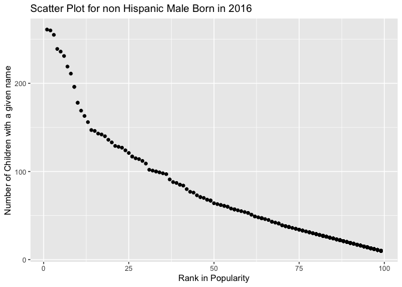

p8105\_hw2\_cm3928
================
Clement Mugenzi
9/25/2019

# Question 1

## First Part

In the chunk below, I will load the dataset, clean names, and get rid of
unwanted rows.

``` r
trash_df = 
  read_excel("Trash-Wheel-Collection-Totals-8-6-19.xlsx",
             range = "A2:N408") %>% 
  janitor::clean_names() %>% 
  filter(dumpster >= 1) %>% 
  mutate(
    sports_balls = round(sports_balls, digits = 0),
    sports_balls = as.integer(sports_balls)
  )
view(trash_df)
```

``` r
kable(trash_df, markdown, digits = 1)
```

| dumpster |   month   | year |    date    | weight\_tons | volume\_cubic\_yards | plastic\_bottles | polystyrene | cigarette\_butts | glass\_bottles | grocery\_bags | chip\_bags | sports\_balls | homes\_powered |
| :------: | :-------: | :--: | :--------: | :----------: | :------------------: | :--------------: | :---------: | :--------------: | :------------: | :-----------: | :--------: | :-----------: | :------------: |
|    1     |    May    | 2014 | 2014-05-16 |     4.31     |          18          |       1450       |    1820     |      126000      |       72       |      584      |    1162    |       7       |    0.00000     |
|    2     |    May    | 2014 | 2014-05-16 |     2.74     |          13          |       1120       |    1030     |      91000       |       42       |      496      |    874     |       5       |    0.00000     |
|    3     |    May    | 2014 | 2014-05-16 |     3.45     |          15          |       2450       |    3100     |      105000      |       50       |     1080      |    2032    |       6       |    0.00000     |
|    4     |    May    | 2014 | 2014-05-17 |     3.10     |          15          |       2380       |    2730     |      100000      |       52       |      896      |    1971    |       6       |    0.00000     |
|    5     |    May    | 2014 | 2014-05-17 |     4.06     |          18          |       980        |     870     |      120000      |       72       |      368      |    753     |       7       |    0.00000     |
|    6     |    May    | 2014 | 2014-05-20 |     2.71     |          13          |       1430       |    2140     |      90000       |       46       |      672      |    1144    |       5       |    0.00000     |
|    7     |    May    | 2014 | 2014-05-21 |     1.91     |          8           |       910        |    1090     |      56000       |       32       |      416      |    692     |       3       |    0.00000     |
|    8     |    May    | 2014 | 2014-05-28 |     3.70     |          16          |       3580       |    4310     |      112000      |       58       |     1552      |    3015    |       6       |    0.00000     |
|    9     |   June    | 2014 | 2014-06-05 |     2.52     |          14          |       2400       |    2790     |      98000       |       49       |      984      |    1988    |       6       |    0.00000     |
|    10    |   June    | 2014 | 2014-06-11 |     3.76     |          18          |       1340       |    1730     |      130000      |       75       |      448      |    1066    |       7       |    0.00000     |
|    11    |   June    | 2014 | 2014-06-11 |     3.43     |          15          |       740        |     869     |      110000      |       38       |      344      |    544     |       6       |    0.00000     |
|    12    |   June    | 2014 | 2014-06-12 |     4.17     |          19          |       950        |    1140     |      133000      |       45       |      520      |    727     |       8       |    0.00000     |
|    13    |   June    | 2014 | 2014-06-13 |     5.13     |          15          |       530        |     630     |      104000      |       58       |      224      |    361     |       6       |    0.00000     |
|    14    |   June    | 2014 | 2014-06-13 |     4.17     |          15          |       840        |     760     |      100000      |       62       |      344      |    631     |       6       |    0.00000     |
|    15    |   June    | 2014 | 2014-06-19 |     3.28     |          15          |       1130       |    1350     |      102000      |       64       |      432      |    883     |       6       |    0.00000     |
|    16    |   June    | 2014 | 2014-06-19 |     3.05     |          15          |       1640       |    2130     |      106000      |       56       |      752      |    1327    |       6       |    0.00000     |
|    17    |   June    | 2014 | 2014-06-28 |     2.49     |          13          |       1350       |    1620     |      89000       |       47       |      696      |    1075    |       5       |    0.00000     |
|    18    |   July    | 2014 | 2014-07-03 |     2.54     |          15          |       1640       |    1960     |      108000      |       65       |      744      |    1327    |       6       |    0.00000     |
|    19    |   July    | 2014 | 2014-07-07 |     2.41     |          15          |       1730       |    2100     |      107000      |       63       |      896      |    1405    |       6       |    0.00000     |
|    20    |   July    | 2014 | 2014-07-11 |     3.83     |          18          |       5960       |    6540     |      132000      |       79       |     2560      |    5085    |       7       |    0.00000     |
|    21    |   July    | 2014 | 2014-07-14 |     2.73     |          15          |       2170       |    2620     |      112000      |       32       |     1144      |    1788    |       6       |    0.00000     |
|    22    |   July    | 2014 | 2014-07-15 |     4.40     |          16          |       1930       |    2210     |      115000      |       53       |      688      |    1579    |       6       |    0.00000     |
|    23    |   July    | 2014 | 2014-07-15 |     2.79     |          14          |       3200       |    3840     |      98000       |       25       |     1464      |    2684    |       6       |    0.00000     |
|    24    |   July    | 2014 | 2014-07-25 |     2.50     |          13          |       2500       |    3040     |      85000       |       18       |     1248      |    2075    |       5       |    0.00000     |
|    25    |  August   | 2014 | 2014-08-04 |     4.39     |          16          |       2140       |    2050     |      118000      |       68       |      904      |    1762    |       6       |    0.00000     |
|    26    |  August   | 2014 | 2014-08-04 |     5.33     |          17          |       1630       |    1950     |      123000      |       75       |      512      |    1318    |       7       |    0.00000     |
|    27    |  August   | 2014 | 2014-08-13 |     3.58     |          20          |       3640       |    4360     |      141000      |       82       |     1560      |    3067    |       8       |    0.00000     |
|    28    |  August   | 2014 | 2014-08-13 |     3.10     |          17          |       1430       |    1870     |      121000      |       63       |      552      |    1144    |       7       |    0.00000     |
|    29    |  August   | 2014 | 2014-08-19 |     1.77     |          10          |       570        |     780     |      32000       |       21       |      310      |    1440    |       4       |    0.00000     |
|    30    | September | 2014 | 2014-09-03 |     3.76     |          18          |       4800       |    3640     |      310000      |      110       |     1880      |    2200    |       7       |    0.00000     |
|    31    | September | 2014 | 2014-09-24 |     1.24     |          8           |       550        |     860     |      18000       |       11       |      420      |    1040    |       3       |    0.00000     |
|    32    | September | 2014 | 2014-09-26 |     3.14     |          15          |       2240       |    2880     |      112000      |       42       |     1200      |    1860    |       6       |    0.00000     |
|    33    |  October  | 2014 | 2014-10-03 |     2.71     |          16          |       4220       |    4840     |      84000       |       38       |     1400      |    2140    |       6       |    0.00000     |
|    34    |  October  | 2014 | 2014-10-09 |     2.11     |          14          |       1400       |    1650     |      80000       |       18       |     1450      |    2030    |       6       |    0.00000     |
|    35    |  October  | 2014 | 2014-10-20 |     4.09     |          18          |       2820       |    3010     |      78000       |       7        |      990      |    1450    |       7       |    0.00000     |
|    36    |  October  | 2014 | 2014-10-20 |     2.31     |          14          |       1900       |    2240     |      81000       |       22       |      840      |    1260    |       6       |    0.00000     |
|    37    |  October  | 2014 | 2014-10-24 |     3.50     |          15          |       3650       |    3880     |      94000       |       51       |     1210      |    1840    |       6       |    0.00000     |
|    38    | November  | 2014 | 2014-11-06 |     2.70     |          15          |       760        |    1680     |      22000       |       18       |      960      |    1720    |       6       |    0.00000     |
|    39    | November  | 2014 | 2014-11-17 |     3.25     |          18          |       1250       |    2730     |      46000       |       28       |     1130      |    2340    |       7       |    0.00000     |
|    40    | November  | 2014 | 2014-11-20 |     3.84     |          15          |       880        |    1840     |      35000       |       14       |      730      |    1760    |       6       |    0.00000     |
|    41    | November  | 2014 | 2014-11-28 |     2.88     |          15          |       1800       |    3970     |      52000       |       32       |      560      |    1850    |       6       |    0.00000     |
|    42    | December  | 2014 | 2014-12-01 |     1.81     |          17          |       1370       |    3140     |      38000       |       28       |      950      |    1620    |       7       |    0.00000     |
|    43    | December  | 2014 | 2014-12-17 |     3.48     |          15          |       550        |    1450     |      22000       |       34       |      740      |    1280    |       6       |    0.00000     |
|    44    | December  | 2014 | 2014-12-30 |     3.18     |          15          |       640        |    1670     |      26000       |       42       |      880      |    1540    |       6       |    0.00000     |
|    45    |  January  | 2015 | 2015-01-12 |     2.87     |          17          |       1160       |    2250     |      31000       |       60       |     1120      |    2450    |       7       |    0.00000     |
|    46    |  January  | 2015 | 2015-01-23 |     2.00     |          14          |       1570       |    2400     |      33000       |       37       |      380      |    910     |       6       |    0.00000     |
|    47    |  January  | 2015 | 2015-01-26 |     2.14     |          13          |       1340       |    2650     |      28000       |       46       |      430      |    1170    |       5       |    0.00000     |
|    48    | February  | 2015 | 2015-02-04 |     2.54     |          15          |       1740       |    2250     |      22000       |       38       |      320      |    980     |       3       |    42.33333    |
|    49    |   March   | 2015 | 2015-03-09 |     3.82     |          18          |       2870       |    3240     |      25000       |       26       |      540      |    860     |       8       |    63.66667    |
|    50    |   March   | 2015 | 2015-03-13 |     1.83     |          15          |       3120       |    5430     |      32000       |       54       |      650      |    1120    |      16       |    30.50000    |
|    51    |   March   | 2015 | 2015-03-27 |     2.02     |          15          |       2780       |    4980     |      26000       |       47       |      470      |    960     |      14       |    33.66667    |
|    52    |   April   | 2015 | 2015-04-08 |     2.50     |          18          |       2240       |    2360     |      27000       |       46       |      270      |    840     |      13       |    41.66667    |
|    53    |   April   | 2015 | 2015-04-10 |     3.41     |          15          |       2550       |    3420     |      32000       |       32       |      320      |    1260    |      16       |    56.83333    |
|    54    |   April   | 2015 | 2015-04-19 |     1.83     |          11          |       1470       |    1840     |      18000       |       22       |      240      |    680     |       8       |    30.50000    |
|    55    |   April   | 2015 | 2015-04-20 |     3.84     |          18          |       1240       |    1630     |      23000       |       18       |      430      |    760     |       5       |    64.00000    |
|    56    |   April   | 2015 | 2015-04-20 |     3.22     |          15          |       1150       |    1420     |      19000       |       16       |      370      |    590     |       8       |    53.66667    |
|    57    |   April   | 2015 | 2015-04-20 |     3.03     |          15          |       2850       |    3160     |      18000       |       15       |      350      |    610     |      11       |    0.00000     |
|    58    |   April   | 2015 | 2015-04-20 |     2.64     |          18          |       960        |    1280     |      22000       |       22       |      450      |    820     |       7       |    0.00000     |
|    59    |   April   | 2015 | 2015-04-20 |     3.54     |          15          |       870        |    1140     |      18000       |       17       |      330      |    620     |       6       |    59.00000    |
|    60    |    May    | 2015 | 2015-05-15 |     1.95     |          9           |       1340       |    2150     |      22000       |       16       |      190      |    530     |       8       |    32.50000    |
|    61    |    May    | 2015 | 2015-05-17 |     4.25     |          18          |       2630       |    3480     |      38000       |       36       |     1240      |    1760    |      22       |    70.83333    |
|    62    |    May    | 2015 | 2015-05-17 |     5.62     |          15          |       1850       |    3270     |      54000       |       44       |      970      |    1320    |      28       |    93.66667    |
|    63    |    May    | 2015 | 2015-05-18 |     3.81     |          15          |       2830       |    3780     |      48000       |       28       |      650      |    1130    |      19       |    63.50000    |
|    64    |    May    | 2015 | 2015-05-19 |     3.45     |          18          |       1740       |    2630     |      32000       |       16       |      820      |    1250    |      32       |    57.50000    |
|    65    |    May    | 2015 | 2015-05-19 |     3.34     |          15          |       2780       |    3250     |      37000       |       32       |     1140      |    1960    |      24       |    55.66667    |
|    66    |   June    | 2015 | 2015-06-01 |     2.54     |          15          |       1260       |    1830     |      56000       |       56       |     1230      |    2140    |      26       |    42.33333    |
|    67    |   June    | 2015 | 2015-06-09 |     4.66     |          18          |       2340       |    3460     |      48000       |       42       |     1620      |    1840    |      36       |    77.66667    |
|    68    |   June    | 2015 | 2015-06-09 |     3.39     |          15          |       3240       |    4360     |      33000       |       23       |     1430      |    1760    |      24       |    56.50000    |
|    69    |   June    | 2015 | 2015-06-09 |     3.17     |          15          |       940        |    1220     |      35000       |       18       |      840      |    960     |       9       |    52.83333    |
|    70    |   June    | 2015 | 2015-06-09 |     3.15     |          18          |       830        |    1150     |      37000       |       26       |      920      |    1050    |      16       |    52.50000    |
|    71    |   June    | 2015 | 2015-06-09 |     3.83     |          15          |       960        |    1190     |      33000       |       22       |      730      |    940     |      22       |    0.00000     |
|    72    |   June    | 2015 | 2015-06-10 |     4.78     |          15          |       870        |    1040     |      32000       |       24       |      820      |    960     |      17       |    79.66667    |
|    73    |   June    | 2015 | 2015-06-10 |     3.85     |          18          |       920        |    1290     |      34000       |       26       |      930      |    1020    |      13       |    0.00000     |
|    74    |   June    | 2015 | 2015-06-10 |     4.48     |          15          |       1130       |    1370     |      38000       |       29       |     1270      |    1450    |      14       |    0.00000     |
|    75    |   June    | 2015 | 2015-06-10 |     4.18     |          15          |       1060       |    1250     |      37000       |       27       |     1340      |    1420    |      21       |    0.00000     |
|    76    |   June    | 2015 | 2015-06-10 |     3.38     |          18          |       740        |     930     |      34000       |       19       |     1130      |    1340    |      15       |    0.00000     |
|    77    |   June    | 2015 | 2015-06-10 |     3.83     |          15          |       950        |    1220     |      35000       |       21       |     1370      |    1430    |      13       |    0.00000     |
|    78    |   June    | 2015 | 2015-06-12 |     3.95     |          15          |       2340       |    3250     |      65000       |       45       |     2730      |    3340    |      18       |    0.00000     |
|    79    |   June    | 2015 | 2015-06-15 |     2.44     |          18          |       2660       |    3420     |      72000       |       37       |     2430      |    3170    |      16       |    40.66667    |
|    80    |   June    | 2015 | 2015-06-18 |     2.85     |          15          |       2430       |    3120     |      68000       |       35       |     2370      |    2820    |      22       |    47.50000    |
|    81    |   June    | 2015 | 2015-06-24 |     3.43     |          15          |       2690       |    3370     |      82000       |       29       |     1910      |    2180    |      32       |    57.16667    |
|    82    |   June    | 2015 | 2015-06-24 |     4.28     |          18          |       1540       |    1780     |      45000       |       24       |     1830      |    1990    |      18       |    71.33333    |
|    83    |   June    | 2015 | 2015-06-24 |     3.94     |          15          |       1240       |    1450     |      37000       |       31       |     1650      |    1780    |      21       |    65.66667    |
|    84    |   June    | 2015 | 2015-06-28 |     3.38     |          15          |       2870       |    3560     |      68000       |       36       |     2140      |    2450    |      34       |    56.33333    |
|    85    |   June    | 2015 | 2015-06-28 |     3.45     |          18          |       2450       |    3240     |      74000       |       41       |     2320      |    2750    |      19       |    57.50000    |
|    86    |   June    | 2015 | 2015-06-29 |     3.93     |          15          |       1830       |    2240     |      36000       |       28       |     1630      |    2450    |      14       |    65.50000    |
|    87    |   July    | 2015 | 2015-07-07 |     4.07     |          15          |       2360       |    3120     |      82000       |       32       |     1840      |    2950    |      22       |    67.83333    |
|    88    |   July    | 2015 | 2015-07-08 |     3.03     |          18          |       2640       |    3520     |      68000       |       28       |     1460      |    2630    |      16       |    50.50000    |
|    89    |   July    | 2015 | 2015-07-14 |     3.52     |          15          |       2840       |    3360     |      65000       |       41       |     1690      |    2580    |      25       |    58.66667    |
|    90    |   July    | 2015 | 2015-07-14 |     3.51     |          15          |       2640       |    3120     |      76000       |       38       |     2130      |    2760    |      27       |    58.50000    |
|    91    |   July    | 2015 | 2015-07-27 |     3.68     |          18          |       3070       |    4250     |      82000       |       26       |     1770      |    2540    |      18       |    61.33333    |
|    92    |   July    | 2015 | 2015-07-29 |     3.40     |          15          |       2820       |    3740     |      75000       |       31       |     2400      |    2940    |      20       |    56.66667    |
|    93    |  August   | 2015 | 2015-08-04 |     3.72     |          15          |       2640       |    3250     |      68000       |       26       |     1860      |    2730    |      17       |    62.00000    |
|    94    |  August   | 2015 | 2015-08-18 |     1.84     |          9           |       870        |     980     |      34000       |       13       |      750      |    930     |      56       |    30.66667    |
|    95    |  August   | 2015 | 2015-08-21 |     3.00     |          15          |       3220       |    3460     |      67000       |       36       |     2170      |    2450    |      32       |    50.00000    |
|    96    |  August   | 2015 | 2015-08-25 |     4.33     |          18          |       1980       |    2190     |      48000       |       21       |     1600      |    1840    |      22       |    72.16667    |
|    97    |  August   | 2015 | 2015-08-25 |     4.30     |          15          |       410        |     540     |       3000       |       16       |      250      |    330     |       6       |    0.00000     |
|    98    |  August   | 2015 | 2015-08-26 |     3.39     |          15          |       640        |     780     |      32000       |       18       |      350      |    560     |       3       |    0.00000     |
|    99    | September | 2015 | 2015-09-11 |     4.08     |          18          |       2730       |    3140     |      54000       |       45       |     2430      |    2680    |      17       |    0.00000     |
|   100    | September | 2015 | 2015-09-11 |     3.62     |          15          |       1360       |    1570     |      26000       |       25       |     1420      |    1570    |      13       |    0.00000     |
|   101    | September | 2015 | 2015-09-22 |     2.40     |          7           |       760        |    1030     |      24000       |       16       |      780      |    1340    |      12       |    0.00000     |
|   102    | September | 2015 | 2015-09-30 |     4.24     |          18          |       1240       |    1460     |      46000       |       43       |      860      |    920     |       7       |    0.00000     |
|   103    | September | 2015 | 2015-09-30 |     3.31     |          15          |       800        |     920     |      32000       |       26       |      270      |    450     |       8       |    55.16667    |
|   104    |  October  | 2015 | 2015-10-12 |     2.90     |          15          |       2540       |    2780     |      42000       |       54       |     2230      |    3140    |      16       |    0.00000     |
|   105    |  October  | 2015 | 2015-10-27 |     2.46     |          18          |       2130       |    2560     |      34000       |       43       |     1970      |    2430    |      23       |    41.00000    |
|   106    |  October  | 2015 | 2015-10-31 |     2.89     |          15          |       2670       |    2820     |      36000       |       35       |     2450      |    2830    |      33       |    48.16667    |
|   107    | November  | 2015 | 2015-11-20 |     4.46     |          15          |       1940       |    2230     |      28000       |       47       |     2960      |    3320    |      27       |    0.00000     |
|   108    | December  | 2015 | 2015-12-02 |     3.42     |          18          |       2140       |    2570     |      19000       |       62       |     3100      |    3540    |      15       |    0.00000     |
|   109    | December  | 2015 | 2015-12-02 |     3.56     |          15          |       1960       |    2340     |      21000       |       56       |     3300      |    4120    |      21       |    0.00000     |
|   110    | December  | 2015 | 2015-12-23 |     1.92     |          12          |       1640       |    2150     |      32000       |       32       |     2430      |    2660    |       9       |    32.00000    |
|   111    | December  | 2015 | 2015-12-24 |     2.90     |          18          |       1850       |    2670     |      33000       |       36       |     2770      |    3240    |      13       |    48.33333    |
|   112    | December  | 2015 | 2015-12-26 |     3.24     |          15          |       2370       |    3240     |      24000       |       42       |     1830      |    2250    |      22       |    54.00000    |
|   113    | December  | 2015 | 2015-12-26 |     4.41     |          15          |       2530       |    3300     |      41000       |       47       |     2190      |    3540    |      17       |    73.50000    |
|   114    | December  | 2015 | 2015-12-26 |     3.39     |          18          |       2720       |    3690     |      23000       |       22       |     2520      |    3360    |      27       |    56.50000    |
|   115    | December  | 2015 | 2015-12-26 |     3.27     |          15          |       2250       |    3180     |      37000       |       63       |     2740      |    2840    |       8       |    54.50000    |
|   116    |  January  | 2016 | 2016-01-10 |     3.60     |          15          |       3240       |    4160     |      28000       |       54       |     1360      |    2580    |      17       |    60.00000    |
|   117    | February  | 2016 | 2016-02-02 |     4.06     |          18          |       3530       |    4620     |      24000       |       62       |     1850      |    2210    |      14       |    67.66667    |
|   118    | February  | 2016 | 2016-02-03 |     2.11     |          15          |       2340       |    3870     |      31000       |       46       |     2130      |    2680    |      21       |    35.16667    |
|   119    | February  | 2016 | 2016-02-05 |     3.01     |          15          |       2460       |    3640     |      27000       |       38       |     1920      |    2390    |      26       |    50.16667    |
|   120    | February  | 2016 | 2016-02-17 |     3.41     |          18          |       1340       |    1680     |      24000       |       22       |     1530      |    1940    |       6       |    56.83333    |
|   121    | February  | 2016 | 2016-02-19 |     3.66     |          15          |       950        |    1120     |      21000       |       32       |     1370      |    1640    |       4       |    61.00000    |
|   122    | February  | 2016 | 2016-02-25 |     4.51     |          15          |       2240       |    3150     |      36000       |       46       |     2450      |    3140    |      16       |    75.16667    |
|   123    |   March   | 2016 | 2016-03-01 |     2.89     |          18          |       3050       |    3270     |      29000       |       24       |     1740      |    2250    |      24       |    48.16667    |
|   124    |   March   | 2016 | 2016-03-11 |     2.89     |          15          |       1630       |    1820     |      18000       |       37       |     2150      |    2390    |      23       |    48.16667    |
|   125    |   March   | 2016 | 2016-03-12 |     2.51     |          15          |       1120       |    1460     |      17000       |       43       |     2270      |    2490    |      18       |    41.83333    |
|   126    |   March   | 2016 | 2016-03-15 |     3.58     |          18          |       3340       |    3640     |      45000       |       48       |     3450      |    3740    |      46       |    59.66667    |
|   127    |   March   | 2016 | 2016-03-29 |     3.41     |          15          |       3560       |    3740     |      43000       |       53       |     3320      |    3570    |      38       |    56.83333    |
|   128    |   April   | 2016 | 2016-04-08 |     2.79     |          15          |       2460       |    3150     |      38000       |       46       |     3540      |    3840    |      24       |    46.50000    |
|   129    |   April   | 2016 | 2016-04-30 |     4.21     |          18          |       3860       |    4240     |      47000       |       18       |     3200      |    3470    |      36       |    70.16667    |
|   130    |   April   | 2016 | 2016-04-30 |     4.88     |          15          |       3230       |    3640     |      52000       |       27       |     3750      |    3940    |      42       |    81.33333    |
|   131    |   April   | 2016 | 2016-04-30 |     4.47     |          15          |       3760       |    4150     |      45000       |       40       |     2840      |    3270    |      23       |    74.50000    |
|   132    |   April   | 2016 | 2016-04-30 |     3.29     |          18          |       3640       |    3520     |      52000       |       33       |     2530      |    2940    |      34       |    54.83333    |
|   133    |    May    | 2016 | 2016-05-07 |     4.16     |          15          |       4230       |    4620     |      53000       |       34       |     2727      |    3360    |      38       |    69.33333    |
|   134    |    May    | 2016 | 2016-05-12 |     2.93     |          15          |       3590       |    3840     |      47000       |       42       |     1760      |    2640    |      26       |    48.83333    |
|   135    |    May    | 2016 | 2016-05-31 |     2.37     |          18          |       3740       |    4120     |      56000       |       65       |     1680      |    2530    |      32       |    39.50000    |
|   136    |   June    | 2016 | 2016-06-15 |     2.57     |          15          |       4200       |    4630     |      38000       |       53       |     1480      |    1760    |      43       |    42.83333    |
|   137    |   June    | 2016 | 2016-06-16 |     2.39     |          15          |       3840       |    3990     |      41000       |       32       |     1540      |    2030    |      38       |    39.83333    |
|   138    |   June    | 2016 | 2016-06-21 |     3.98     |          15          |       4350       |    4120     |      45000       |       42       |     1630      |    2140    |      24       |    66.33333    |
|   139    |   June    | 2016 | 2016-06-22 |     3.47     |          15          |       3960       |    3720     |      52000       |       38       |     1870      |    2200    |      35       |    57.83333    |
|   140    |   June    | 2016 | 2016-06-24 |     3.97     |          18          |       4150       |    3970     |      48000       |       41       |     1530      |    1700    |      26       |    66.16667    |
|   141    |   June    | 2016 | 2016-06-30 |     3.12     |          18          |       4450       |    4310     |      58000       |       43       |     2130      |    2410    |      29       |    52.00000    |
|   142    |   July    | 2016 | 2016-07-01 |     3.17     |          15          |       3460       |    3820     |      43000       |       38       |     2240      |    2670    |      31       |    52.83333    |
|   143    |   July    | 2016 | 2016-07-13 |     2.12     |          15          |       2850       |    3120     |      52000       |       53       |     1930      |    2150    |      28       |    35.33333    |
|   144    |   July    | 2016 | 2016-07-23 |     2.31     |          18          |       3560       |    3780     |      65000       |       33       |     2460      |    2520    |      34       |    38.50000    |
|   145    |   July    | 2016 | 2016-07-28 |     3.16     |          15          |       4130       |    4360     |      52000       |       54       |     2610      |    2900    |      26       |    52.66667    |
|   146    |   July    | 2016 | 2016-07-29 |     4.02     |          15          |       4350       |    4600     |      55000       |       34       |     2430      |    2780    |      38       |    67.00000    |
|   147    |   July    | 2016 | 2016-07-29 |     3.26     |          18          |       4420       |    4850     |      65000       |       48       |     2340      |    2580    |      25       |    54.33333    |
|   148    |   July    | 2016 | 2016-07-31 |     3.82     |          15          |       2130       |    2240     |      35000       |       45       |     1830      |    2140    |      16       |    63.66667    |
|   149    |   July    | 2016 | 2016-07-31 |     4.88     |          15          |       2450       |    2500     |      32000       |       33       |     1950      |    2070    |      24       |    81.33333    |
|   150    |  August   | 2016 | 2016-08-04 |     5.05     |          18          |       2300       |    2260     |      16000       |       28       |     1360      |    1650    |      15       |    84.16667    |
|   151    |  August   | 2016 | 2016-08-16 |     2.79     |          15          |       2850       |    3120     |      34000       |       42       |     2100      |    2630    |      31       |    46.50000    |
|   152    |  August   | 2016 | 2016-08-17 |     3.47     |          15          |       2640       |    2900     |      38000       |       37       |     2340      |    2760    |      22       |    57.83333    |
|   153    |  August   | 2016 | 2016-08-19 |     4.01     |          18          |       3250       |    3570     |      42000       |       56       |     2700      |    3020    |      28       |    66.83333    |
|   154    |  August   | 2016 | 2016-08-24 |     3.18     |          15          |       2530       |    2740     |      52000       |       38       |     2810      |    3150    |      32       |    53.00000    |
|   155    | September | 2016 | 2016-09-02 |     3.13     |          15          |       2780       |    2640     |      38000       |       21       |     2130      |    2830    |      15       |    52.16667    |
|   156    | September | 2016 | 2016-09-07 |     2.43     |          18          |       2740       |    3360     |      24000       |       32       |     2210      |    2490    |      28       |    40.50000    |
|   157    | September | 2016 | 2016-09-19 |     3.08     |          15          |       2530       |    3460     |      21000       |       38       |     2300      |    2760    |      33       |    51.33333    |
|   158    |  October  | 2016 | 2016-10-09 |     2.90     |          15          |       1876       |    3990     |      27600       |       10       |     1240      |    1980    |      11       |    48.33333    |
|   159    |  October  | 2016 | 2016-10-27 |     3.00     |          18          |       2340       |    3150     |      19000       |       46       |     2470      |    2810    |      37       |    50.00000    |
|   160    | November  | 2016 | 2016-11-17 |     2.01     |          15          |       2244       |    4358     |      27000       |       64       |     3400      |    3700    |      22       |    33.50000    |
|   161    | November  | 2016 | 2016-11-29 |     1.98     |          15          |       2980       |    4460     |      36000       |       18       |     1880      |    1610    |      11       |    33.00000    |
|   162    | November  | 2016 | 2016-11-30 |     2.75     |          18          |       3460       |    5840     |      16000       |       42       |     3260      |    3430    |      34       |    45.83333    |
|   163    | December  | 2016 | 2016-12-01 |     3.41     |          15          |       1840       |    4760     |      23000       |       43       |     3470      |    3800    |       6       |    56.83333    |
|   164    | December  | 2016 | 2016-12-06 |     2.55     |          15          |       1360       |    3850     |      34000       |       39       |     2340      |    4220    |      24       |    42.50000    |
|   165    | December  | 2016 | 2016-12-16 |     1.74     |          18          |       1880       |    2890     |      26000       |       59       |     2100      |    4040    |      20       |    29.00000    |
|   166    | December  | 2016 | 2017-01-02 |     2.13     |          15          |       2460       |    2740     |      32000       |       48       |     3250      |    4430    |      15       |    35.50000    |
|   167    |  January  | 2017 | 2017-01-19 |     2.43     |          15          |       2260       |    2780     |      28000       |       36       |     2870      |    3640    |      22       |    40.50000    |
|   168    | February  | 2017 | 2017-02-26 |     2.32     |          18          |       2890       |    2460     |      30000       |       22       |     2610      |    3250    |      19       |    38.66667    |
|   169    | February  | 2017 | 2017-02-26 |     3.72     |          15          |       2140       |    1870     |      15000       |       23       |     2040      |    2450    |      12       |    62.00000    |
|   170    |   March   | 2017 | 2017-03-30 |     2.14     |          15          |       2570       |    2930     |      23000       |       28       |     2650      |    2910    |      14       |    35.66667    |
|   171    |   March   | 2017 | 2017-03-31 |     2.74     |          18          |       2030       |    2340     |      14000       |       18       |     1960      |    2150    |      18       |    45.66667    |
|   172    |   March   | 2017 | 2017-03-31 |     2.63     |          15          |       1940       |    2170     |      12000       |       15       |     1820      |    1980    |      10       |    43.83333    |
|   173    |   March   | 2017 | 2017-03-31 |     2.09     |          15          |       1870       |    2040     |      11000       |       13       |     1950      |    2210    |       6       |    34.83333    |
|   174    |   April   | 2017 | 2017-04-01 |     2.67     |          18          |       1920       |    2130     |      13000       |       21       |     2230      |    2590    |       8       |    44.50000    |
|   175    |   April   | 2017 | 2017-04-01 |     2.67     |          18          |       1920       |    2130     |      13000       |       21       |     2230      |    2590    |       8       |    44.50000    |
|   176    |   April   | 2017 | 2017-04-06 |     3.55     |          15          |       2230       |    2540     |       2000       |       16       |     1480      |    1670    |       5       |    59.16667    |
|   177    |   April   | 2017 | 2017-04-06 |     3.89     |          18          |       980        |    1120     |       3000       |       14       |     1500      |    1730    |       3       |    64.83333    |
|   178    |   April   | 2017 | 2017-04-06 |     3.59     |          15          |       650        |     720     |       2000       |       10       |     1140      |    1450    |       5       |    59.83333    |
|   179    |   April   | 2017 | 2017-04-06 |     3.13     |          15          |       430        |     560     |       4000       |       9        |      870      |    990     |       7       |    52.16667    |
|   180    |   April   | 2017 | 2017-04-06 |     3.33     |          18          |       390        |     460     |       2000       |       8        |      720      |    850     |       2       |    55.50000    |
|   181    |   April   | 2017 | 2017-04-07 |     3.11     |          15          |       490        |     510     |       3000       |       11       |     1020      |    1110    |       7       |    51.83333    |
|   182    |   April   | 2017 | 2017-04-07 |     3.04     |          15          |       210        |     340     |       2000       |       12       |      890      |    1040    |       3       |    50.66667    |
|   183    |   April   | 2017 | 2017-04-07 |     3.21     |          18          |       560        |     670     |       2000       |       15       |      920      |    1080    |       4       |    53.50000    |
|   184    |   April   | 2017 | 2017-04-07 |     4.08     |          15          |       470        |     560     |       3000       |       12       |      780      |    820     |       5       |    68.00000    |
|   185    |   April   | 2017 | 2017-04-07 |     3.26     |          15          |       390        |     450     |       2000       |       8        |      830      |    990     |       8       |    54.33333    |
|   186    |   April   | 2017 | 2017-04-08 |     3.36     |          18          |       460        |     620     |       1000       |       9        |      790      |    830     |      10       |    56.00000    |
|   187    |   April   | 2017 | 2017-04-08 |     3.62     |          15          |       530        |     670     |       2000       |       13       |     1120      |    1340    |       5       |    60.33333    |
|   188    |   April   | 2017 | 2017-04-08 |     4.27     |          15          |       460        |     530     |       1000       |       12       |      820      |    1030    |       7       |    71.16667    |
|   189    |   April   | 2017 | 2017-04-08 |     4.01     |          18          |       340        |     510     |       2000       |       10       |      730      |    910     |       5       |    66.83333    |
|   190    |   April   | 2017 | 2017-04-08 |     3.88     |          15          |       360        |     490     |       1000       |       15       |      820      |    950     |       8       |    64.66667    |
|   191    |   April   | 2017 | 2017-04-21 |     4.67     |          15          |       2540       |    2330     |      12000       |       32       |     2450      |    2670    |      10       |    77.83333    |
|   192    |    May    | 2017 | 2017-05-05 |     3.53     |          18          |       2870       |    3140     |      16000       |       21       |     3460      |    3720    |      11       |    58.83333    |
|   193    |    May    | 2017 | 2017-05-05 |     4.07     |          15          |       2230       |    2820     |      14000       |       19       |     3250      |    3890    |      14       |    67.83333    |
|   194    |    May    | 2017 | 2017-05-06 |     3.93     |          15          |       2340       |    2530     |      15000       |       18       |     2890      |    3100    |      12       |    65.50000    |
|   195    |    May    | 2017 | 2017-05-11 |     2.59     |          18          |       2560       |    2430     |      18000       |       16       |     3120      |    3240    |       8       |    43.16667    |
|   196    |    May    | 2017 | 2017-05-11 |     3.81     |          15          |       2340       |    2250     |      19000       |       22       |     2830      |    3020    |       5       |    63.50000    |
|   197    |    May    | 2017 | 2017-05-22 |     3.30     |          15          |       2480       |    2320     |      14000       |       21       |     2990      |    3120    |       9       |    55.00000    |
|   198    |    May    | 2017 | 2017-05-22 |     3.84     |          18          |       2540       |    2410     |      15000       |       16       |     1980      |    2230    |       5       |    64.00000    |
|   199    |    May    | 2017 | 2017-05-26 |     4.10     |          15          |       2980       |    2830     |      17000       |       18       |     2590      |    2730    |      14       |    68.33333    |
|   200    |   June    | 2017 | 2017-06-21 |     4.10     |          18          |       3250       |    2980     |      21000       |       23       |     3460      |    3640    |      12       |    68.33333    |
|   201    |   June    | 2017 | 2017-06-21 |     2.52     |          15          |       3340       |    3120     |      26000       |       16       |     2640      |    3010    |       8       |    42.00000    |
|   202    |   June    | 2017 | 2017-06-27 |     1.95     |          15          |       2850       |    2560     |      17000       |       21       |     2430      |    2790    |       7       |    32.50000    |
|   203    |   July    | 2017 | 2017-07-03 |     3.58     |          18          |       3220       |    3140     |      23000       |       24       |     2870      |    3160    |      18       |    59.66667    |
|   204    |   July    | 2017 | 2017-07-03 |     1.50     |          15          |       2110       |    1920     |      14000       |       32       |     1780      |    2140    |      11       |    25.00000    |
|   205    |   July    | 2017 | 2017-07-12 |     3.63     |          15          |       3670       |    3240     |      32000       |       34       |     3020      |    3560    |      22       |    60.50000    |
|   206    |   July    | 2017 | 2017-07-27 |     2.21     |          18          |       2890       |    2710     |      11000       |       20       |     2890      |    3250    |      13       |    36.83333    |
|   207    |   July    | 2017 | 2017-07-28 |     4.04     |          15          |       1460       |    1250     |       9000       |       12       |     1120      |    1540    |      21       |    67.33333    |
|   208    |  August   | 2017 | 2017-08-02 |     3.87     |          15          |       3240       |    3120     |      18000       |       27       |     2780      |    3170    |      14       |    64.50000    |
|   209    |  August   | 2017 | 2017-08-04 |     3.68     |          18          |       3530       |    3240     |      26000       |       25       |     3250      |    3590    |       9       |    61.33333    |
|   210    |  August   | 2017 | 2017-08-07 |     2.17     |          15          |       2760       |    2500     |      19000       |       31       |     2230      |    2740    |       6       |    36.16667    |
|   211    |  August   | 2017 | 2017-08-11 |     2.10     |          15          |       2980       |    2740     |      22000       |       28       |     2640      |    2930    |      13       |    35.00000    |
|   212    |  August   | 2017 | 2017-08-18 |     3.70     |          18          |       2430       |    2010     |      27000       |       36       |     2910      |    3310    |      11       |    61.66667    |
|   213    |  August   | 2017 | 2017-08-19 |     3.39     |          15          |       1500       |    1390     |      12000       |       42       |      600      |    750     |       6       |    56.50000    |
|   214    |  August   | 2017 | 2017-08-19 |     3.14     |          15          |       1270       |    1140     |       9000       |       13       |      780      |    890     |       8       |    52.33333    |
|   215    |  August   | 2017 | 2017-08-19 |     3.54     |          18          |       1340       |    1180     |      13000       |       31       |      630      |    1250    |       5       |    59.00000    |
|   216    | September | 2017 | 2017-09-12 |     3.07     |          18          |       2780       |    2540     |      11000       |       21       |     1460      |    1870    |       6       |    51.16667    |
|   217    | September | 2017 | 2017-09-25 |     2.15     |          15          |       2910       |    2890     |      14000       |       32       |     1870      |    2140    |      12       |    35.83333    |
|   218    |  October  | 2017 | 2017-10-11 |     2.76     |          15          |       2760       |    2450     |      11000       |       24       |     1640      |    2350    |       8       |    46.00000    |
|   219    |  October  | 2017 | 2017-10-25 |     2.76     |          18          |       2950       |    2780     |      10000       |       29       |     1780      |    2130    |       7       |    46.00000    |
|   220    | November  | 2017 | 2017-11-14 |     2.38     |          15          |       2550       |    2870     |      12000       |       23       |     1640      |    2210    |      13       |    39.66667    |
|   221    | November  | 2017 | 2017-11-15 |     2.02     |          15          |       2720       |    2980     |      11000       |       32       |     1870      |    2340    |      11       |    33.66667    |
|   222    |  January  | 2018 | 2018-01-15 |     2.17     |          15          |       2540       |    3160     |      15000       |       28       |     2220      |    2560    |      12       |    36.16667    |
|   223    |  January  | 2018 | 2018-01-25 |     2.08     |          15          |       2370       |    2790     |      21000       |       12       |     1540      |    2760    |       8       |    34.66667    |
|   224    | February  | 2018 | 2018-02-05 |     3.12     |          18          |       2250       |    3120     |      18000       |       16       |     1630      |    2800    |       6       |    52.00000    |
|   225    | February  | 2018 | 2018-02-05 |     2.45     |          15          |       1260       |    1670     |      22000       |       9        |      870      |    1580    |       4       |    40.83333    |
|   226    | February  | 2018 | 2018-02-05 |     3.72     |          15          |       950        |    1470     |      16000       |       11       |      920      |    1340    |       6       |    62.00000    |
|   227    | February  | 2018 | 2018-02-06 |     4.00     |          18          |       1020       |    1590     |      14000       |       7        |     1110      |    1850    |      12       |    66.66667    |
|   228    | February  | 2018 | 2018-02-11 |     3.54     |          15          |       2250       |    2560     |      24000       |       18       |     1430      |    2260    |      14       |    59.00000    |
|   229    | February  | 2018 | 2018-02-11 |     3.19     |          15          |       1130       |    1470     |      12000       |       10       |      650      |    1400    |       5       |    53.16667    |
|   230    | February  | 2018 | 2018-02-11 |     4.51     |          18          |       1240       |    1510     |      11000       |       6        |      710      |    1390    |       4       |    75.16667    |
|   231    | February  | 2018 | 2018-02-13 |     2.97     |          15          |       1950       |    2130     |      16000       |       3        |     1050      |    1670    |       8       |    49.50000    |
|   232    | February  | 2018 | 2018-02-13 |     3.78     |          15          |       1460       |    1620     |      12000       |       5        |      630      |    1320    |       3       |    63.00000    |
|   233    |   March   | 2018 | 2018-03-06 |     2.66     |          15          |       2210       |    2650     |      18000       |       11       |     1420      |    1710    |       7       |    44.33333    |
|   234    |   March   | 2018 | 2018-03-06 |     2.64     |          15          |       2470       |    2810     |      19000       |       13       |     1540      |    1980    |      10       |    44.00000    |
|   235    |   April   | 2018 | 2018-04-16 |     4.30     |          15          |       2150       |    2300     |      23000       |       16       |     1320      |    2070    |      12       |    71.66667    |
|   236    |   April   | 2018 | 2018-04-16 |     2.91     |          15          |       970        |    1100     |       8000       |       2        |      300      |    800     |       1       |    48.50000    |
|   237    |   April   | 2018 | 2018-04-16 |     3.62     |          15          |       840        |     920     |       7000       |       3        |      290      |    650     |       4       |    60.33333    |
|   238    |   April   | 2018 | 2018-04-16 |     2.40     |          12          |       790        |     910     |       8000       |       4        |      260      |    590     |       2       |    40.00000    |
|   239    |   April   | 2018 | 2018-04-17 |     3.19     |          15          |       750        |     830     |       6000       |       3        |      190      |    400     |       4       |    53.16667    |
|   240    |   April   | 2018 | 2018-04-17 |     3.03     |          15          |       810        |     890     |       5000       |       4        |      200      |    450     |       3       |    50.50000    |
|   241    |   April   | 2018 | 2018-04-17 |     3.26     |          15          |       790        |    1020     |       6000       |       3        |      150      |    500     |       4       |    54.33333    |
|   242    |   April   | 2018 | 2018-04-17 |     3.04     |          15          |       670        |     840     |       7000       |       2        |      230      |    620     |       3       |    50.66667    |
|   243    |   April   | 2018 | 2018-04-18 |     3.09     |          15          |       710        |     910     |       7000       |       4        |      310      |    780     |       4       |    51.50000    |
|   244    |   April   | 2018 | 2018-04-18 |     2.72     |          15          |       730        |     840     |       6000       |       6        |      280      |    640     |       2       |    45.33333    |
|   245    |   April   | 2018 | 2018-04-18 |     3.65     |          15          |       820        |     980     |       7000       |       5        |      170      |    590     |       5       |    60.83333    |
|   246    |   April   | 2018 | 2018-04-18 |     3.38     |          15          |       760        |     870     |       6000       |       3        |      240      |    720     |       1       |    56.33333    |
|   247    |   April   | 2018 | 2018-04-18 |     3.44     |          15          |       670        |     780     |       6000       |       7        |      310      |    810     |       3       |    57.33333    |
|   248    |   April   | 2018 | 2018-04-18 |     2.57     |          15          |       730        |     850     |       6000       |       2        |      110      |    570     |       2       |    42.83333    |
|   249    |   April   | 2018 | 2018-04-20 |     3.36     |          15          |       750        |     870     |       7000       |       4        |      230      |    730     |       4       |    56.00000    |
|   250    |   April   | 2018 | 2018-04-20 |     2.72     |          15          |       820        |     910     |       8000       |       3        |      190      |    610     |       2       |    45.33333    |
|   251    |   April   | 2018 | 2018-04-26 |     3.81     |          15          |       1580       |    1870     |      12000       |       12       |      980      |    1560    |       3       |    63.50000    |
|   252    |    May    | 2018 | 2018-05-12 |     3.36     |          15          |       2130       |    2340     |      11000       |       9        |     1140      |    2140    |       4       |    56.00000    |
|   253    |    May    | 2018 | 2018-05-14 |     4.29     |          15          |       2350       |    2130     |      14000       |       5        |      600      |    2350    |       5       |    71.50000    |
|   254    |    May    | 2018 | 2018-05-14 |     4.29     |          15          |       2460       |    2370     |      17000       |       3        |      740      |    2570    |       3       |    71.50000    |
|   255    |    May    | 2018 | 2018-05-16 |     4.00     |          15          |       1220       |    1360     |       8000       |       4        |      350      |    780     |       2       |    66.66667    |
|   256    |    May    | 2018 | 2018-05-16 |     3.25     |          15          |       950        |     890     |       7000       |       3        |      250      |    1010    |       3       |    54.16667    |
|   257    |    May    | 2018 | 2018-05-16 |     1.60     |          15          |       400        |     320     |       4000       |       2        |      210      |    780     |       0       |    26.66667    |
|   258    |    May    | 2018 | 2018-05-17 |     3.62     |          15          |       1050       |    1170     |       6000       |       4        |      470      |    970     |       2       |    60.33333    |
|   259    |    May    | 2018 | 2018-05-28 |     3.19     |          15          |       1480       |    1560     |       8000       |       3        |     1360      |    2340    |       3       |    53.16667    |
|   260    |    May    | 2018 | 2018-05-28 |     2.86     |          15          |       1300       |    1230     |       7000       |       6        |     1130      |    2140    |       2       |    47.66667    |
|   261    |    May    | 2018 | 2018-05-28 |     4.10     |          15          |       1650       |    1490     |       9000       |       2        |      820      |    1930    |       1       |    68.33333    |
|   262    |    May    | 2018 | 2018-05-31 |     3.38     |          15          |       2130       |    2240     |      11000       |       9        |      650      |    2350    |       2       |    56.33333    |
|   263    |   June    | 2018 | 2018-06-03 |     3.35     |          15          |       2340       |    2580     |      12000       |       11       |     1130      |    1760    |       5       |    55.83333    |
|   264    |   June    | 2018 | 2018-06-03 |     3.17     |          15          |       1890       |    2130     |      14000       |       6        |      870      |    1590    |       4       |    52.83333    |
|   265    |   June    | 2018 | 2018-06-05 |     4.19     |          15          |       1420       |    1650     |       8000       |       3        |      590      |    1020    |       3       |    69.83333    |
|   266    |   June    | 2018 | 2018-06-05 |     2.60     |          15          |       1280       |    1330     |       9000       |       3        |      630      |    1170    |       2       |    43.33333    |
|   267    |   June    | 2018 | 2018-06-05 |     4.15     |          15          |       1140       |    1290     |       7000       |       2        |      570      |    1340    |       4       |    69.16667    |
|   268    |   June    | 2018 | 2018-06-12 |     4.23     |          15          |       870        |     950     |      11000       |       6        |      890      |    1220    |       2       |    70.50000    |
|   269    |   June    | 2018 | 2018-06-12 |     4.15     |          15          |       940        |    1130     |      10000       |       8        |      760      |    1430    |       8       |    69.16667    |
|   270    |   June    | 2018 | 2018-06-12 |     4.44     |          15          |       620        |     730     |       5000       |       4        |      810      |    1020    |       3       |    74.00000    |
|   271    |   June    | 2018 | 2018-06-28 |     3.12     |          15          |       1560       |    1780     |      13000       |       5        |     1240      |    1750    |       2       |    52.00000    |
|   272    |   June    | 2018 | 2018-06-29 |     0.96     |          15          |       1720       |    1980     |      12000       |       4        |     1110      |    1500    |       2       |    16.00000    |
|   273    |   July    | 2018 | 2018-07-18 |     2.99     |          15          |       1890       |    1630     |      13000       |       8        |      850      |    1290    |       3       |    49.83333    |
|   274    |   July    | 2018 | 2018-07-22 |     3.49     |          15          |       1760       |    1830     |      10000       |       10       |      790      |    1340    |       1       |    58.16667    |
|   275    |   July    | 2018 | 2018-07-24 |     4.39     |          15          |       890        |    1020     |       8000       |       4        |      340      |    710     |       5       |    73.16667    |
|   276    |   July    | 2018 | 2018-07-24 |     3.57     |          15          |       710        |     850     |       6000       |       2        |      410      |    820     |       3       |    59.50000    |
|   277    |   July    | 2018 | 2018-07-24 |     3.79     |          15          |       620        |     540     |       4000       |       2        |      370      |    560     |       1       |    63.16667    |
|   278    |   July    | 2018 | 2018-07-24 |     4.24     |          15          |       780        |     670     |       5000       |       3        |      50       |    720     |       2       |    70.66667    |
|   279    |   July    | 2018 | 2018-07-25 |     3.49     |          15          |       540        |     430     |       8000       |       6        |      410      |    910     |       7       |    58.16667    |
|   280    |   July    | 2018 | 2018-07-25 |     4.16     |          15          |       670        |     720     |       7000       |       4        |      360      |    840     |       4       |    69.33333    |
|   281    |   July    | 2018 | 2018-07-26 |     3.17     |          15          |       820        |     540     |       6000       |       8        |      430      |    750     |       5       |    52.83333    |
|   282    |   July    | 2018 | 2018-07-28 |     3.31     |          15          |       540        |     650     |      10000       |       5        |      500      |    690     |       1       |    55.16667    |
|   283    |   July    | 2018 | 2018-07-28 |     3.32     |          15          |       730        |     670     |       7000       |       6        |      290      |    1020    |       7       |    55.33333    |
|   284    |   July    | 2018 | 2018-07-28 |     3.98     |          15          |       910        |     790     |       5000       |       9        |      370      |    560     |       2       |    66.33333    |
|   285    |   July    | 2018 | 2018-07-28 |     3.84     |          15          |       710        |     630     |       8000       |       2        |      300      |    730     |       3       |    64.00000    |
|   286    |  August   | 2018 | 2018-08-09 |     3.31     |          15          |       1750       |     990     |      11000       |       6        |      910      |    1650    |       6       |    55.16667    |
|   287    |  August   | 2018 | 2018-08-14 |     4.62     |          18          |       1320       |    1010     |       4900       |       14       |     1260      |    920     |       1       |    77.00000    |
|   288    |  August   | 2018 | 2018-08-14 |     3.74     |          15          |       2740       |    1130     |       6700       |       29       |     2100      |    1340    |       9       |    62.33333    |
|   289    |  August   | 2018 | 2018-08-14 |     3.27     |          15          |       1120       |     790     |       4000       |       4        |     1050      |    1160    |       0       |    54.50000    |
|   290    |  August   | 2018 | 2018-08-14 |     3.04     |          18          |       2100       |     980     |       3000       |       12       |      940      |    990     |       2       |    50.66667    |
|   291    | September | 2018 | 2018-09-01 |     2.43     |          15          |       3110       |    1420     |       6500       |       38       |      990      |    1620    |      14       |    40.50000    |
|   292    | September | 2018 | 2018-09-01 |     3.35     |          15          |       1200       |     880     |       5000       |       9        |     1210      |    1500    |      11       |    55.83333    |
|   293    | September | 2018 | 2018-09-09 |     3.50     |          15          |       1390       |     870     |       7200       |       18       |      560      |    2100    |       6       |    58.33333    |
|   294    | September | 2018 | 2018-09-09 |     4.25     |          18          |       940        |     600     |       2500       |       6        |      470      |    860     |       0       |    70.83333    |
|   295    | September | 2018 | 2018-09-10 |     3.77     |          15          |       1220       |     940     |       5000       |       12       |      850      |    1100    |       4       |    62.83333    |
|   296    | September | 2018 | 2018-09-16 |     2.26     |          15          |       1960       |    1070     |       7000       |       31       |     1000      |    1570    |       9       |    37.66667    |
|   297    | September | 2018 | 2018-09-25 |     3.09     |          18          |       2150       |     950     |       8000       |       19       |      490      |    1410    |      16       |    51.50000    |
|   298    | September | 2018 | 2018-09-25 |     2.95     |          15          |       2380       |    1250     |       7500       |       22       |     1500      |    1860    |      14       |    49.16667    |
|   299    |  October  | 2018 | 2018-10-04 |     3.28     |          15          |       1440       |     800     |       4000       |       11       |     1700      |    2100    |       8       |    54.66667    |
|   300    |  October  | 2018 | 2018-10-04 |     3.10     |          18          |       1080       |     610     |       6000       |       26       |      820      |    1640    |       8       |    51.66667    |
|   301    |  October  | 2018 | 2018-10-19 |     3.04     |          15          |       1840       |     710     |       8000       |       38       |     1050      |    1820    |      11       |    50.66667    |
|   302    | November  | 2018 | 2018-11-04 |     3.11     |          15          |       2100       |    1420     |       5500       |       12       |      880      |    980     |       6       |    51.83333    |
|   303    | November  | 2018 | 2018-11-04 |     2.26     |          15          |       1500       |    1040     |       4000       |       8        |     1210      |    1440    |       4       |    37.66667    |
|   304    | November  | 2018 | 2018-11-04 |     3.46     |          15          |       660        |     560     |       3000       |       4        |      700      |    840     |       0       |    57.66667    |
|   305    | November  | 2018 | 2018-11-04 |     4.54     |          18          |       590        |     540     |       2000       |       14       |      390      |    880     |       4       |    75.66667    |
|   306    | November  | 2018 | 2018-11-19 |     3.19     |          15          |       1200       |    1140     |       6500       |       21       |     1100      |    1660    |       9       |    53.16667    |
|   307    | November  | 2018 | 2018-11-25 |     3.17     |          15          |       2610       |    1600     |       6000       |       28       |      940      |    1650    |      14       |    52.83333    |
|   308    | November  | 2018 | 2018-11-25 |     2.78     |          18          |       1820       |    1880     |       5000       |       8        |      800      |    1220    |       2       |    46.33333    |
|   309    | November  | 2018 | 2018-11-25 |     2.77     |          15          |       1080       |    1640     |       6000       |       14       |      640      |    980     |       0       |    46.16667    |
|   310    | November  | 2018 | 2018-11-30 |     3.26     |          15          |       790        |    1000     |       5500       |       31       |     1080      |    1140    |       6       |    54.33333    |
|   311    | December  | 2018 | 2018-12-17 |     3.53     |          18          |       1240       |     990     |       4000       |       20       |      840      |    1200    |       8       |    58.83333    |
|   312    | December  | 2018 | 2018-12-20 |     3.38     |          15          |       780        |     940     |       3000       |       10       |      550      |    840     |       8       |    56.33333    |
|   313    | December  | 2018 | 2018-12-20 |     2.96     |          15          |       480        |     500     |       1500       |       18       |      400      |    300     |       0       |    49.33333    |
|   314    | December  | 2018 | 2018-12-20 |     3.62     |          15          |       300        |     440     |       2000       |       10       |      250      |    400     |       4       |    60.33333    |
|   315    |  January  | 2019 | 2019-01-23 |     2.50     |          15          |       990        |    1640     |       4500       |       6        |      990      |    1230    |      13       |    41.66667    |
|   316    |  January  | 2019 | 2019-01-23 |     3.07     |          15          |       1110       |    1940     |       6000       |       21       |     1010      |    750     |      17       |    51.16667    |
|   317    | February  | 2019 | 2019-02-12 |     2.33     |          15          |       580        |     890     |       3400       |       0        |      750      |    1100    |       2       |    38.83333    |
|   318    | February  | 2019 | 2019-02-12 |     3.24     |          15          |       2200       |    2750     |       4600       |       4        |     1400      |    1750    |      11       |    54.00000    |
|   319    |   March   | 2019 | 2019-03-05 |     2.52     |          15          |       1900       |    3300     |       6600       |       14       |      790      |    1250    |      14       |    42.00000    |
|   320    |   March   | 2019 | 2019-03-05 |     2.27     |          14          |       2800       |    2700     |       8400       |       5        |      800      |    1400    |       9       |    37.83333    |
|   321    |   March   | 2019 | 2019-03-22 |     3.06     |          15          |       840        |    1050     |       3500       |       3        |      450      |    840     |       0       |    51.00000    |
|   322    |   March   | 2019 | 2019-03-22 |     3.33     |          15          |       680        |     880     |       2400       |       4        |      240      |    650     |       6       |    55.50000    |
|   323    |   March   | 2019 | 2019-03-22 |     3.03     |          15          |       300        |     500     |       2000       |       0        |      425      |    750     |       6       |    50.50000    |
|   324    |   March   | 2019 | 2019-03-23 |     2.60     |          15          |       240        |     450     |       1200       |       2        |      350      |    600     |       3       |    43.33333    |
|   325    |   April   | 2019 | 2019-04-13 |     2.26     |          15          |       1015       |     990     |       5600       |       6        |      510      |    775     |      11       |    37.66667    |
|   326    |   April   | 2019 | 2019-04-18 |     3.52     |          15          |       2150       |    2200     |       6450       |       11       |      780      |    1020    |      14       |    58.66667    |
|   327    |   April   | 2019 | 2019-04-18 |     3.84     |          15          |       580        |     480     |       3100       |       3        |      250      |    230     |       4       |    64.00000    |
|   328    |   April   | 2019 | 2019-04-24 |     3.57     |          15          |       1400       |    1760     |       5500       |       5        |     1040      |    1200    |       8       |    59.50000    |
|   329    |   April   | 2019 | 2019-04-30 |     5.10     |          15          |       800        |     450     |       2400       |       2        |      240      |    350     |       1       |    85.00000    |
|   330    |   April   | 2019 | 2019-04-30 |     3.53     |          15          |       1110       |    1460     |       7200       |       12       |      500      |    580     |       4       |    58.83333    |
|   331    |    May    | 2019 | 2019-05-11 |     3.04     |          15          |       1980       |    2100     |       4400       |       6        |      660      |    680     |       8       |    50.66667    |
|   332    |    May    | 2019 | 2019-05-11 |     3.07     |          15          |       1040       |    1240     |       3200       |       14       |      780      |    1040    |      14       |    51.16667    |
|   333    |    May    | 2019 | 2019-05-13 |     3.23     |          15          |       940        |    1400     |       5990       |       10       |     1000      |    780     |       9       |    53.83333    |
|   334    |    May    | 2019 | 2019-05-13 |     3.73     |          15          |       600        |     450     |       1200       |       3        |      240      |    350     |       4       |    62.16667    |
|   335    |    May    | 2019 | 2019-05-13 |     3.38     |          15          |       460        |     840     |       980        |       4        |      180      |    250     |       4       |    56.33333    |
|   336    |    May    | 2019 | 2019-05-13 |     2.92     |          15          |       980        |    1200     |       2400       |       18       |      640      |    800     |      14       |    48.66667    |
|   337    |    May    | 2019 | 2019-05-15 |     2.83     |          15          |       1880       |    2440     |       4200       |       10       |      990      |    460     |      22       |    47.16667    |
|   338    |    May    | 2019 | 2019-05-15 |     2.76     |          15          |       900        |    1300     |       3800       |       4        |      480      |    660     |       6       |    46.00000    |
|   339    |    May    | 2019 | 2019-05-28 |     2.51     |          15          |       1740       |    2000     |       6400       |       13       |      600      |    780     |       9       |    41.83333    |
|   340    |    May    | 2019 | 2019-05-28 |     2.72     |          15          |       1140       |    1080     |       5400       |       16       |      900      |    1080    |      10       |    45.33333    |
|   341    |    May    | 2019 | 2019-05-31 |     3.19     |          15          |       2040       |    1250     |       6600       |       17       |      860      |    1480    |       8       |    53.16667    |
|   342    |   June    | 2019 | 2019-06-12 |     3.23     |          15          |       2800       |    2200     |       7800       |       14       |     1050      |    2000    |      17       |    53.83333    |
|   343    |   June    | 2019 | 2019-06-12 |     3.08     |          15          |       1800       |    2240     |       6300       |       11       |      600      |    1450    |       8       |    51.33333    |
|   344    |   June    | 2019 | 2019-06-17 |     3.02     |          15          |       3300       |    2400     |       8000       |       18       |      500      |    1600    |      16       |    50.33333    |

## Second Part

Let us first load and clean precipitation data from year 2018 as well as
add a new variable year.

``` r
prec_2018 =
  read_excel("Trash-Wheel-Collection-Totals-8-6-19.xlsx",
             range = "A2:B14", sheet = 5) %>%
  mutate(year = 2018) %>% 
  janitor::clean_names()
```

``` r
kable(prec_2018, markdown, digits = 1)
```

| month | total | year |
| :---: | :---: | :--: |
|   1   | 0.94  | 2018 |
|   2   | 4.80  | 2018 |
|   3   | 2.69  | 2018 |
|   4   | 4.69  | 2018 |
|   5   | 9.27  | 2018 |
|   6   | 4.77  | 2018 |
|   7   | 10.20 | 2018 |
|   8   | 6.45  | 2018 |
|   9   | 10.47 | 2018 |
|  10   | 2.12  | 2018 |
|  11   | 7.82  | 2018 |
|  12   | 6.11  | 2018 |

Next, I will load and clean precipitation data from 2017 as well as
create a new variable year.

``` r
prec_2017 = 
  read_excel("Trash-Wheel-Collection-Totals-8-6-19.xlsx",
             range = "A2:B14", sheet = 6) %>% 
  mutate(year = 2017) %>% 
  janitor::clean_names()
```

``` r
kable(prec_2017, markdown, digits = 1)
```

| month | total | year |
| :---: | :---: | :--: |
|   1   | 2.34  | 2017 |
|   2   | 1.46  | 2017 |
|   3   | 3.57  | 2017 |
|   4   | 3.99  | 2017 |
|   5   | 5.64  | 2017 |
|   6   | 1.40  | 2017 |
|   7   | 7.09  | 2017 |
|   8   | 4.44  | 2017 |
|   9   | 1.95  | 2017 |
|  10   | 0.00  | 2017 |
|  11   | 0.11  | 2017 |
|  12   | 0.94  | 2017 |

Finally, I will combine both the 2018 and 2017 precipitation dataframes
and convert month to character variable.

``` r
prec_df = 
  left_join(prec_2017, prec_2018, by = "month") %>% 
  mutate(
    month = as.numeric(month),
    month = month.name[month])
```

``` r
kable(prec_df, markdown, digits = 1)
```

|   month   | total.x | year.x | total.y | year.y |
| :-------: | :-----: | :----: | :-----: | :----: |
|  January  |  2.34   |  2017  |  0.94   |  2018  |
| February  |  1.46   |  2017  |  4.80   |  2018  |
|   March   |  3.57   |  2017  |  2.69   |  2018  |
|   April   |  3.99   |  2017  |  4.69   |  2018  |
|    May    |  5.64   |  2017  |  9.27   |  2018  |
|   June    |  1.40   |  2017  |  4.77   |  2018  |
|   July    |  7.09   |  2017  |  10.20  |  2018  |
|  August   |  4.44   |  2017  |  6.45   |  2018  |
| September |  1.95   |  2017  |  10.47  |  2018  |
|  October  |  0.00   |  2017  |  2.12   |  2018  |
| November  |  0.11   |  2017  |  7.82   |  2018  |
| December  |  0.94   |  2017  |  6.11   |  2018  |

The Mr.Trash Wheel is a dataset comprised of **14** variables and
**344** observations. And the key variables are **dumpster**, **month**,
**year** and **sports balls**.

Precipitation dataframes for years 2018 and 2017, both have **3**
variables and **12** observations. Lastly, when both precipitation
dataframes are combined, the resulting dataframe is comprised of **5**
variables and **12** observations. Key variables for the combined
dataframe are **month** and **year**.

The total precipitation for year 2018 was **70.33**.

``` r
med = 
  trash_df %>% 
  filter(year == "2017") %>% 
  select(year, sports_balls)
```

So, the median number of sports balls for year 2017 was **8**.

# Question 2

The Chunk below will load the dataset pols\_month, clean it, and break
up the variable mon into variables year, month, and day. It will also
replace month number with month name, and finally, create a president
variable with values gop and dem.

``` r
pols_df = 
  read_excel("fivethirtyeight_datasets/pols-month.xlsx") %>% 
  separate(col = mon, into = c("year", "month", "day")) %>% 
   mutate(
    month = as.numeric(month),
    month = month.name[month],
    president = recode(prez_gop, `0` = "dem", `1` = "gop")) %>% 
  select(-c(prez_gop, prez_dem, day))
```

``` r
kable(pols_df, markdown, digits = 1)
```

| year |   month   | gov\_gop | sen\_gop | rep\_gop | gov\_dem | sen\_dem | rep\_dem | president |
| :--: | :-------: | :------: | :------: | :------: | :------: | :------: | :------: | :-------: |
| 1947 |  January  |    23    |    51    |   253    |    23    |    45    |   198    |    dem    |
| 1947 | February  |    23    |    51    |   253    |    23    |    45    |   198    |    dem    |
| 1947 |   March   |    23    |    51    |   253    |    23    |    45    |   198    |    dem    |
| 1947 |   April   |    23    |    51    |   253    |    23    |    45    |   198    |    dem    |
| 1947 |    May    |    23    |    51    |   253    |    23    |    45    |   198    |    dem    |
| 1947 |   June    |    23    |    51    |   253    |    23    |    45    |   198    |    dem    |
| 1947 |   July    |    23    |    51    |   253    |    23    |    45    |   198    |    dem    |
| 1947 |  August   |    23    |    51    |   253    |    23    |    45    |   198    |    dem    |
| 1947 | September |    23    |    51    |   253    |    23    |    45    |   198    |    dem    |
| 1947 |  October  |    23    |    51    |   253    |    23    |    45    |   198    |    dem    |
| 1947 | November  |    24    |    51    |   253    |    23    |    45    |   198    |    dem    |
| 1947 | December  |    24    |    51    |   253    |    23    |    45    |   198    |    dem    |
| 1948 |  January  |    22    |    53    |   253    |    24    |    48    |   198    |    dem    |
| 1948 | February  |    22    |    53    |   253    |    24    |    48    |   198    |    dem    |
| 1948 |   March   |    22    |    53    |   253    |    24    |    48    |   198    |    dem    |
| 1948 |   April   |    22    |    53    |   253    |    24    |    48    |   198    |    dem    |
| 1948 |    May    |    22    |    53    |   253    |    24    |    48    |   198    |    dem    |
| 1948 |   June    |    22    |    53    |   253    |    24    |    48    |   198    |    dem    |
| 1948 |   July    |    22    |    53    |   253    |    24    |    48    |   198    |    dem    |
| 1948 |  August   |    22    |    53    |   253    |    24    |    48    |   198    |    dem    |
| 1948 | September |    22    |    53    |   253    |    24    |    48    |   198    |    dem    |
| 1948 |  October  |    22    |    53    |   253    |    24    |    48    |   198    |    dem    |
| 1948 | November  |    22    |    53    |   253    |    24    |    48    |   198    |    dem    |
| 1948 | December  |    22    |    53    |   253    |    24    |    48    |   198    |    dem    |
| 1949 |  January  |    18    |    45    |   177    |    29    |    58    |   269    |    dem    |
| 1949 | February  |    18    |    45    |   177    |    29    |    58    |   269    |    dem    |
| 1949 |   March   |    18    |    45    |   177    |    29    |    58    |   269    |    dem    |
| 1949 |   April   |    18    |    45    |   177    |    29    |    58    |   269    |    dem    |
| 1949 |    May    |    18    |    45    |   177    |    29    |    58    |   269    |    dem    |
| 1949 |   June    |    18    |    45    |   177    |    29    |    58    |   269    |    dem    |
| 1949 |   July    |    18    |    45    |   177    |    30    |    58    |   269    |    dem    |
| 1949 |  August   |    18    |    45    |   177    |    30    |    58    |   269    |    dem    |
| 1949 | September |    18    |    45    |   177    |    30    |    58    |   269    |    dem    |
| 1949 |  October  |    18    |    45    |   177    |    30    |    58    |   269    |    dem    |
| 1949 | November  |    18    |    45    |   177    |    30    |    58    |   269    |    dem    |
| 1949 | December  |    18    |    45    |   177    |    30    |    58    |   269    |    dem    |
| 1950 |  January  |    18    |    44    |   177    |    29    |    57    |   269    |    dem    |
| 1950 | February  |    18    |    44    |   177    |    29    |    57    |   269    |    dem    |
| 1950 |   March   |    18    |    44    |   177    |    29    |    57    |   269    |    dem    |
| 1950 |   April   |    18    |    44    |   177    |    29    |    57    |   269    |    dem    |
| 1950 |    May    |    18    |    44    |   177    |    29    |    57    |   269    |    dem    |
| 1950 |   June    |    18    |    44    |   177    |    29    |    57    |   269    |    dem    |
| 1950 |   July    |    18    |    44    |   177    |    29    |    57    |   269    |    dem    |
| 1950 |  August   |    18    |    44    |   177    |    29    |    57    |   269    |    dem    |
| 1950 | September |    18    |    44    |   177    |    29    |    57    |   269    |    dem    |
| 1950 |  October  |    18    |    44    |   177    |    29    |    57    |   269    |    dem    |
| 1950 | November  |    18    |    44    |   177    |    29    |    57    |   269    |    dem    |
| 1950 | December  |    18    |    44    |   177    |    29    |    57    |   269    |    dem    |
| 1951 |  January  |    24    |    47    |   207    |    22    |    51    |   242    |    dem    |
| 1951 | February  |    24    |    47    |   207    |    22    |    51    |   242    |    dem    |
| 1951 |   March   |    24    |    47    |   207    |    22    |    51    |   242    |    dem    |
| 1951 |   April   |    24    |    47    |   207    |    22    |    51    |   242    |    dem    |
| 1951 |    May    |    24    |    47    |   207    |    22    |    51    |   242    |    dem    |
| 1951 |   June    |    24    |    47    |   207    |    22    |    51    |   242    |    dem    |
| 1951 |   July    |    24    |    47    |   207    |    22    |    51    |   242    |    dem    |
| 1951 |  August   |    24    |    47    |   207    |    22    |    51    |   242    |    dem    |
| 1951 | September |    24    |    47    |   207    |    22    |    51    |   242    |    dem    |
| 1951 |  October  |    25    |    47    |   207    |    22    |    51    |   242    |    dem    |
| 1951 | November  |    25    |    47    |   207    |    22    |    51    |   242    |    dem    |
| 1951 | December  |    25    |    47    |   207    |    22    |    51    |   242    |    dem    |
| 1952 |  January  |    24    |    50    |   207    |    22    |    50    |   242    |    dem    |
| 1952 | February  |    24    |    50    |   207    |    22    |    50    |   242    |    dem    |
| 1952 |   March   |    24    |    50    |   207    |    22    |    50    |   242    |    dem    |
| 1952 |   April   |    24    |    50    |   207    |    22    |    50    |   242    |    dem    |
| 1952 |    May    |    24    |    50    |   207    |    22    |    50    |   242    |    dem    |
| 1952 |   June    |    24    |    50    |   207    |    22    |    50    |   242    |    dem    |
| 1952 |   July    |    24    |    50    |   207    |    22    |    50    |   242    |    dem    |
| 1952 |  August   |    24    |    50    |   207    |    22    |    50    |   242    |    dem    |
| 1952 | September |    24    |    50    |   207    |    22    |    50    |   242    |    dem    |
| 1952 |  October  |    24    |    50    |   207    |    22    |    50    |   242    |    dem    |
| 1952 | November  |    24    |    50    |   207    |    22    |    50    |   242    |    dem    |
| 1952 | December  |    24    |    50    |   207    |    22    |    50    |   242    |    dem    |
| 1953 |  January  |    29    |    50    |   222    |    17    |    49    |   220    |    gop    |
| 1953 | February  |    29    |    50    |   222    |    17    |    49    |   220    |    gop    |
| 1953 |   March   |    29    |    50    |   222    |    17    |    49    |   220    |    gop    |
| 1953 |   April   |    29    |    50    |   222    |    17    |    49    |   220    |    gop    |
| 1953 |    May    |    29    |    50    |   222    |    17    |    49    |   220    |    gop    |
| 1953 |   June    |    29    |    50    |   222    |    17    |    49    |   220    |    gop    |
| 1953 |   July    |    29    |    50    |   222    |    17    |    49    |   220    |    gop    |
| 1953 |  August   |    29    |    50    |   222    |    17    |    49    |   220    |    gop    |
| 1953 | September |    29    |    50    |   222    |    17    |    49    |   220    |    gop    |
| 1953 |  October  |    30    |    50    |   222    |    18    |    49    |   220    |    gop    |
| 1953 | November  |    30    |    50    |   222    |    18    |    49    |   220    |    gop    |
| 1953 | December  |    30    |    50    |   222    |    18    |    49    |   220    |    gop    |
| 1954 |  January  |    29    |    55    |   222    |    18    |    53    |   220    |    gop    |
| 1954 | February  |    29    |    55    |   222    |    18    |    53    |   220    |    gop    |
| 1954 |   March   |    29    |    55    |   222    |    18    |    53    |   220    |    gop    |
| 1954 |   April   |    29    |    55    |   222    |    18    |    53    |   220    |    gop    |
| 1954 |    May    |    29    |    55    |   222    |    18    |    53    |   220    |    gop    |
| 1954 |   June    |    29    |    55    |   222    |    18    |    53    |   220    |    gop    |
| 1954 |   July    |    29    |    55    |   222    |    18    |    53    |   220    |    gop    |
| 1954 |  August   |    29    |    55    |   222    |    18    |    53    |   220    |    gop    |
| 1954 | September |    29    |    55    |   222    |    18    |    53    |   220    |    gop    |
| 1954 |  October  |    29    |    55    |   222    |    18    |    53    |   220    |    gop    |
| 1954 | November  |    29    |    55    |   222    |    19    |    53    |   220    |    gop    |
| 1954 | December  |    29    |    55    |   222    |    19    |    53    |   220    |    gop    |
| 1955 |  January  |    21    |    47    |   204    |    26    |    48    |   237    |    gop    |
| 1955 | February  |    21    |    47    |   204    |    26    |    48    |   237    |    gop    |
| 1955 |   March   |    21    |    47    |   204    |    26    |    48    |   237    |    gop    |
| 1955 |   April   |    21    |    47    |   204    |    26    |    48    |   237    |    gop    |
| 1955 |    May    |    21    |    47    |   204    |    26    |    48    |   237    |    gop    |
| 1955 |   June    |    21    |    47    |   204    |    26    |    48    |   237    |    gop    |
| 1955 |   July    |    21    |    47    |   204    |    26    |    48    |   237    |    gop    |
| 1955 |  August   |    21    |    47    |   204    |    26    |    48    |   237    |    gop    |
| 1955 | September |    21    |    47    |   204    |    26    |    48    |   237    |    gop    |
| 1955 |  October  |    21    |    47    |   204    |    26    |    48    |   237    |    gop    |
| 1955 | November  |    21    |    47    |   204    |    26    |    48    |   237    |    gop    |
| 1955 | December  |    21    |    47    |   204    |    26    |    48    |   237    |    gop    |
| 1956 |  January  |    21    |    49    |   204    |    26    |    51    |   237    |    gop    |
| 1956 | February  |    21    |    49    |   204    |    26    |    51    |   237    |    gop    |
| 1956 |   March   |    21    |    49    |   204    |    26    |    51    |   237    |    gop    |
| 1956 |   April   |    21    |    49    |   204    |    26    |    50    |   237    |    gop    |
| 1956 |    May    |    21    |    49    |   204    |    26    |    50    |   237    |    gop    |
| 1956 |   June    |    21    |    49    |   204    |    26    |    50    |   237    |    gop    |
| 1956 |   July    |    21    |    49    |   204    |    26    |    50    |   237    |    gop    |
| 1956 |  August   |    21    |    49    |   204    |    26    |    50    |   237    |    gop    |
| 1956 | September |    21    |    49    |   204    |    26    |    50    |   237    |    gop    |
| 1956 |  October  |    21    |    49    |   204    |    26    |    50    |   237    |    gop    |
| 1956 | November  |    21    |    49    |   204    |    26    |    51    |   237    |    gop    |
| 1956 | December  |    21    |    49    |   204    |    26    |    51    |   237    |    gop    |
| 1957 |  January  |    19    |    47    |   203    |    28    |    52    |   242    |    gop    |
| 1957 | February  |    19    |    47    |   203    |    28    |    52    |   242    |    gop    |
| 1957 |   March   |    19    |    47    |   203    |    28    |    52    |   242    |    gop    |
| 1957 |   April   |    19    |    47    |   203    |    28    |    52    |   242    |    gop    |
| 1957 |    May    |    19    |    47    |   203    |    28    |    52    |   242    |    gop    |
| 1957 |   June    |    19    |    47    |   203    |    28    |    52    |   242    |    gop    |
| 1957 |   July    |    19    |    47    |   203    |    28    |    52    |   242    |    gop    |
| 1957 |  August   |    19    |    47    |   203    |    28    |    52    |   242    |    gop    |
| 1957 | September |    20    |    47    |   203    |    28    |    52    |   242    |    gop    |
| 1957 |  October  |    20    |    47    |   203    |    28    |    52    |   242    |    gop    |
| 1957 | November  |    20    |    47    |   203    |    28    |    52    |   242    |    gop    |
| 1957 | December  |    20    |    47    |   203    |    28    |    52    |   242    |    gop    |
| 1958 |  January  |    20    |    47    |   203    |    28    |    52    |   242    |    gop    |
| 1958 | February  |    20    |    47    |   203    |    28    |    52    |   242    |    gop    |
| 1958 |   March   |    20    |    47    |   203    |    28    |    52    |   242    |    gop    |
| 1958 |   April   |    20    |    47    |   203    |    28    |    52    |   242    |    gop    |
| 1958 |    May    |    20    |    47    |   203    |    28    |    52    |   242    |    gop    |
| 1958 |   June    |    20    |    47    |   203    |    28    |    52    |   242    |    gop    |
| 1958 |   July    |    20    |    47    |   203    |    28    |    52    |   242    |    gop    |
| 1958 |  August   |    20    |    47    |   203    |    28    |    52    |   242    |    gop    |
| 1958 | September |    20    |    47    |   203    |    28    |    52    |   242    |    gop    |
| 1958 |  October  |    20    |    47    |   203    |    28    |    52    |   242    |    gop    |
| 1958 | November  |    20    |    47    |   203    |    28    |    52    |   242    |    gop    |
| 1958 | December  |    20    |    47    |   203    |    28    |    52    |   242    |    gop    |
| 1959 |  January  |    15    |    35    |   159    |    35    |    65    |   289    |    gop    |
| 1959 | February  |    15    |    35    |   159    |    35    |    65    |   289    |    gop    |
| 1959 |   March   |    15    |    35    |   159    |    35    |    65    |   289    |    gop    |
| 1959 |   April   |    15    |    35    |   159    |    35    |    65    |   289    |    gop    |
| 1959 |    May    |    15    |    35    |   159    |    35    |    65    |   289    |    gop    |
| 1959 |   June    |    15    |    35    |   159    |    35    |    65    |   289    |    gop    |
| 1959 |   July    |    15    |    35    |   159    |    35    |    65    |   289    |    gop    |
| 1959 |  August   |    15    |    35    |   159    |    35    |    65    |   289    |    gop    |
| 1959 | September |    15    |    35    |   159    |    35    |    65    |   289    |    gop    |
| 1959 |  October  |    15    |    35    |   159    |    35    |    65    |   289    |    gop    |
| 1959 | November  |    15    |    35    |   159    |    35    |    65    |   289    |    gop    |
| 1959 | December  |    15    |    35    |   159    |    35    |    65    |   289    |    gop    |
| 1960 |  January  |    16    |    35    |   159    |    34    |    70    |   289    |    gop    |
| 1960 | February  |    16    |    35    |   159    |    34    |    70    |   289    |    gop    |
| 1960 |   March   |    16    |    35    |   159    |    34    |    70    |   289    |    gop    |
| 1960 |   April   |    16    |    35    |   159    |    34    |    70    |   289    |    gop    |
| 1960 |    May    |    16    |    35    |   159    |    34    |    70    |   289    |    gop    |
| 1960 |   June    |    16    |    35    |   159    |    34    |    70    |   289    |    gop    |
| 1960 |   July    |    16    |    35    |   159    |    34    |    70    |   289    |    gop    |
| 1960 |  August   |    16    |    35    |   159    |    34    |    70    |   289    |    gop    |
| 1960 | September |    17    |    35    |   159    |    34    |    70    |   289    |    gop    |
| 1960 |  October  |    17    |    35    |   159    |    34    |    70    |   289    |    gop    |
| 1960 | November  |    17    |    35    |   159    |    34    |    70    |   289    |    gop    |
| 1960 | December  |    17    |    35    |   159    |    34    |    70    |   289    |    gop    |
| 1961 |  January  |    16    |    37    |   176    |    34    |    64    |   273    |    dem    |
| 1961 | February  |    16    |    37    |   176    |    34    |    64    |   273    |    dem    |
| 1961 |   March   |    16    |    37    |   176    |    34    |    64    |   273    |    dem    |
| 1961 |   April   |    16    |    37    |   176    |    34    |    64    |   273    |    dem    |
| 1961 |    May    |    16    |    37    |   176    |    34    |    64    |   273    |    dem    |
| 1961 |   June    |    16    |    37    |   176    |    34    |    64    |   273    |    dem    |
| 1961 |   July    |    16    |    37    |   176    |    34    |    64    |   273    |    dem    |
| 1961 |  August   |    16    |    37    |   176    |    34    |    64    |   273    |    dem    |
| 1961 | September |    16    |    37    |   176    |    34    |    64    |   273    |    dem    |
| 1961 |  October  |    16    |    37    |   176    |    34    |    64    |   273    |    dem    |
| 1961 | November  |    16    |    37    |   176    |    34    |    64    |   273    |    dem    |
| 1961 | December  |    16    |    37    |   176    |    34    |    64    |   273    |    dem    |
| 1962 |  January  |    16    |    42    |   176    |    34    |    65    |   273    |    dem    |
| 1962 | February  |    16    |    42    |   176    |    34    |    65    |   273    |    dem    |
| 1962 |   March   |    16    |    42    |   176    |    34    |    65    |   273    |    dem    |
| 1962 |   April   |    16    |    42    |   176    |    34    |    65    |   273    |    dem    |
| 1962 |    May    |    16    |    42    |   176    |    34    |    65    |   273    |    dem    |
| 1962 |   June    |    16    |    42    |   176    |    34    |    65    |   273    |    dem    |
| 1962 |   July    |    16    |    42    |   176    |    34    |    65    |   273    |    dem    |
| 1962 |  August   |    16    |    42    |   176    |    34    |    65    |   273    |    dem    |
| 1962 | September |    16    |    42    |   176    |    34    |    65    |   273    |    dem    |
| 1962 |  October  |    16    |    42    |   176    |    34    |    65    |   273    |    dem    |
| 1962 | November  |    16    |    42    |   176    |    34    |    65    |   273    |    dem    |
| 1962 | December  |    16    |    42    |   176    |    34    |    65    |   273    |    dem    |
| 1963 |  January  |    17    |    34    |   182    |    33    |    68    |   262    |    dem    |
| 1963 | February  |    17    |    34    |   182    |    33    |    68    |   262    |    dem    |
| 1963 |   March   |    16    |    34    |   182    |    34    |    68    |   262    |    dem    |
| 1963 |   April   |    16    |    34    |   182    |    34    |    68    |   262    |    dem    |
| 1963 |    May    |    16    |    34    |   182    |    34    |    68    |   262    |    dem    |
| 1963 |   June    |    16    |    34    |   182    |    34    |    68    |   262    |    dem    |
| 1963 |   July    |    16    |    34    |   182    |    34    |    68    |   262    |    dem    |
| 1963 |  August   |    16    |    34    |   182    |    34    |    68    |   262    |    dem    |
| 1963 | September |    16    |    34    |   182    |    34    |    68    |   262    |    dem    |
| 1963 |  October  |    16    |    34    |   182    |    34    |    68    |   262    |    dem    |
| 1963 | November  |    16    |    34    |   182    |    34    |    68    |   262    |    dem    |
| 1963 | December  |    16    |    34    |   182    |    34    |    68    |   262    |    dem    |
| 1964 |  January  |    16    |    34    |   182    |    34    |    71    |   262    |    dem    |
| 1964 | February  |    16    |    34    |   182    |    34    |    71    |   262    |    dem    |
| 1964 |   March   |    16    |    34    |   182    |    34    |    71    |   262    |    dem    |
| 1964 |   April   |    16    |    34    |   182    |    34    |    71    |   262    |    dem    |
| 1964 |    May    |    16    |    34    |   182    |    34    |    71    |   262    |    dem    |
| 1964 |   June    |    16    |    34    |   182    |    34    |    71    |   262    |    dem    |
| 1964 |   July    |    16    |    34    |   182    |    34    |    71    |   262    |    dem    |
| 1964 |  August   |    16    |    34    |   182    |    34    |    71    |   262    |    dem    |
| 1964 | September |    16    |    34    |   182    |    34    |    71    |   262    |    dem    |
| 1964 |  October  |    16    |    34    |   182    |    34    |    71    |   262    |    dem    |
| 1964 | November  |    16    |    34    |   182    |    34    |    71    |   262    |    dem    |
| 1964 | December  |    16    |    34    |   182    |    34    |    71    |   262    |    dem    |
| 1965 |  January  |    17    |    32    |   141    |    33    |    69    |   301    |    dem    |
| 1965 | February  |    17    |    32    |   141    |    33    |    69    |   301    |    dem    |
| 1965 |   March   |    17    |    32    |   141    |    33    |    69    |   301    |    dem    |
| 1965 |   April   |    17    |    32    |   141    |    33    |    69    |   301    |    dem    |
| 1965 |    May    |    17    |    32    |   141    |    33    |    69    |   301    |    dem    |
| 1965 |   June    |    17    |    32    |   141    |    33    |    69    |   301    |    dem    |
| 1965 |   July    |    17    |    32    |   141    |    33    |    69    |   301    |    dem    |
| 1965 |  August   |    17    |    32    |   141    |    33    |    69    |   301    |    dem    |
| 1965 | September |    17    |    32    |   141    |    33    |    69    |   301    |    dem    |
| 1965 |  October  |    17    |    32    |   141    |    33    |    69    |   301    |    dem    |
| 1965 | November  |    17    |    32    |   141    |    33    |    69    |   301    |    dem    |
| 1965 | December  |    17    |    32    |   141    |    33    |    69    |   301    |    dem    |
| 1966 |  January  |    18    |    33    |   141    |    33    |    70    |   301    |    dem    |
| 1966 | February  |    18    |    33    |   141    |    33    |    70    |   301    |    dem    |
| 1966 |   March   |    18    |    33    |   141    |    33    |    70    |   301    |    dem    |
| 1966 |   April   |    18    |    33    |   141    |    33    |    70    |   301    |    dem    |
| 1966 |    May    |    18    |    33    |   141    |    33    |    70    |   301    |    dem    |
| 1966 |   June    |    18    |    33    |   141    |    33    |    70    |   301    |    dem    |
| 1966 |   July    |    18    |    33    |   141    |    33    |    70    |   301    |    dem    |
| 1966 |  August   |    18    |    33    |   141    |    33    |    70    |   301    |    dem    |
| 1966 | September |    18    |    33    |   141    |    33    |    70    |   301    |    dem    |
| 1966 |  October  |    18    |    33    |   141    |    33    |    70    |   301    |    dem    |
| 1966 | November  |    18    |    33    |   141    |    33    |    70    |   301    |    dem    |
| 1966 | December  |    18    |    33    |   141    |    33    |    70    |   301    |    dem    |
| 1967 |  January  |    25    |    36    |   188    |    27    |    64    |   251    |    dem    |
| 1967 | February  |    25    |    36    |   188    |    27    |    64    |   251    |    dem    |
| 1967 |   March   |    25    |    36    |   188    |    27    |    64    |   251    |    dem    |
| 1967 |   April   |    25    |    36    |   188    |    27    |    64    |   251    |    dem    |
| 1967 |    May    |    25    |    36    |   188    |    27    |    64    |   251    |    dem    |
| 1967 |   June    |    25    |    36    |   188    |    27    |    64    |   251    |    dem    |
| 1967 |   July    |    25    |    36    |   188    |    27    |    64    |   251    |    dem    |
| 1967 |  August   |    25    |    36    |   188    |    27    |    64    |   251    |    dem    |
| 1967 | September |    25    |    36    |   188    |    27    |    64    |   251    |    dem    |
| 1967 |  October  |    25    |    36    |   188    |    27    |    64    |   251    |    dem    |
| 1967 | November  |    25    |    36    |   188    |    27    |    64    |   251    |    dem    |
| 1967 | December  |    25    |    36    |   188    |    27    |    64    |   251    |    dem    |
| 1968 |  January  |    26    |    39    |   188    |    26    |    65    |   251    |    dem    |
| 1968 | February  |    26    |    39    |   188    |    26    |    65    |   251    |    dem    |
| 1968 |   March   |    26    |    39    |   188    |    26    |    65    |   251    |    dem    |
| 1968 |   April   |    26    |    39    |   188    |    26    |    65    |   251    |    dem    |
| 1968 |    May    |    26    |    39    |   188    |    26    |    65    |   251    |    dem    |
| 1968 |   June    |    26    |    39    |   188    |    26    |    65    |   251    |    dem    |
| 1968 |   July    |    26    |    39    |   188    |    26    |    65    |   251    |    dem    |
| 1968 |  August   |    26    |    39    |   188    |    26    |    65    |   251    |    dem    |
| 1968 | September |    26    |    39    |   188    |    26    |    65    |   251    |    dem    |
| 1968 |  October  |    26    |    39    |   188    |    26    |    65    |   251    |    dem    |
| 1968 | November  |    26    |    39    |   188    |    26    |    65    |   251    |    dem    |
| 1968 | December  |    26    |    39    |   188    |    26    |    65    |   251    |    dem    |
| 1969 |  January  |    31    |    43    |   199    |    22    |    57    |   250    |    gop    |
| 1969 | February  |    31    |    43    |   199    |    22    |    57    |   250    |    gop    |
| 1969 |   March   |    31    |    43    |   199    |    22    |    57    |   250    |    gop    |
| 1969 |   April   |    31    |    43    |   199    |    22    |    57    |   250    |    gop    |
| 1969 |    May    |    31    |    43    |   199    |    22    |    57    |   250    |    gop    |
| 1969 |   June    |    31    |    43    |   199    |    22    |    57    |   250    |    gop    |
| 1969 |   July    |    31    |    43    |   199    |    22    |    57    |   250    |    gop    |
| 1969 |  August   |    31    |    43    |   199    |    22    |    57    |   250    |    gop    |
| 1969 | September |    31    |    43    |   199    |    22    |    57    |   250    |    gop    |
| 1969 |  October  |    31    |    43    |   199    |    22    |    57    |   250    |    gop    |
| 1969 | November  |    31    |    43    |   199    |    22    |    57    |   250    |    gop    |
| 1969 | December  |    31    |    43    |   199    |    22    |    57    |   250    |    gop    |
| 1970 |  January  |    32    |    43    |   199    |    20    |    58    |   250    |    gop    |
| 1970 | February  |    32    |    43    |   199    |    20    |    58    |   250    |    gop    |
| 1970 |   March   |    32    |    43    |   199    |    20    |    58    |   250    |    gop    |
| 1970 |   April   |    32    |    43    |   199    |    20    |    58    |   250    |    gop    |
| 1970 |    May    |    32    |    43    |   199    |    20    |    58    |   250    |    gop    |
| 1970 |   June    |    32    |    43    |   199    |    20    |    58    |   250    |    gop    |
| 1970 |   July    |    32    |    43    |   199    |    20    |    58    |   250    |    gop    |
| 1970 |  August   |    32    |    43    |   199    |    20    |    58    |   250    |    gop    |
| 1970 | September |    32    |    43    |   199    |    20    |    58    |   250    |    gop    |
| 1970 |  October  |    32    |    43    |   199    |    20    |    58    |   250    |    gop    |
| 1970 | November  |    32    |    43    |   199    |    20    |    58    |   250    |    gop    |
| 1970 | December  |    32    |    43    |   199    |    20    |    58    |   250    |    gop    |
| 1971 |  January  |    21    |    44    |   185    |    30    |    55    |   259    |    gop    |
| 1971 | February  |    21    |    44    |   185    |    30    |    55    |   259    |    gop    |
| 1971 |   March   |    21    |    44    |   185    |    30    |    55    |   259    |    gop    |
| 1971 |   April   |    21    |    44    |   185    |    30    |    55    |   259    |    gop    |
| 1971 |    May    |    21    |    44    |   185    |    30    |    55    |   259    |    gop    |
| 1971 |   June    |    21    |    44    |   185    |    30    |    55    |   259    |    gop    |
| 1971 |   July    |    21    |    44    |   185    |    30    |    55    |   259    |    gop    |
| 1971 |  August   |    21    |    44    |   185    |    30    |    55    |   259    |    gop    |
| 1971 | September |    21    |    44    |   185    |    30    |    55    |   259    |    gop    |
| 1971 |  October  |    21    |    44    |   185    |    30    |    55    |   259    |    gop    |
| 1971 | November  |    21    |    44    |   185    |    30    |    55    |   259    |    gop    |
| 1971 | December  |    21    |    44    |   185    |    30    |    55    |   259    |    gop    |
| 1972 |  January  |    20    |    44    |   185    |    31    |    57    |   259    |    gop    |
| 1972 | February  |    20    |    44    |   185    |    31    |    57    |   259    |    gop    |
| 1972 |   March   |    20    |    44    |   185    |    31    |    57    |   259    |    gop    |
| 1972 |   April   |    20    |    44    |   185    |    31    |    57    |   259    |    gop    |
| 1972 |    May    |    20    |    44    |   185    |    31    |    57    |   259    |    gop    |
| 1972 |   June    |    20    |    44    |   185    |    31    |    57    |   259    |    gop    |
| 1972 |   July    |    20    |    44    |   185    |    31    |    57    |   259    |    gop    |
| 1972 |  August   |    20    |    44    |   185    |    31    |    57    |   259    |    gop    |
| 1972 | September |    20    |    44    |   185    |    31    |    57    |   259    |    gop    |
| 1972 |  October  |    20    |    44    |   185    |    31    |    57    |   259    |    gop    |
| 1972 | November  |    20    |    44    |   185    |    31    |    57    |   259    |    gop    |
| 1972 | December  |    20    |    44    |   185    |    31    |    57    |   259    |    gop    |
| 1973 |  January  |    19    |    42    |   195    |    32    |    56    |   249    |    gop    |
| 1973 | February  |    19    |    42    |   195    |    32    |    56    |   249    |    gop    |
| 1973 |   March   |    19    |    42    |   195    |    32    |    56    |   249    |    gop    |
| 1973 |   April   |    19    |    42    |   195    |    32    |    56    |   249    |    gop    |
| 1973 |    May    |    19    |    42    |   195    |    32    |    56    |   249    |    gop    |
| 1973 |   June    |    19    |    42    |   195    |    32    |    56    |   249    |    gop    |
| 1973 |   July    |    19    |    42    |   195    |    32    |    56    |   249    |    gop    |
| 1973 |  August   |    20    |    42    |   195    |    32    |    56    |   249    |    gop    |
| 1973 | September |    20    |    42    |   195    |    32    |    56    |   249    |    gop    |
| 1973 |  October  |    20    |    42    |   195    |    32    |    56    |   249    |    gop    |
| 1973 | November  |    20    |    42    |   195    |    32    |    56    |   249    |    gop    |
| 1973 | December  |    20    |    42    |   195    |    32    |    56    |   249    |    gop    |
| 1974 |  January  |    18    |    45    |   195    |    34    |    59    |   249    |    gop    |
| 1974 | February  |    18    |    45    |   195    |    34    |    59    |   249    |    gop    |
| 1974 |   March   |    18    |    45    |   195    |    34    |    59    |   249    |    gop    |
| 1974 |   April   |    18    |    45    |   195    |    34    |    59    |   249    |    gop    |
| 1974 |    May    |    18    |    45    |   195    |    34    |    59    |   249    |    gop    |
| 1974 |   June    |    18    |    45    |   195    |    34    |    59    |   249    |    gop    |
| 1974 |   July    |    18    |    45    |   195    |    34    |    59    |   249    |    gop    |
| 1974 |  August   |    18    |    45    |   195    |    34    |    59    |   249    |    gop    |
| 1974 | September |    18    |    45    |   195    |    34    |    59    |   249    |    gop    |
| 1974 |  October  |    18    |    45    |   195    |    34    |    59    |   249    |    gop    |
| 1974 | November  |    18    |    45    |   195    |    34    |    59    |   249    |    gop    |
| 1974 | December  |    18    |    45    |   195    |    34    |    59    |   249    |    gop    |
| 1975 |  January  |    13    |    38    |   148    |    37    |    61    |   295    |    gop    |
| 1975 | February  |    13    |    38    |   148    |    37    |    61    |   295    |    gop    |
| 1975 |   March   |    13    |    38    |   148    |    37    |    61    |   295    |    gop    |
| 1975 |   April   |    13    |    38    |   148    |    37    |    61    |   295    |    gop    |
| 1975 |    May    |    13    |    38    |   148    |    37    |    61    |   295    |    gop    |
| 1975 |   June    |    13    |    38    |   148    |    37    |    61    |   295    |    gop    |
| 1975 |   July    |    13    |    38    |   148    |    37    |    61    |   295    |    gop    |
| 1975 |  August   |    13    |    38    |   148    |    37    |    61    |   295    |    gop    |
| 1975 | September |    13    |    38    |   148    |    37    |    61    |   295    |    gop    |
| 1975 |  October  |    13    |    38    |   148    |    37    |    61    |   295    |    gop    |
| 1975 | November  |    13    |    38    |   148    |    37    |    61    |   295    |    gop    |
| 1975 | December  |    13    |    38    |   148    |    37    |    61    |   295    |    gop    |
| 1976 |  January  |    13    |    39    |   148    |    37    |    65    |   295    |    gop    |
| 1976 | February  |    13    |    39    |   148    |    37    |    65    |   295    |    gop    |
| 1976 |   March   |    13    |    39    |   148    |    37    |    65    |   295    |    gop    |
| 1976 |   April   |    13    |    39    |   148    |    37    |    65    |   295    |    gop    |
| 1976 |    May    |    13    |    39    |   148    |    37    |    65    |   295    |    gop    |
| 1976 |   June    |    13    |    39    |   148    |    37    |    65    |   295    |    gop    |
| 1976 |   July    |    13    |    39    |   148    |    37    |    65    |   295    |    gop    |
| 1976 |  August   |    13    |    39    |   148    |    37    |    65    |   295    |    gop    |
| 1976 | September |    13    |    39    |   148    |    37    |    65    |   295    |    gop    |
| 1976 |  October  |    13    |    39    |   148    |    37    |    65    |   295    |    gop    |
| 1976 | November  |    13    |    39    |   148    |    37    |    65    |   295    |    gop    |
| 1976 | December  |    13    |    39    |   148    |    37    |    65    |   295    |    gop    |
| 1977 |  January  |    12    |    38    |   147    |    38    |    62    |   294    |    dem    |
| 1977 | February  |    12    |    38    |   147    |    38    |    62    |   294    |    dem    |
| 1977 |   March   |    12    |    38    |   147    |    38    |    62    |   294    |    dem    |
| 1977 |   April   |    12    |    38    |   147    |    38    |    62    |   294    |    dem    |
| 1977 |    May    |    12    |    38    |   147    |    38    |    62    |   294    |    dem    |
| 1977 |   June    |    12    |    38    |   147    |    39    |    62    |   294    |    dem    |
| 1977 |   July    |    12    |    38    |   147    |    40    |    62    |   294    |    dem    |
| 1977 |  August   |    12    |    38    |   147    |    40    |    62    |   294    |    dem    |
| 1977 | September |    12    |    38    |   147    |    40    |    62    |   294    |    dem    |
| 1977 |  October  |    12    |    38    |   147    |    40    |    62    |   294    |    dem    |
| 1977 | November  |    12    |    38    |   147    |    41    |    62    |   294    |    dem    |
| 1977 | December  |    12    |    38    |   147    |    41    |    62    |   294    |    dem    |
| 1978 |  January  |    12    |    41    |   147    |    38    |    66    |   294    |    dem    |
| 1978 | February  |    12    |    41    |   147    |    38    |    66    |   294    |    dem    |
| 1978 |   March   |    12    |    41    |   147    |    38    |    66    |   294    |    dem    |
| 1978 |   April   |    12    |    41    |   147    |    38    |    66    |   294    |    dem    |
| 1978 |    May    |    12    |    41    |   147    |    38    |    66    |   294    |    dem    |
| 1978 |   June    |    12    |    41    |   147    |    38    |    66    |   294    |    dem    |
| 1978 |   July    |    12    |    41    |   147    |    38    |    66    |   294    |    dem    |
| 1978 |  August   |    12    |    41    |   147    |    39    |    66    |   294    |    dem    |
| 1978 | September |    12    |    41    |   147    |    39    |    66    |   294    |    dem    |
| 1978 |  October  |    12    |    41    |   147    |    39    |    66    |   294    |    dem    |
| 1978 | November  |    12    |    41    |   147    |    39    |    66    |   294    |    dem    |
| 1978 | December  |    12    |    41    |   147    |    39    |    66    |   294    |    dem    |
| 1979 |  January  |    19    |    41    |   160    |    32    |    58    |   280    |    dem    |
| 1979 | February  |    19    |    41    |   160    |    32    |    58    |   280    |    dem    |
| 1979 |   March   |    19    |    41    |   160    |    32    |    58    |   280    |    dem    |
| 1979 |   April   |    19    |    41    |   160    |    32    |    58    |   280    |    dem    |
| 1979 |    May    |    19    |    41    |   160    |    32    |    58    |   280    |    dem    |
| 1979 |   June    |    19    |    41    |   160    |    32    |    58    |   280    |    dem    |
| 1979 |   July    |    19    |    41    |   160    |    32    |    58    |   280    |    dem    |
| 1979 |  August   |    19    |    41    |   160    |    32    |    58    |   280    |    dem    |
| 1979 | September |    19    |    41    |   160    |    32    |    58    |   280    |    dem    |
| 1979 |  October  |    19    |    41    |   160    |    32    |    58    |   280    |    dem    |
| 1979 | November  |    19    |    41    |   160    |    32    |    58    |   280    |    dem    |
| 1979 | December  |    19    |    41    |   160    |    32    |    58    |   280    |    dem    |
| 1980 |  January  |    19    |    42    |   160    |    32    |    59    |   280    |    dem    |
| 1980 | February  |    19    |    42    |   160    |    32    |    59    |   280    |    dem    |
| 1980 |   March   |    20    |    42    |   160    |    31    |    59    |   280    |    dem    |
| 1980 |   April   |    20    |    42    |   160    |    31    |    59    |   280    |    dem    |
| 1980 |    May    |    20    |    42    |   160    |    31    |    59    |   280    |    dem    |
| 1980 |   June    |    20    |    42    |   160    |    31    |    59    |   280    |    dem    |
| 1980 |   July    |    20    |    42    |   160    |    31    |    59    |   280    |    dem    |
| 1980 |  August   |    20    |    42    |   160    |    31    |    59    |   280    |    dem    |
| 1980 | September |    20    |    42    |   160    |    31    |    59    |   280    |    dem    |
| 1980 |  October  |    20    |    42    |   160    |    31    |    59    |   280    |    dem    |
| 1980 | November  |    20    |    42    |   160    |    31    |    59    |   280    |    dem    |
| 1980 | December  |    20    |    42    |   160    |    31    |    59    |   280    |    dem    |
| 1981 |  January  |    24    |    53    |   196    |    27    |    46    |   246    |    gop    |
| 1981 | February  |    24    |    53    |   196    |    27    |    46    |   246    |    gop    |
| 1981 |   March   |    24    |    53    |   196    |    27    |    46    |   246    |    gop    |
| 1981 |   April   |    24    |    53    |   196    |    27    |    46    |   246    |    gop    |
| 1981 |    May    |    24    |    53    |   196    |    27    |    46    |   246    |    gop    |
| 1981 |   June    |    24    |    53    |   196    |    27    |    46    |   246    |    gop    |
| 1981 |   July    |    24    |    53    |   196    |    27    |    46    |   246    |    gop    |
| 1981 |  August   |    24    |    53    |   196    |    27    |    46    |   246    |    gop    |
| 1981 | September |    24    |    53    |   196    |    27    |    46    |   246    |    gop    |
| 1981 |  October  |    24    |    53    |   196    |    27    |    46    |   246    |    gop    |
| 1981 | November  |    24    |    53    |   196    |    27    |    46    |   246    |    gop    |
| 1981 | December  |    24    |    53    |   196    |    27    |    46    |   246    |    gop    |
| 1982 |  January  |    24    |    54    |   196    |    27    |    47    |   246    |    gop    |
| 1982 | February  |    24    |    54    |   196    |    27    |    47    |   246    |    gop    |
| 1982 |   March   |    24    |    54    |   196    |    27    |    47    |   246    |    gop    |
| 1982 |   April   |    24    |    54    |   196    |    27    |    47    |   246    |    gop    |
| 1982 |    May    |    24    |    54    |   196    |    27    |    47    |   246    |    gop    |
| 1982 |   June    |    24    |    54    |   196    |    27    |    47    |   246    |    gop    |
| 1982 |   July    |    24    |    54    |   196    |    27    |    47    |   246    |    gop    |
| 1982 |  August   |    24    |    54    |   196    |    27    |    47    |   246    |    gop    |
| 1982 | September |    24    |    54    |   196    |    27    |    47    |   246    |    gop    |
| 1982 |  October  |    24    |    54    |   196    |    27    |    47    |   246    |    gop    |
| 1982 | November  |    24    |    54    |   196    |    27    |    47    |   246    |    gop    |
| 1982 | December  |    24    |    54    |   196    |    27    |    47    |   246    |    gop    |
| 1983 |  January  |    16    |    55    |   168    |    34    |    46    |   272    |    gop    |
| 1983 | February  |    16    |    55    |   168    |    34    |    46    |   272    |    gop    |
| 1983 |   March   |    16    |    55    |   168    |    34    |    46    |   272    |    gop    |
| 1983 |   April   |    16    |    55    |   168    |    34    |    46    |   271    |    gop    |
| 1983 |    May    |    16    |    55    |   168    |    34    |    46    |   271    |    gop    |
| 1983 |   June    |    16    |    55    |   168    |    34    |    46    |   271    |    gop    |
| 1983 |   July    |    16    |    55    |   168    |    34    |    46    |   272    |    gop    |
| 1983 |  August   |    16    |    55    |   168    |    34    |    46    |   272    |    gop    |
| 1983 | September |    16    |    55    |   168    |    34    |    46    |   272    |    gop    |
| 1983 |  October  |    16    |    55    |   168    |    34    |    46    |   272    |    gop    |
| 1983 | November  |    16    |    55    |   168    |    34    |    46    |   272    |    gop    |
| 1983 | December  |    16    |    55    |   168    |    34    |    46    |   272    |    gop    |
| 1984 |  January  |    16    |    55    |   168    |    34    |    45    |   271    |    gop    |
| 1984 | February  |    16    |    55    |   168    |    34    |    45    |   271    |    gop    |
| 1984 |   March   |    15    |    55    |   168    |    34    |    45    |   271    |    gop    |
| 1984 |   April   |    15    |    55    |   168    |    34    |    45    |   271    |    gop    |
| 1984 |    May    |    15    |    55    |   168    |    35    |    45    |   271    |    gop    |
| 1984 |   June    |    15    |    55    |   168    |    35    |    45    |   271    |    gop    |
| 1984 |   July    |    15    |    55    |   168    |    35    |    45    |   271    |    gop    |
| 1984 |  August   |    15    |    55    |   168    |    35    |    45    |   271    |    gop    |
| 1984 | September |    15    |    55    |   168    |    35    |    45    |   271    |    gop    |
| 1984 |  October  |    15    |    55    |   168    |    35    |    45    |   271    |    gop    |
| 1984 | November  |    15    |    55    |   168    |    35    |    45    |   271    |    gop    |
| 1984 | December  |    15    |    55    |   168    |    35    |    45    |   271    |    gop    |
| 1985 |  January  |    16    |    53    |   183    |    34    |    47    |   257    |    gop    |
| 1985 | February  |    16    |    53    |   183    |    34    |    47    |   257    |    gop    |
| 1985 |   March   |    16    |    53    |   183    |    34    |    47    |   257    |    gop    |
| 1985 |   April   |    16    |    53    |   183    |    34    |    47    |   257    |    gop    |
| 1985 |    May    |    16    |    53    |   183    |    34    |    47    |   257    |    gop    |
| 1985 |   June    |    16    |    53    |   183    |    34    |    47    |   257    |    gop    |
| 1985 |   July    |    16    |    53    |   183    |    34    |    47    |   257    |    gop    |
| 1985 |  August   |    16    |    53    |   183    |    34    |    47    |   257    |    gop    |
| 1985 | September |    16    |    53    |   183    |    34    |    47    |   257    |    gop    |
| 1985 |  October  |    16    |    53    |   183    |    34    |    47    |   257    |    gop    |
| 1985 | November  |    16    |    53    |   183    |    34    |    47    |   257    |    gop    |
| 1985 | December  |    16    |    53    |   183    |    34    |    47    |   257    |    gop    |
| 1986 |  January  |    16    |    53    |   183    |    34    |    48    |   257    |    gop    |
| 1986 | February  |    16    |    53    |   183    |    34    |    48    |   257    |    gop    |
| 1986 |   March   |    16    |    53    |   183    |    34    |    48    |   257    |    gop    |
| 1986 |   April   |    16    |    53    |   183    |    34    |    48    |   257    |    gop    |
| 1986 |    May    |    16    |    53    |   183    |    34    |    48    |   257    |    gop    |
| 1986 |   June    |    16    |    53    |   183    |    34    |    48    |   257    |    gop    |
| 1986 |   July    |    16    |    54    |   183    |    34    |    48    |   257    |    gop    |
| 1986 |  August   |    16    |    54    |   183    |    34    |    48    |   257    |    gop    |
| 1986 | September |    16    |    54    |   183    |    34    |    48    |   257    |    gop    |
| 1986 |  October  |    16    |    54    |   183    |    34    |    48    |   257    |    gop    |
| 1986 | November  |    16    |    54    |   183    |    34    |    48    |   257    |    gop    |
| 1986 | December  |    16    |    54    |   183    |    34    |    48    |   257    |    gop    |
| 1987 |  January  |    24    |    46    |   179    |    27    |    55    |   262    |    gop    |
| 1987 | February  |    24    |    46    |   179    |    27    |    55    |   262    |    gop    |
| 1987 |   March   |    24    |    46    |   179    |    27    |    55    |   262    |    gop    |
| 1987 |   April   |    24    |    46    |   179    |    27    |    55    |   262    |    gop    |
| 1987 |    May    |    24    |    46    |   179    |    27    |    55    |   262    |    gop    |
| 1987 |   June    |    24    |    46    |   179    |    27    |    55    |   262    |    gop    |
| 1987 |   July    |    24    |    46    |   179    |    27    |    55    |   262    |    gop    |
| 1987 |  August   |    24    |    46    |   179    |    27    |    55    |   262    |    gop    |
| 1987 | September |    24    |    46    |   179    |    27    |    55    |   262    |    gop    |
| 1987 |  October  |    24    |    46    |   179    |    27    |    55    |   262    |    gop    |
| 1987 | November  |    24    |    46    |   179    |    27    |    55    |   262    |    gop    |
| 1987 | December  |    24    |    46    |   179    |    27    |    55    |   262    |    gop    |
| 1988 |  January  |    24    |    46    |   179    |    28    |    54    |   262    |    gop    |
| 1988 | February  |    24    |    46    |   179    |    28    |    54    |   262    |    gop    |
| 1988 |   March   |    25    |    46    |   179    |    28    |    54    |   262    |    gop    |
| 1988 |   April   |    24    |    46    |   179    |    28    |    54    |   262    |    gop    |
| 1988 |    May    |    24    |    46    |   179    |    28    |    54    |   262    |    gop    |
| 1988 |   June    |    24    |    46    |   179    |    28    |    54    |   262    |    gop    |
| 1988 |   July    |    24    |    46    |   178    |    28    |    54    |   262    |    gop    |
| 1988 |  August   |    24    |    46    |   178    |    28    |    54    |   262    |    gop    |
| 1988 | September |    24    |    46    |   178    |    28    |    54    |   262    |    gop    |
| 1988 |  October  |    24    |    46    |   178    |    28    |    54    |   262    |    gop    |
| 1988 | November  |    24    |    46    |   179    |    28    |    54    |   262    |    gop    |
| 1988 | December  |    24    |    46    |   179    |    28    |    54    |   262    |    gop    |
| 1989 |  January  |    23    |    46    |   178    |    29    |    55    |   264    |    gop    |
| 1989 | February  |    23    |    46    |   178    |    29    |    55    |   264    |    gop    |
| 1989 |   March   |    23    |    46    |   178    |    29    |    55    |   264    |    gop    |
| 1989 |   April   |    23    |    46    |   178    |    29    |    55    |   264    |    gop    |
| 1989 |    May    |    23    |    46    |   178    |    29    |    55    |   264    |    gop    |
| 1989 |   June    |    23    |    46    |   178    |    29    |    55    |   262    |    gop    |
| 1989 |   July    |    23    |    46    |   178    |    29    |    55    |   261    |    gop    |
| 1989 |  August   |    23    |    46    |   178    |    29    |    55    |   261    |    gop    |
| 1989 | September |    23    |    46    |   178    |    29    |    55    |   261    |    gop    |
| 1989 |  October  |    23    |    46    |   178    |    29    |    55    |   261    |    gop    |
| 1989 | November  |    23    |    46    |   178    |    29    |    55    |   261    |    gop    |
| 1989 | December  |    23    |    46    |   178    |    29    |    55    |   261    |    gop    |
| 1990 |  January  |    22    |    46    |   176    |    30    |    55    |   258    |    gop    |
| 1990 | February  |    22    |    46    |   176    |    30    |    55    |   258    |    gop    |
| 1990 |   March   |    22    |    46    |   176    |    30    |    55    |   258    |    gop    |
| 1990 |   April   |    22    |    46    |   176    |    30    |    55    |   258    |    gop    |
| 1990 |    May    |    22    |    46    |   176    |    30    |    55    |   257    |    gop    |
| 1990 |   June    |    22    |    46    |   176    |    30    |    56    |   257    |    gop    |
| 1990 |   July    |    22    |    46    |   176    |    30    |    56    |   257    |    gop    |
| 1990 |  August   |    22    |    46    |   176    |    30    |    56    |   257    |    gop    |
| 1990 | September |    22    |    46    |   176    |    30    |    56    |   257    |    gop    |
| 1990 |  October  |    22    |    46    |   176    |    30    |    56    |   258    |    gop    |
| 1990 | November  |    22    |    46    |   176    |    30    |    56    |   259    |    gop    |
| 1990 | December  |    22    |    46    |   176    |    30    |    56    |   259    |    gop    |
| 1991 |  January  |    20    |    45    |   168    |    29    |    57    |   269    |    gop    |
| 1991 | February  |    20    |    45    |   168    |    29    |    57    |   269    |    gop    |
| 1991 |   March   |    21    |    45    |   166    |    28    |    57    |   269    |    gop    |
| 1991 |   April   |    21    |    45    |   166    |    28    |    57    |   269    |    gop    |
| 1991 |    May    |    21    |    45    |   166    |    28    |    57    |   268    |    gop    |
| 1991 |   June    |    21    |    45    |   166    |    28    |    57    |   268    |    gop    |
| 1991 |   July    |    21    |    45    |   166    |    28    |    57    |   268    |    gop    |
| 1991 |  August   |    21    |    45    |   166    |    29    |    57    |   268    |    gop    |
| 1991 | September |    21    |    45    |   166    |    29    |    57    |   268    |    gop    |
| 1991 |  October  |    21    |    45    |   166    |    29    |    57    |   268    |    gop    |
| 1991 | November  |    21    |    45    |   167    |    29    |    57    |   269    |    gop    |
| 1991 | December  |    21    |    45    |   167    |    29    |    57    |   269    |    gop    |
| 1992 |  January  |    20    |    43    |   166    |    27    |    58    |   268    |    gop    |
| 1992 | February  |    20    |    43    |   166    |    27    |    58    |   268    |    gop    |
| 1992 |   March   |    20    |    43    |   166    |    28    |    58    |   268    |    gop    |
| 1992 |   April   |    20    |    43    |   166    |    28    |    58    |   268    |    gop    |
| 1992 |    May    |    20    |    43    |   166    |    28    |    58    |   268    |    gop    |
| 1992 |   June    |    20    |    43    |   166    |    28    |    58    |   268    |    gop    |
| 1992 |   July    |    20    |    43    |   166    |    28    |    58    |   268    |    gop    |
| 1992 |  August   |    20    |    43    |   166    |    28    |    58    |   268    |    gop    |
| 1992 | September |    20    |    43    |   166    |    28    |    58    |   268    |    gop    |
| 1992 |  October  |    20    |    43    |   166    |    28    |    59    |   268    |    gop    |
| 1992 | November  |    20    |    43    |   166    |    28    |    60    |   270    |    gop    |
| 1992 | December  |    20    |    43    |   166    |    28    |    60    |   270    |    gop    |
| 1993 |  January  |    18    |    46    |   175    |    30    |    57    |   255    |    dem    |
| 1993 | February  |    18    |    46    |   175    |    30    |    57    |   255    |    dem    |
| 1993 |   March   |    18    |    46    |   175    |    30    |    57    |   255    |    dem    |
| 1993 |   April   |    18    |    46    |   175    |    30    |    57    |   256    |    dem    |
| 1993 |    May    |    17    |    46    |   177    |    31    |    57    |   257    |    dem    |
| 1993 |   June    |    17    |    46    |   178    |    31    |    57    |   258    |    dem    |
| 1993 |   July    |    17    |    46    |   178    |    31    |    57    |   258    |    dem    |
| 1993 |  August   |    17    |    46    |   178    |    31    |    57    |   258    |    dem    |
| 1993 | September |    17    |    46    |   178    |    31    |    57    |   258    |    dem    |
| 1993 |  October  |    17    |    46    |   178    |    31    |    57    |   258    |    dem    |
| 1993 | November  |    17    |    46    |   178    |    31    |    57    |   258    |    dem    |
| 1993 | December  |    17    |    46    |   178    |    31    |    57    |   258    |    dem    |
| 1994 |  January  |    19    |    48    |   178    |    28    |    54    |   257    |    dem    |
| 1994 | February  |    19    |    48    |   178    |    28    |    54    |   257    |    dem    |
| 1994 |   March   |    19    |    48    |   178    |    28    |    54    |   257    |    dem    |
| 1994 |   April   |    19    |    48    |   178    |    28    |    54    |   256    |    dem    |
| 1994 |    May    |    19    |    48    |   178    |    28    |    54    |   256    |    dem    |
| 1994 |   June    |    19    |    48    |   178    |    28    |    54    |   256    |    dem    |
| 1994 |   July    |    19    |    48    |   178    |    28    |    54    |   256    |    dem    |
| 1994 |  August   |    19    |    48    |   178    |    28    |    54    |   256    |    dem    |
| 1994 | September |    19    |    48    |   178    |    28    |    54    |   256    |    dem    |
| 1994 |  October  |    19    |    48    |   178    |    28    |    54    |   256    |    dem    |
| 1994 | November  |    19    |    48    |   178    |    28    |    54    |   256    |    dem    |
| 1994 | December  |    19    |    48    |   178    |    28    |    54    |   256    |    dem    |
| 1995 |  January  |    30    |    54    |   235    |    20    |    46    |   199    |    dem    |
| 1995 | February  |    30    |    54    |   235    |    20    |    46    |   199    |    dem    |
| 1995 |   March   |    30    |    54    |   235    |    20    |    46    |   199    |    dem    |
| 1995 |   April   |    30    |    54    |   235    |    20    |    46    |   199    |    dem    |
| 1995 |    May    |    30    |    54    |   235    |    20    |    46    |   199    |    dem    |
| 1995 |   June    |    30    |    54    |   235    |    20    |    46    |   199    |    dem    |
| 1995 |   July    |    30    |    54    |   235    |    20    |    46    |   199    |    dem    |
| 1995 |  August   |    30    |    54    |   235    |    20    |    46    |   199    |    dem    |
| 1995 | September |    30    |    54    |   235    |    20    |    46    |   199    |    dem    |
| 1995 |  October  |    30    |    54    |   235    |    20    |    46    |   199    |    dem    |
| 1995 | November  |    30    |    54    |   235    |    20    |    46    |   199    |    dem    |
| 1995 | December  |    30    |    54    |   235    |    20    |    46    |   199    |    dem    |
| 1996 |  January  |    31    |    54    |   236    |    19    |    47    |   196    |    dem    |
| 1996 | February  |    31    |    54    |   236    |    19    |    47    |   196    |    dem    |
| 1996 |   March   |    31    |    54    |   236    |    19    |    47    |   195    |    dem    |
| 1996 |   April   |    31    |    54    |   236    |    19    |    47    |   196    |    dem    |
| 1996 |    May    |    31    |    54    |   236    |    19    |    47    |   197    |    dem    |
| 1996 |   June    |    31    |    54    |   236    |    19    |    47    |   198    |    dem    |
| 1996 |   July    |    32    |    54    |   235    |    19    |    47    |   198    |    dem    |
| 1996 |  August   |    32    |    54    |   235    |    19    |    47    |   198    |    dem    |
| 1996 | September |    32    |    54    |   235    |    19    |    47    |   198    |    dem    |
| 1996 |  October  |    32    |    54    |   235    |    19    |    47    |   198    |    dem    |
| 1996 | November  |    32    |    55    |   235    |    19    |    47    |   198    |    dem    |
| 1996 | December  |    32    |    55    |   235    |    19    |    47    |   198    |    dem    |
| 1997 |  January  |    32    |    55    |   227    |    18    |    45    |   207    |    dem    |
| 1997 | February  |    32    |    55    |   227    |    18    |    45    |   207    |    dem    |
| 1997 |   March   |    32    |    55    |   227    |    18    |    45    |   207    |    dem    |
| 1997 |   April   |    32    |    55    |   227    |    18    |    45    |   207    |    dem    |
| 1997 |    May    |    32    |    55    |   228    |    18    |    45    |   207    |    dem    |
| 1997 |   June    |    32    |    55    |   228    |    18    |    45    |   207    |    dem    |
| 1997 |   July    |    32    |    55    |   228    |    18    |    45    |   207    |    dem    |
| 1997 |  August   |    33    |    55    |   228    |    18    |    45    |   207    |    dem    |
| 1997 | September |    34    |    55    |   228    |    18    |    45    |   207    |    dem    |
| 1997 |  October  |    34    |    55    |   228    |    18    |    45    |   207    |    dem    |
| 1997 | November  |    34    |    55    |   229    |    18    |    45    |   207    |    dem    |
| 1997 | December  |    34    |    55    |   229    |    18    |    45    |   207    |    dem    |
| 1998 |  January  |    32    |    55    |   227    |    18    |    45    |   203    |    dem    |
| 1998 | February  |    32    |    55    |   227    |    18    |    45    |   203    |    dem    |
| 1998 |   March   |    32    |    55    |   227    |    18    |    45    |   204    |    dem    |
| 1998 |   April   |    32    |    55    |   227    |    18    |    45    |   205    |    dem    |
| 1998 |    May    |    32    |    55    |   227    |    18    |    45    |   205    |    dem    |
| 1998 |   June    |    32    |    55    |   227    |    18    |    45    |   206    |    dem    |
| 1998 |   July    |    32    |    55    |   228    |    18    |    45    |   206    |    dem    |
| 1998 |  August   |    32    |    55    |   228    |    18    |    45    |   206    |    dem    |
| 1998 | September |    32    |    55    |   228    |    18    |    45    |   206    |    dem    |
| 1998 |  October  |    32    |    55    |   228    |    18    |    45    |   206    |    dem    |
| 1998 | November  |    32    |    55    |   228    |    18    |    45    |   206    |    dem    |
| 1998 | December  |    32    |    55    |   228    |    18    |    45    |   206    |    dem    |
| 1999 |  January  |    31    |    55    |   223    |    17    |    45    |   210    |    dem    |
| 1999 | February  |    31    |    55    |   223    |    17    |    45    |   210    |    dem    |
| 1999 |   March   |    31    |    55    |   222    |    17    |    45    |   210    |    dem    |
| 1999 |   April   |    31    |    55    |   222    |    17    |    45    |   210    |    dem    |
| 1999 |    May    |    31    |    55    |   222    |    17    |    45    |   210    |    dem    |
| 1999 |   June    |    31    |    55    |   223    |    17    |    45    |   210    |    dem    |
| 1999 |   July    |    31    |    55    |   223    |    17    |    45    |   210    |    dem    |
| 1999 |  August   |    31    |    55    |   223    |    17    |    45    |   210    |    dem    |
| 1999 | September |    31    |    55    |   223    |    17    |    45    |   210    |    dem    |
| 1999 |  October  |    31    |    55    |   223    |    17    |    45    |   210    |    dem    |
| 1999 | November  |    31    |    56    |   223    |    17    |    45    |   211    |    dem    |
| 1999 | December  |    31    |    56    |   223    |    17    |    45    |   211    |    dem    |
| 2000 |  January  |    30    |    55    |   223    |    18    |    45    |   210    |    dem    |
| 2000 | February  |    30    |    55    |   223    |    18    |    45    |   210    |    dem    |
| 2000 |   March   |    30    |    55    |   223    |    18    |    45    |   210    |    dem    |
| 2000 |   April   |    30    |    55    |   223    |    18    |    45    |   210    |    dem    |
| 2000 |    May    |    30    |    55    |   223    |    18    |    45    |   210    |    dem    |
| 2000 |   June    |    30    |    55    |   223    |    18    |    45    |   210    |    dem    |
| 2000 |   July    |    30    |    55    |   223    |    18    |    45    |   210    |    dem    |
| 2000 |  August   |    30    |    55    |   223    |    18    |    46    |   210    |    dem    |
| 2000 | September |    30    |    55    |   223    |    18    |    46    |   210    |    dem    |
| 2000 |  October  |    30    |    55    |   223    |    18    |    46    |   210    |    dem    |
| 2000 | November  |    30    |    55    |   223    |    19    |    46    |   210    |    dem    |
| 2000 | December  |    30    |    55    |   223    |    19    |    46    |   210    |    dem    |
| 2001 |  January  |    29    |    49    |   220    |    19    |    50    |   211    |    gop    |
| 2001 | February  |    29    |    49    |   220    |    19    |    50    |   211    |    gop    |
| 2001 |   March   |    29    |    49    |   220    |    19    |    50    |   211    |    gop    |
| 2001 |   April   |    29    |    49    |   220    |    19    |    50    |   210    |    gop    |
| 2001 |    May    |    29    |    49    |   220    |    19    |    50    |   210    |    gop    |
| 2001 |   June    |    29    |    49    |   221    |    19    |    50    |   210    |    gop    |
| 2001 |   July    |    29    |    49    |   222    |    19    |    50    |   210    |    gop    |
| 2001 |  August   |    29    |    49    |   222    |    19    |    50    |   210    |    gop    |
| 2001 | September |    29    |    49    |   222    |    19    |    50    |   210    |    gop    |
| 2001 |  October  |    30    |    49    |   222    |    19    |    50    |   210    |    gop    |
| 2001 | November  |    30    |    49    |   223    |    19    |    50    |   211    |    gop    |
| 2001 | December  |    30    |    49    |   223    |    19    |    50    |   211    |    gop    |
| 2002 |  January  |    27    |    50    |   221    |    21    |    50    |   211    |    gop    |
| 2002 | February  |    27    |    50    |   221    |    21    |    50    |   211    |    gop    |
| 2002 |   March   |    27    |    50    |   222    |    21    |    50    |   211    |    gop    |
| 2002 |   April   |    27    |    50    |   222    |    21    |    50    |   211    |    gop    |
| 2002 |    May    |    27    |    50    |   222    |    21    |    50    |   211    |    gop    |
| 2002 |   June    |    27    |    50    |   222    |    21    |    50    |   211    |    gop    |
| 2002 |   July    |    27    |    50    |   222    |    21    |    50    |   211    |    gop    |
| 2002 |  August   |    27    |    50    |   222    |    21    |    50    |   211    |    gop    |
| 2002 | September |    27    |    50    |   222    |    21    |    50    |   211    |    gop    |
| 2002 |  October  |    27    |    50    |   222    |    21    |    50    |   211    |    gop    |
| 2002 | November  |    27    |    50    |   222    |    21    |    50    |   211    |    gop    |
| 2002 | December  |    27    |    50    |   222    |    21    |    50    |   211    |    gop    |
| 2003 |  January  |    26    |    51    |   231    |    24    |    48    |   203    |    gop    |
| 2003 | February  |    26    |    51    |   231    |    24    |    48    |   203    |    gop    |
| 2003 |   March   |    26    |    51    |   231    |    24    |    48    |   203    |    gop    |
| 2003 |   April   |    26    |    51    |   231    |    24    |    48    |   203    |    gop    |
| 2003 |    May    |    26    |    51    |   231    |    24    |    48    |   203    |    gop    |
| 2003 |   June    |    26    |    51    |   231    |    24    |    48    |   203    |    gop    |
| 2003 |   July    |    26    |    51    |   231    |    24    |    48    |   203    |    gop    |
| 2003 |  August   |    26    |    51    |   231    |    24    |    48    |   203    |    gop    |
| 2003 | September |    26    |    51    |   231    |    25    |    48    |   203    |    gop    |
| 2003 |  October  |    26    |    51    |   231    |    25    |    48    |   203    |    gop    |
| 2003 | November  |    27    |    51    |   231    |    25    |    48    |   203    |    gop    |
| 2003 | December  |    27    |    51    |   231    |    25    |    48    |   203    |    gop    |
| 2004 |  January  |    28    |    51    |   229    |    22    |    48    |   203    |    gop    |
| 2004 | February  |    28    |    51    |   229    |    22    |    48    |   203    |    gop    |
| 2004 |   March   |    28    |    51    |   229    |    22    |    48    |   204    |    gop    |
| 2004 |   April   |    28    |    51    |   229    |    22    |    48    |   204    |    gop    |
| 2004 |    May    |    28    |    51    |   229    |    22    |    48    |   204    |    gop    |
| 2004 |   June    |    28    |    51    |   229    |    22    |    48    |   204    |    gop    |
| 2004 |   July    |    29    |    51    |   229    |    22    |    48    |   204    |    gop    |
| 2004 |  August   |    29    |    51    |   229    |    22    |    48    |   205    |    gop    |
| 2004 | September |    29    |    51    |   229    |    22    |    48    |   205    |    gop    |
| 2004 |  October  |    29    |    51    |   229    |    22    |    48    |   205    |    gop    |
| 2004 | November  |    29    |    51    |   229    |    23    |    48    |   205    |    gop    |
| 2004 | December  |    29    |    51    |   229    |    23    |    48    |   205    |    gop    |
| 2005 |  January  |    28    |    54    |   232    |    22    |    45    |   201    |    gop    |
| 2005 | February  |    28    |    54    |   232    |    22    |    45    |   201    |    gop    |
| 2005 |   March   |    28    |    54    |   232    |    22    |    45    |   202    |    gop    |
| 2005 |   April   |    28    |    54    |   232    |    22    |    45    |   202    |    gop    |
| 2005 |    May    |    28    |    54    |   231    |    22    |    45    |   202    |    gop    |
| 2005 |   June    |    28    |    54    |   231    |    22    |    45    |   202    |    gop    |
| 2005 |   July    |    28    |    54    |   231    |    22    |    45    |   202    |    gop    |
| 2005 |  August   |    28    |    54    |   231    |    22    |    45    |   202    |    gop    |
| 2005 | September |    28    |    54    |   232    |    22    |    45    |   202    |    gop    |
| 2005 |  October  |    28    |    54    |   232    |    22    |    45    |   202    |    gop    |
| 2005 | November  |    28    |    54    |   232    |    22    |    45    |   202    |    gop    |
| 2005 | December  |    28    |    54    |   232    |    22    |    45    |   202    |    gop    |
| 2006 |  January  |    28    |    54    |   231    |    22    |    45    |   201    |    gop    |
| 2006 | February  |    28    |    54    |   231    |    22    |    45    |   201    |    gop    |
| 2006 |   March   |    28    |    54    |   231    |    22    |    45    |   201    |    gop    |
| 2006 |   April   |    28    |    54    |   231    |    22    |    45    |   201    |    gop    |
| 2006 |    May    |    28    |    54    |   231    |    22    |    45    |   201    |    gop    |
| 2006 |   June    |    28    |    54    |   231    |    22    |    45    |   201    |    gop    |
| 2006 |   July    |    28    |    54    |   231    |    22    |    45    |   201    |    gop    |
| 2006 |  August   |    28    |    54    |   231    |    22    |    45    |   201    |    gop    |
| 2006 | September |    28    |    54    |   231    |    22    |    45    |   201    |    gop    |
| 2006 |  October  |    28    |    54    |   231    |    22    |    45    |   201    |    gop    |
| 2006 | November  |    28    |    54    |   232    |    22    |    45    |   202    |    gop    |
| 2006 | December  |    28    |    54    |   232    |    22    |    45    |   202    |    gop    |
| 2007 |  January  |    22    |    48    |   201    |    28    |    50    |   233    |    gop    |
| 2007 | February  |    22    |    48    |   201    |    28    |    50    |   233    |    gop    |
| 2007 |   March   |    22    |    48    |   201    |    28    |    50    |   233    |    gop    |
| 2007 |   April   |    22    |    48    |   201    |    28    |    50    |   233    |    gop    |
| 2007 |    May    |    22    |    48    |   201    |    28    |    50    |   232    |    gop    |
| 2007 |   June    |    22    |    47    |   201    |    28    |    50    |   232    |    gop    |
| 2007 |   July    |    22    |    48    |   201    |    28    |    50    |   232    |    gop    |
| 2007 |  August   |    22    |    48    |   202    |    28    |    50    |   232    |    gop    |
| 2007 | September |    22    |    48    |   202    |    28    |    50    |   233    |    gop    |
| 2007 |  October  |    22    |    48    |   202    |    28    |    50    |   233    |    gop    |
| 2007 | November  |    22    |    48    |   202    |    28    |    50    |   234    |    gop    |
| 2007 | December  |    22    |    48    |   202    |    28    |    50    |   234    |    gop    |
| 2008 |  January  |    22    |    48    |   198    |    28    |    50    |   231    |    gop    |
| 2008 | February  |    22    |    48    |   198    |    28    |    50    |   231    |    gop    |
| 2008 |   March   |    22    |    48    |   198    |    28    |    50    |   233    |    gop    |
| 2008 |   April   |    22    |    48    |   198    |    28    |    50    |   234    |    gop    |
| 2008 |    May    |    22    |    48    |   199    |    28    |    50    |   235    |    gop    |
| 2008 |   June    |    22    |    48    |   199    |    28    |    50    |   235    |    gop    |
| 2008 |   July    |    22    |    48    |   199    |    28    |    50    |   236    |    gop    |
| 2008 |  August   |    22    |    48    |   199    |    28    |    50    |   236    |    gop    |
| 2008 | September |    22    |    48    |   199    |    28    |    50    |   236    |    gop    |
| 2008 |  October  |    22    |    48    |   199    |    28    |    50    |   236    |    gop    |
| 2008 | November  |    22    |    48    |   199    |    28    |    50    |   236    |    gop    |
| 2008 | December  |    22    |    48    |   199    |    28    |    50    |   236    |    gop    |
| 2009 |  January  |    22    |    40    |   179    |    28    |    57    |   254    |    dem    |
| 2009 | February  |    22    |    40    |   179    |    28    |    57    |   254    |    dem    |
| 2009 |   March   |    22    |    40    |   179    |    28    |    57    |   253    |    dem    |
| 2009 |   April   |    22    |    40    |   179    |    28    |    57    |   254    |    dem    |
| 2009 |    May    |    22    |    40    |   179    |    28    |    57    |   255    |    dem    |
| 2009 |   June    |    22    |    40    |   179    |    28    |    57    |   255    |    dem    |
| 2009 |   July    |    22    |    40    |   179    |    28    |    58    |   254    |    dem    |
| 2009 |  August   |    24    |    40    |   179    |    28    |    58    |   255    |    dem    |
| 2009 | September |    24    |    41    |   179    |    28    |    58    |   255    |    dem    |
| 2009 |  October  |    24    |    41    |   179    |    28    |    59    |   255    |    dem    |
| 2009 | November  |    24    |    41    |   179    |    28    |    59    |   257    |    dem    |
| 2009 | December  |    24    |    41    |   179    |    28    |    59    |   257    |    dem    |
| 2010 |  January  |    24    |    41    |   178    |    26    |    57    |   255    |    dem    |
| 2010 | February  |    24    |    41    |   178    |    26    |    57    |   255    |    dem    |
| 2010 |   March   |    24    |    41    |   178    |    26    |    57    |   253    |    dem    |
| 2010 |   April   |    24    |    41    |   177    |    26    |    57    |   254    |    dem    |
| 2010 |    May    |    24    |    41    |   177    |    26    |    57    |   254    |    dem    |
| 2010 |   June    |    24    |    41    |   178    |    26    |    57    |   255    |    dem    |
| 2010 |   July    |    24    |    41    |   178    |    26    |    56    |   255    |    dem    |
| 2010 |  August   |    24    |    41    |   178    |    26    |    57    |   255    |    dem    |
| 2010 | September |    24    |    41    |   178    |    26    |    57    |   255    |    dem    |
| 2010 |  October  |    24    |    41    |   178    |    26    |    57    |   255    |    dem    |
| 2010 | November  |    24    |    41    |   178    |    27    |    59    |   255    |    dem    |
| 2010 | December  |    24    |    41    |   178    |    27    |    59    |   255    |    dem    |
| 2011 |  January  |    29    |    47    |   241    |    21    |    51    |   193    |    dem    |
| 2011 | February  |    29    |    47    |   241    |    21    |    51    |   193    |    dem    |
| 2011 |   March   |    29    |    47    |   241    |    21    |    51    |   192    |    dem    |
| 2011 |   April   |    29    |    47    |   241    |    21    |    51    |   192    |    dem    |
| 2011 |    May    |    29    |    47    |   240    |    21    |    51    |   192    |    dem    |
| 2011 |   June    |    29    |    47    |   240    |    21    |    51    |   193    |    dem    |
| 2011 |   July    |    29    |    47    |   240    |    21    |    51    |   192    |    dem    |
| 2011 |  August   |    29    |    47    |   240    |    21    |    51    |   193    |    dem    |
| 2011 | September |    29    |    47    |   242    |    21    |    51    |   193    |    dem    |
| 2011 |  October  |    29    |    47    |   242    |    21    |    51    |   193    |    dem    |
| 2011 | November  |    29    |    47    |   242    |    21    |    51    |   193    |    dem    |
| 2011 | December  |    29    |    47    |   242    |    21    |    51    |   193    |    dem    |
| 2012 |  January  |    29    |    47    |   242    |    21    |    51    |   192    |    dem    |
| 2012 | February  |    29    |    47    |   242    |    21    |    51    |   192    |    dem    |
| 2012 |   March   |    29    |    47    |   242    |    21    |    51    |   191    |    dem    |
| 2012 |   April   |    29    |    47    |   242    |    21    |    51    |   190    |    dem    |
| 2012 |    May    |    29    |    47    |   242    |    21    |    51    |   190    |    dem    |
| 2012 |   June    |    29    |    47    |   242    |    21    |    51    |   191    |    dem    |
| 2012 |   July    |    29    |    47    |   242    |    21    |    51    |   191    |    dem    |
| 2012 |  August   |    29    |    47    |   242    |    21    |    51    |   191    |    dem    |
| 2012 | September |    29    |    47    |   242    |    21    |    51    |   191    |    dem    |
| 2012 |  October  |    29    |    47    |   242    |    21    |    51    |   191    |    dem    |
| 2012 | November  |    29    |    47    |   243    |    21    |    51    |   194    |    dem    |
| 2012 | December  |    29    |    47    |   243    |    21    |    51    |   194    |    dem    |
| 2013 |  January  |    30    |    45    |   232    |    20    |    53    |   200    |    dem    |
| 2013 | February  |    30    |    45    |   232    |    20    |    53    |   200    |    dem    |
| 2013 |   March   |    30    |    45    |   232    |    20    |    53    |   200    |    dem    |
| 2013 |   April   |    30    |    45    |   232    |    20    |    53    |   201    |    dem    |
| 2013 |    May    |    30    |    45    |   233    |    20    |    53    |   201    |    dem    |
| 2013 |   June    |    30    |    46    |   234    |    20    |    52    |   201    |    dem    |
| 2013 |   July    |    30    |    46    |   234    |    20    |    52    |   201    |    dem    |
| 2013 |  August   |    30    |    46    |   234    |    20    |    53    |   201    |    dem    |
| 2013 | September |    30    |    46    |   234    |    20    |    53    |   201    |    dem    |
| 2013 |  October  |    30    |    46    |   234    |    20    |    53    |   201    |    dem    |
| 2013 | November  |    30    |    46    |   234    |    20    |    54    |   201    |    dem    |
| 2013 | December  |    30    |    46    |   234    |    20    |    54    |   201    |    dem    |
| 2014 |  January  |    29    |    45    |   232    |    21    |    53    |   200    |    dem    |
| 2014 | February  |    29    |    45    |   232    |    21    |    53    |   200    |    dem    |
| 2014 |   March   |    29    |    45    |   233    |    21    |    53    |   199    |    dem    |
| 2014 |   April   |    29    |    45    |   233    |    21    |    53    |   199    |    dem    |
| 2014 |    May    |    29    |    45    |   233    |    21    |    53    |   199    |    dem    |
| 2014 |   June    |    29    |    45    |   233    |    21    |    53    |   199    |    dem    |
| 2014 |   July    |    29    |    45    |   234    |    21    |    53    |   199    |    dem    |
| 2014 |  August   |    29    |    45    |   234    |    21    |    53    |   199    |    dem    |
| 2014 | September |    29    |    45    |   234    |    21    |    53    |   199    |    dem    |
| 2014 |  October  |    29    |    45    |   234    |    21    |    53    |   199    |    dem    |
| 2014 | November  |    29    |    45    |   235    |    21    |    53    |   201    |    dem    |
| 2014 | December  |    29    |    45    |   235    |    21    |    53    |   201    |    dem    |
| 2015 |  January  |    31    |    54    |   245    |    18    |    44    |   188    |    dem    |
| 2015 | February  |    31    |    54    |   245    |    18    |    44    |   188    |    dem    |
| 2015 |   March   |    31    |    54    |   245    |    18    |    44    |   188    |    dem    |
| 2015 |   April   |    31    |    54    |   244    |    18    |    44    |   188    |    dem    |
| 2015 |    May    |    31    |    54    |   245    |    18    |    44    |   188    |    dem    |
| 2015 |   June    |    31    |    54    |   246    |    18    |    44    |   188    |    dem    |

The following chunk will load, clean the dataset snp, and variables
will be arranged in a way to make it easier for me to join datasets.

``` r
snp_df1 = 
  read_csv("fivethirtyeight_datasets/snp.csv") %>%   
  separate(col = date, into = c("day", "month", "year")) %>% 
  mutate(
    month = as.numeric(month),
    month = month.name[month]) %>% 
  select(-day)
```

    ## Parsed with column specification:
    ## cols(
    ##   date = col_character(),
    ##   close = col_double()
    ## )

``` r
snp_df = snp_df1[,c(2,1,3)]
```

``` r
kable(snp_df, markdown, digits = 1)
```

| year |  month   |  close  |
| :--: | :------: | :-----: |
| 2015 | January  | 2079.65 |
| 2015 | January  | 2063.11 |
| 2015 | January  | 2107.39 |
| 2015 | January  | 2085.51 |
| 2015 | February | 2067.89 |
| 2015 | February | 2104.50 |
| 2015 | February | 1994.99 |
| 2014 | January  | 2058.90 |
| 2014 |  March   | 2067.56 |
| 2014 | January  | 2018.05 |
| 2014 | February | 1972.29 |
| 2014 | January  | 2003.37 |
| 2014 | January  | 1930.67 |
| 2014 | February | 1960.23 |
| 2014 | January  | 1923.57 |
| 2014 | January  | 1883.95 |
| 2014 |  March   | 1872.34 |
| 2014 |  March   | 1859.45 |
| 2014 | February | 1782.59 |
| 2013 | February | 1848.36 |
| 2013 | January  | 1805.81 |
| 2013 | January  | 1756.54 |
| 2013 |  March   | 1681.55 |
| 2013 | January  | 1632.97 |
| 2013 | January  | 1685.73 |
| 2013 |  March   | 1606.28 |
| 2013 | January  | 1630.74 |
| 2013 | January  | 1597.57 |
| 2013 | January  | 1569.19 |
| 2013 | January  | 1514.68 |
| 2013 | February | 1498.11 |
| 2012 |  March   | 1426.19 |
| 2012 | January  | 1416.18 |
| 2012 | January  | 1412.16 |
| 2012 |  April   | 1440.67 |
| 2012 | January  | 1406.58 |
| 2012 | February | 1379.32 |
| 2012 | January  | 1362.16 |
| 2012 | January  | 1310.33 |
| 2012 | February | 1397.91 |
| 2012 | January  | 1408.47 |
| 2012 | January  | 1365.68 |
| 2012 |  March   | 1312.41 |
| 2011 | January  | 1257.60 |
| 2011 | January  | 1246.96 |
| 2011 |  March   | 1253.30 |
| 2011 | January  | 1131.42 |
| 2011 | January  | 1218.89 |
| 2011 | January  | 1292.28 |
| 2011 | January  | 1320.64 |
| 2011 | February | 1345.20 |
| 2011 | January  | 1363.61 |
| 2011 | January  | 1325.83 |
| 2011 | January  | 1327.22 |
| 2011 |  March   | 1286.12 |
| 2010 | January  | 1257.64 |
| 2010 | January  | 1180.55 |
| 2010 | January  | 1183.26 |
| 2010 | January  | 1141.20 |
| 2010 | February | 1049.33 |
| 2010 | January  | 1101.60 |
| 2010 | January  | 1030.71 |
| 2010 |  March   | 1089.41 |
| 2010 | January  | 1186.69 |
| 2010 | January  | 1169.43 |
| 2010 | January  | 1104.49 |
| 2010 |  April   | 1073.87 |
| 2009 | January  | 1115.10 |
| 2009 | February | 1095.63 |
| 2009 | January  | 1036.19 |
| 2009 | January  | 1057.08 |
| 2009 |  March   | 1020.62 |
| 2009 | January  | 987.48  |
| 2009 | January  | 919.32  |
| 2009 | January  | 919.14  |
| 2009 | January  | 872.81  |
| 2009 | February | 797.87  |
| 2009 | February | 735.09  |
| 2009 | February | 825.88  |
| 2008 | January  | 903.25  |
| 2008 |  March   | 896.24  |
| 2008 | January  | 968.75  |
| 2008 | February | 1166.36 |
| 2008 | January  | 1282.83 |
| 2008 | January  | 1267.38 |
| 2008 | February | 1280.00 |
| 2008 | January  | 1400.38 |
| 2008 | January  | 1385.59 |
| 2008 |  March   | 1322.70 |
| 2008 | January  | 1330.63 |
| 2008 | February | 1378.55 |
| 2007 |  March   | 1468.36 |
| 2007 | January  | 1481.14 |
| 2007 | January  | 1549.38 |
| 2007 |  April   | 1526.75 |
| 2007 | January  | 1473.99 |
| 2007 | February | 1455.27 |
| 2007 | January  | 1503.35 |
| 2007 | January  | 1530.62 |
| 2007 | February | 1482.37 |
| 2007 | January  | 1420.86 |
| 2007 | January  | 1406.82 |
| 2007 |  March   | 1438.24 |
| 2006 | January  | 1418.30 |
| 2006 | January  | 1400.63 |
| 2006 | February | 1377.94 |
| 2006 | January  | 1335.85 |
| 2006 | January  | 1303.82 |
| 2006 |  March   | 1276.66 |
| 2006 | January  | 1270.20 |
| 2006 | January  | 1270.09 |
| 2006 |  March   | 1310.61 |
| 2006 | January  | 1294.87 |
| 2006 | January  | 1280.66 |
| 2006 |  March   | 1280.08 |
| 2005 | January  | 1248.29 |
| 2005 | January  | 1249.48 |
| 2005 |  March   | 1207.01 |
| 2005 | January  | 1228.81 |
| 2005 | January  | 1220.33 |
| 2005 | January  | 1234.18 |
| 2005 | January  | 1191.33 |
| 2005 | February | 1191.50 |
| 2005 | January  | 1156.85 |
| 2005 | January  | 1180.59 |
| 2005 | January  | 1203.60 |
| 2005 |  March   | 1181.27 |
| 2004 | January  | 1211.92 |
| 2004 | January  | 1173.82 |
| 2004 | January  | 1130.20 |
| 2004 | January  | 1114.58 |
| 2004 | February | 1104.24 |
| 2004 | January  | 1101.72 |
| 2004 | January  | 1140.84 |
| 2004 |  March   | 1120.68 |
| 2004 | January  | 1107.30 |
| 2004 | January  | 1126.21 |
| 2004 | February | 1144.94 |
| 2004 | February | 1131.13 |
| 2003 | January  | 1111.92 |
| 2003 |  March   | 1058.20 |
| 2003 | January  | 1050.71 |
| 2003 | February | 995.97  |
| 2003 | January  | 1008.01 |
| 2003 | January  | 990.31  |
| 2003 | February | 974.50  |
| 2003 | January  | 963.59  |
| 2003 | January  | 916.92  |
| 2003 |  March   | 848.18  |
| 2003 |  March   | 841.15  |
| 2003 | February | 855.70  |
| 2002 | February | 879.82  |
| 2002 | January  | 936.31  |
| 2002 | January  | 885.76  |
| 2002 |  March   | 815.28  |
| 2002 | January  | 916.07  |
| 2002 | January  | 911.62  |
| 2002 |  March   | 989.82  |
| 2002 | January  | 1067.14 |
| 2002 | January  | 1076.92 |
| 2002 | January  | 1147.39 |
| 2002 | January  | 1106.73 |
| 2002 | February | 1130.20 |
| 2001 |  March   | 1148.08 |
| 2001 | January  | 1139.45 |
| 2001 | January  | 1059.78 |
| 2001 |  April   | 1040.94 |
| 2001 | January  | 1133.58 |
| 2001 | February | 1211.23 |
| 2001 | January  | 1224.38 |
| 2001 | January  | 1255.82 |
| 2001 | February | 1249.46 |
| 2001 | January  | 1160.33 |
| 2001 | January  | 1239.94 |
| 2001 | February | 1366.01 |
| 2000 | January  | 1320.28 |
| 2000 | January  | 1314.95 |
| 2000 | February | 1429.40 |
| 2000 | January  | 1436.51 |
| 2000 | January  | 1517.68 |
| 2000 |  March   | 1430.83 |
| 2000 | January  | 1454.60 |
| 2000 | January  | 1420.60 |
| 2000 |  March   | 1452.43 |
| 2000 | January  | 1498.58 |
| 2000 | January  | 1366.42 |
| 2000 |  March   | 1394.46 |
| 1999 | January  | 1469.25 |
| 1999 | January  | 1388.91 |
| 1999 | January  | 1362.93 |
| 1999 | January  | 1282.71 |
| 1999 | February | 1320.41 |
| 1999 | January  | 1328.72 |
| 1999 | January  | 1372.71 |
| 1999 |  March   | 1301.84 |
| 1999 | January  | 1335.18 |
| 1999 | January  | 1286.37 |
| 1999 | January  | 1238.33 |
| 1999 |  April   | 1279.64 |
| 1998 | January  | 1229.23 |
| 1998 | February | 1163.63 |
| 1998 | January  | 1098.67 |
| 1998 | January  | 1017.01 |
| 1998 |  March   | 957.28  |
| 1998 | January  | 1120.67 |
| 1998 | January  | 1133.84 |
| 1998 | January  | 1090.82 |
| 1998 | January  | 1111.75 |
| 1998 | February | 1101.75 |
| 1998 | February | 1049.34 |
| 1998 | February | 980.28  |
| 1997 | January  | 970.43  |
| 1997 |  March   | 955.40  |
| 1997 | January  | 914.62  |
| 1997 | February | 947.28  |
| 1997 | January  | 899.47  |
| 1997 | January  | 954.31  |
| 1997 | February | 885.14  |
| 1997 | January  | 848.28  |
| 1997 | January  | 801.34  |
| 1997 |  March   | 757.12  |
| 1997 |  March   | 790.82  |
| 1997 | February | 786.16  |
| 1996 | February | 740.74  |
| 1996 | January  | 757.02  |
| 1996 | January  | 705.27  |
| 1996 |  March   | 687.33  |
| 1996 | January  | 651.99  |
| 1996 | January  | 639.95  |
| 1996 |  March   | 670.63  |
| 1996 | January  | 669.12  |
| 1996 | January  | 654.17  |
| 1996 | January  | 645.50  |
| 1996 | January  | 640.43  |
| 1996 | February | 636.02  |
| 1995 | January  | 615.93  |
| 1995 | January  | 605.37  |
| 1995 | February | 581.50  |
| 1995 | January  | 584.41  |
| 1995 | January  | 561.88  |
| 1995 |  March   | 562.06  |
| 1995 | January  | 544.75  |
| 1995 | January  | 533.40  |
| 1995 |  March   | 514.71  |
| 1995 | January  | 500.71  |
| 1995 | January  | 487.39  |
| 1995 |  March   | 470.42  |
| 1994 | January  | 459.27  |
| 1994 | January  | 453.69  |
| 1994 |  March   | 472.35  |
| 1994 | January  | 462.71  |
| 1994 | January  | 475.49  |
| 1994 | January  | 458.26  |
| 1994 | January  | 444.27  |
| 1994 | February | 456.50  |
| 1994 |  April   | 450.91  |
| 1994 | January  | 445.77  |
| 1994 | January  | 467.14  |
| 1994 |  March   | 481.61  |
| 1993 | January  | 466.45  |
| 1993 | January  | 461.79  |
| 1993 | January  | 467.83  |
| 1993 | January  | 458.93  |
| 1993 | February | 463.56  |
| 1993 | January  | 448.13  |
| 1993 | January  | 450.53  |
| 1993 |  March   | 450.19  |
| 1993 | January  | 440.19  |
| 1993 | January  | 451.67  |
| 1993 | January  | 443.38  |
| 1993 |  April   | 438.78  |
| 1992 | January  | 435.71  |
| 1992 | February | 431.35  |
| 1992 | January  | 418.68  |
| 1992 | January  | 417.80  |
| 1992 |  March   | 414.03  |
| 1992 | January  | 424.21  |
| 1992 | January  | 408.14  |
| 1992 | January  | 415.35  |
| 1992 | January  | 414.95  |
| 1992 | February | 403.69  |
| 1992 |  March   | 412.70  |
| 1992 | February | 408.78  |
| 1991 | February | 417.09  |
| 1991 | January  | 375.22  |
| 1991 | January  | 392.45  |
| 1991 |  March   | 387.86  |
| 1991 | January  | 395.43  |
| 1991 | January  | 387.81  |
| 1991 |  March   | 371.16  |
| 1991 | January  | 389.83  |
| 1991 | January  | 375.34  |
| 1991 | January  | 375.22  |
| 1991 | January  | 367.07  |
| 1991 | February | 343.93  |
| 1990 |  March   | 330.22  |
| 1990 | January  | 322.22  |
| 1990 | January  | 304.00  |
| 1990 |  April   | 306.05  |
| 1990 | January  | 322.56  |
| 1990 | February | 356.15  |
| 1990 | January  | 358.02  |
| 1990 | January  | 361.23  |
| 1990 | February | 330.80  |
| 1990 | January  | 339.94  |
| 1990 | January  | 331.89  |
| 1990 | February | 329.08  |
| 1989 | January  | 353.40  |
| 1989 | January  | 345.99  |
| 1989 | February | 340.36  |
| 1989 | January  | 349.15  |
| 1989 | January  | 351.45  |
| 1989 |  March   | 346.08  |
| 1989 | January  | 317.98  |
| 1989 | January  | 320.52  |
| 1989 |  March   | 309.64  |
| 1989 | January  | 294.87  |
| 1989 | January  | 288.86  |
| 1989 |  March   | 297.47  |
| 1988 | January  | 277.72  |
| 1988 | January  | 273.70  |
| 1988 |  March   | 278.97  |
| 1988 | January  | 271.91  |
| 1988 | January  | 261.52  |
| 1988 | January  | 272.02  |
| 1988 | January  | 273.50  |
| 1988 | February | 262.16  |
| 1988 |  April   | 261.33  |
| 1988 | January  | 258.89  |
| 1988 | January  | 267.82  |
| 1988 |  April   | 257.07  |
| 1987 | January  | 247.08  |
| 1987 | February | 230.30  |
| 1987 | January  | 251.79  |
| 1987 | January  | 321.83  |
| 1987 |  March   | 329.80  |
| 1987 | January  | 318.66  |
| 1987 | January  | 304.00  |
| 1987 | January  | 290.10  |
| 1987 | January  | 288.36  |
| 1987 | February | 291.70  |
| 1987 | February | 284.20  |
| 1987 | February | 274.08  |
| 1986 | January  | 242.17  |
| 1986 |  March   | 249.22  |
| 1986 | January  | 243.98  |
| 1986 | February | 231.32  |
| 1986 | January  | 252.93  |
| 1986 | January  | 236.12  |
| 1986 | February | 250.84  |
| 1986 | January  | 247.35  |
| 1986 | January  | 235.52  |
| 1986 |  March   | 238.90  |
| 1986 |  March   | 226.92  |
| 1986 | February | 211.78  |
| 1985 | February | 211.28  |
| 1985 | January  | 202.17  |
| 1985 | January  | 189.82  |
| 1985 |  March   | 182.08  |
| 1985 | January  | 188.63  |
| 1985 | January  | 190.92  |
| 1985 |  March   | 191.85  |
| 1985 | January  | 189.55  |
| 1985 | January  | 179.83  |
| 1985 | January  | 180.66  |
| 1985 | January  | 181.18  |
| 1985 | February | 179.63  |
| 1984 |  March   | 167.24  |
| 1984 | January  | 163.58  |
| 1984 | January  | 166.09  |
| 1984 |  April   | 166.10  |
| 1984 | January  | 166.68  |
| 1984 | February | 150.66  |
| 1984 | January  | 153.18  |
| 1984 | January  | 150.55  |
| 1984 | February | 160.05  |
| 1984 | January  | 159.18  |
| 1984 | January  | 157.06  |
| 1984 |  March   | 163.41  |
| 1983 | January  | 164.93  |
| 1983 | January  | 166.40  |
| 1983 |  March   | 163.55  |
| 1983 | January  | 166.07  |
| 1983 | January  | 164.40  |
| 1983 | January  | 162.56  |
| 1983 | January  | 167.64  |
| 1983 | February | 162.39  |
| 1983 |  April   | 164.43  |
| 1983 | January  | 152.96  |
| 1983 | January  | 148.06  |
| 1983 |  March   | 145.30  |
| 1982 | January  | 140.64  |
| 1982 | January  | 138.53  |
| 1982 | January  | 133.72  |
| 1982 | January  | 120.42  |
| 1982 | February | 119.51  |
| 1982 | January  | 107.09  |
| 1982 | January  | 109.61  |
| 1982 |  March   | 111.88  |
| 1982 | January  | 116.44  |
| 1982 | January  | 111.96  |
| 1982 | January  | 113.11  |
| 1982 |  April   | 120.40  |
| 1981 | January  | 122.55  |
| 1981 | February | 126.35  |
| 1981 | January  | 121.89  |
| 1981 | January  | 116.18  |
| 1981 |  March   | 122.79  |
| 1981 | January  | 130.92  |
| 1981 | January  | 131.21  |
| 1981 | January  | 132.59  |
| 1981 | January  | 132.81  |
| 1981 | February | 136.00  |
| 1981 | February | 131.27  |
| 1981 | February | 129.55  |
| 1980 | January  | 135.76  |
| 1980 |  March   | 140.52  |
| 1980 | January  | 127.47  |
| 1980 | February | 125.46  |
| 1980 | January  | 122.38  |
| 1980 | January  | 121.67  |
| 1980 | February | 114.24  |
| 1980 | January  | 111.24  |
| 1980 | January  | 106.29  |
| 1980 |  March   | 102.09  |
| 1980 | January  | 113.66  |
| 1980 | February | 114.16  |
| 1979 |  March   | 107.94  |
| 1979 | January  | 106.16  |
| 1979 | January  | 101.82  |
| 1979 |  April   | 109.32  |
| 1979 | January  | 109.32  |
| 1979 | February | 103.81  |
| 1979 | January  | 102.91  |
| 1979 | January  |  99.08  |
| 1979 | February | 101.76  |
| 1979 | January  | 101.59  |
| 1979 | January  |  96.28  |
| 1979 | February |  99.93  |
| 1978 | January  |  96.11  |
| 1978 | January  |  94.70  |
| 1978 | February |  93.15  |
| 1978 | January  | 102.54  |
| 1978 | January  | 103.29  |
| 1978 |  March   | 100.68  |
| 1978 | January  |  95.53  |
| 1978 | January  |  97.24  |
| 1978 |  March   |  96.83  |
| 1978 | January  |  89.21  |
| 1978 | January  |  87.04  |
| 1978 |  March   |  89.25  |
| 1977 | January  |  95.10  |
| 1977 | January  |  94.83  |
| 1977 |  March   |  92.34  |
| 1977 | January  |  96.53  |
| 1977 | January  |  96.77  |
| 1977 | January  |  98.85  |
| 1977 | January  | 100.48  |
| 1977 | February |  96.12  |
| 1977 | January  |  98.44  |
| 1977 | January  |  98.42  |
| 1977 | January  |  99.82  |
| 1977 |  March   | 102.03  |
| 1976 | January  | 107.46  |
| 1976 | January  | 102.10  |
| 1976 | January  | 102.90  |
| 1976 | January  | 105.24  |
| 1976 | February | 102.91  |
| 1976 | January  | 103.44  |
| 1976 | January  | 104.28  |
| 1976 |  March   | 100.18  |
| 1976 | January  | 101.64  |
| 1976 | January  | 102.77  |
| 1976 | February |  99.71  |
| 1976 | February | 100.86  |
| 1975 | January  |  90.19  |
| 1975 |  March   |  91.24  |
| 1975 | January  |  89.04  |
| 1975 | February |  83.87  |
| 1975 | January  |  86.88  |
| 1975 | January  |  88.75  |
| 1975 | February |  95.19  |
| 1975 | January  |  91.15  |
| 1975 | January  |  87.30  |
| 1975 |  March   |  83.36  |
| 1975 |  March   |  81.59  |
| 1975 | February |  76.98  |
| 1974 | February |  68.56  |
| 1974 | January  |  69.97  |
| 1974 | January  |  73.90  |
| 1974 |  March   |  63.54  |
| 1974 | January  |  72.15  |
| 1974 | January  |  79.31  |
| 1974 |  March   |  86.00  |
| 1974 | January  |  87.28  |
| 1974 | January  |  90.31  |
| 1974 | January  |  93.98  |
| 1974 | January  |  96.22  |
| 1974 | February |  96.57  |
| 1973 |  March   |  97.55  |
| 1973 | January  |  95.96  |
| 1973 | January  | 108.29  |
| 1973 |  April   | 108.43  |
| 1973 | January  | 104.25  |
| 1973 | February | 108.22  |
| 1973 | January  | 104.26  |
| 1973 | January  | 104.95  |
| 1973 | February | 106.97  |
| 1973 | January  | 111.52  |
| 1973 | January  | 111.68  |
| 1973 | February | 116.03  |
| 1972 | January  | 118.05  |
| 1972 | January  | 116.67  |
| 1972 | February | 111.58  |
| 1972 | January  | 110.55  |
| 1972 | January  | 111.09  |
| 1972 |  March   | 107.39  |
| 1972 | January  | 107.14  |
| 1972 | January  | 109.53  |
| 1972 |  March   | 107.67  |
| 1972 | January  | 107.20  |
| 1972 | January  | 106.57  |
| 1972 |  March   | 103.94  |
| 1971 | January  | 102.09  |
| 1971 | January  |  93.99  |
| 1971 | January  |  94.23  |
| 1971 | January  |  98.34  |
| 1971 | February |  99.03  |
| 1971 | January  |  95.58  |
| 1971 | January  |  98.70  |
| 1971 |  March   |  99.63  |
| 1971 | January  | 103.95  |
| 1971 | January  | 100.31  |
| 1971 | January  |  96.75  |
| 1971 |  April   |  95.88  |
| 1970 | January  |  92.15  |
| 1970 | February |  87.20  |
| 1970 | January  |  83.25  |
| 1970 | January  |  84.30  |
| 1970 |  March   |  81.52  |
| 1970 | January  |  78.05  |
| 1970 | January  |  72.72  |
| 1970 | January  |  76.55  |
| 1970 | January  |  81.52  |
| 1970 | February |  89.63  |
| 1970 | February |  89.50  |
| 1970 | February |  85.02  |
| 1969 | January  |  92.06  |
| 1969 |  March   |  93.81  |
| 1969 | January  |  97.12  |
| 1969 | February |  93.12  |
| 1969 | January  |  95.51  |
| 1969 | January  |  91.83  |
| 1969 | February |  97.71  |
| 1969 | January  | 103.46  |
| 1969 | January  | 103.69  |
| 1969 |  March   | 101.51  |
| 1969 |  March   |  98.13  |
| 1969 | February | 103.01  |
| 1968 | February | 103.86  |
| 1968 | January  | 108.37  |
| 1968 | January  | 103.41  |
| 1968 |  March   | 102.67  |
| 1968 | January  |  98.86  |
| 1968 | January  |  97.74  |
| 1968 |  March   |  99.58  |
| 1968 | January  |  98.68  |
| 1968 | January  |  97.46  |
| 1968 | January  |  90.20  |
| 1968 | January  |  89.36  |
| 1968 | February |  92.24  |
| 1967 | January  |  96.47  |
| 1967 | January  |  94.00  |
| 1967 | February |  93.30  |
| 1967 | January  |  96.71  |
| 1967 | January  |  93.64  |
| 1967 |  March   |  94.75  |
| 1967 | January  |  90.64  |
| 1967 | January  |  89.08  |
| 1967 |  March   |  94.01  |
| 1967 | January  |  90.20  |
| 1967 | January  |  86.78  |
| 1967 |  March   |  86.61  |
| 1966 | January  |  80.33  |
| 1966 | January  |  80.45  |
| 1966 |  March   |  80.20  |
| 1966 | January  |  76.56  |
| 1966 | January  |  77.10  |
| 1966 | January  |  83.60  |
| 1966 | January  |  84.74  |
| 1966 | February |  86.13  |
| 1966 | January  |  91.06  |
| 1966 | January  |  89.23  |
| 1966 | January  |  91.22  |
| 1966 |  March   |  92.88  |
| 1965 | January  |  92.43  |
| 1965 | January  |  91.61  |
| 1965 | January  |  92.42  |
| 1965 | January  |  89.96  |
| 1965 | February |  87.17  |
| 1965 | January  |  85.25  |
| 1965 | January  |  84.12  |
| 1965 |  March   |  88.42  |
| 1965 | January  |  89.11  |
| 1965 | January  |  86.16  |
| 1965 | January  |  87.43  |
| 1965 |  April   |  87.56  |
| 1964 | January  |  84.75  |
| 1964 | February |  84.42  |
| 1964 | January  |  84.86  |
| 1964 | January  |  84.18  |
| 1964 |  March   |  81.83  |
| 1964 | January  |  83.18  |
| 1964 | January  |  81.69  |
| 1964 | January  |  80.37  |
| 1964 | January  |  79.46  |
| 1964 | February |  78.98  |
| 1964 |  March   |  77.80  |
| 1964 | February |  77.04  |
| 1963 | February |  75.02  |
| 1963 | January  |  73.23  |
| 1963 | January  |  74.01  |
| 1963 |  March   |  71.70  |
| 1963 | January  |  72.50  |
| 1963 | January  |  69.13  |
| 1963 |  March   |  69.37  |
| 1963 | January  |  70.80  |
| 1963 | January  |  69.80  |
| 1963 | January  |  66.57  |
| 1963 | January  |  64.29  |
| 1963 | February |  66.20  |
| 1962 |  March   |  63.10  |
| 1962 | January  |  62.26  |
| 1962 | January  |  56.52  |
| 1962 |  April   |  56.27  |
| 1962 | January  |  59.12  |
| 1962 | February |  58.23  |
| 1962 | January  |  54.75  |
| 1962 | January  |  59.63  |
| 1962 | February |  65.24  |
| 1962 | January  |  69.55  |
| 1962 | January  |  69.96  |
| 1962 | February |  68.84  |
| 1961 | January  |  71.55  |
| 1961 | January  |  71.32  |
| 1961 | February |  68.62  |
| 1961 | January  |  66.73  |
| 1961 | January  |  68.07  |
| 1961 |  March   |  66.76  |
| 1961 | January  |  64.64  |
| 1961 | January  |  66.56  |
| 1961 |  March   |  65.31  |
| 1961 | January  |  65.06  |
| 1961 | January  |  63.44  |
| 1961 |  March   |  61.78  |
| 1960 | January  |  58.11  |
| 1960 | January  |  55.54  |
| 1960 |  March   |  53.39  |
| 1960 | January  |  53.52  |
| 1960 | January  |  56.96  |
| 1960 | January  |  55.51  |
| 1960 | January  |  56.92  |
| 1960 | February |  55.83  |
| 1960 | January  |  54.37  |
| 1960 | January  |  55.34  |
| 1960 | January  |  56.12  |
| 1960 |  April   |  55.61  |
| 1959 | January  |  59.89  |
| 1959 | February |  58.28  |
| 1959 | January  |  57.52  |
| 1959 | January  |  56.88  |
| 1959 |  March   |  59.60  |
| 1959 | January  |  60.51  |
| 1959 | January  |  58.47  |
| 1959 | January  |  58.68  |
| 1959 | January  |  57.59  |
| 1959 | February |  55.44  |
| 1959 | February |  55.41  |
| 1959 | February |  55.45  |
| 1958 | January  |  55.21  |
| 1958 |  March   |  52.48  |
| 1958 | January  |  51.33  |
| 1958 | February |  50.06  |
| 1958 | January  |  47.75  |
| 1958 | January  |  47.19  |
| 1958 | February |  45.24  |
| 1958 | January  |  44.09  |
| 1958 | January  |  43.44  |
| 1958 |  March   |  42.10  |
| 1958 |  March   |  40.84  |
| 1958 | February |  41.70  |
| 1957 | February |  39.99  |
| 1957 | January  |  41.72  |
| 1957 | January  |  41.06  |
| 1957 |  March   |  42.42  |
| 1957 | January  |  45.22  |
| 1957 | January  |  47.91  |
| 1957 |  March   |  47.37  |
| 1957 | January  |  47.43  |
| 1957 | January  |  45.74  |
| 1957 | January  |  44.11  |
| 1957 | January  |  43.26  |
| 1957 | February |  44.72  |
| 1956 |  March   |  46.67  |
| 1956 | January  |  45.08  |
| 1956 | January  |  45.58  |
| 1956 |  April   |  45.35  |
| 1956 | January  |  47.51  |
| 1956 | February |  49.39  |
| 1956 | January  |  46.97  |
| 1956 | January  |  45.20  |
| 1956 | February |  48.38  |
| 1956 | January  |  48.48  |
| 1956 | January  |  45.34  |
| 1956 |  March   |  43.82  |
| 1955 | January  |  45.48  |
| 1955 | January  |  45.51  |
| 1955 |  March   |  42.34  |
| 1955 | January  |  43.67  |
| 1955 | January  |  43.18  |
| 1955 | January  |  43.52  |
| 1955 | January  |  41.03  |
| 1955 | February |  37.91  |
| 1955 | January  |  37.96  |
| 1955 | January  |  36.58  |
| 1955 | January  |  36.76  |
| 1955 |  March   |  36.63  |
| 1954 | January  |  35.98  |
| 1954 | January  |  34.24  |
| 1954 | January  |  31.68  |
| 1954 | January  |  32.31  |
| 1954 | February |  29.83  |
| 1954 | January  |  30.88  |
| 1954 | January  |  29.21  |
| 1954 |  March   |  29.19  |
| 1954 | January  |  28.26  |
| 1954 | January  |  26.94  |
| 1954 | January  |  26.15  |
| 1954 |  April   |  26.08  |
| 1953 | January  |  24.81  |
| 1953 | February |  24.76  |
| 1953 | January  |  24.54  |
| 1953 | January  |  23.35  |
| 1953 |  March   |  23.32  |
| 1953 | January  |  24.75  |
| 1953 | January  |  24.14  |
| 1953 | January  |  24.54  |
| 1953 | January  |  24.62  |
| 1953 | February |  25.29  |
| 1953 | February |  25.90  |
| 1953 | February |  26.38  |
| 1952 | January  |  26.57  |
| 1952 |  March   |  25.66  |
| 1952 | January  |  24.52  |
| 1952 | February |  24.54  |
| 1952 | January  |  25.03  |
| 1952 | January  |  25.40  |
| 1952 | February |  24.96  |
| 1952 | January  |  23.86  |
| 1952 | January  |  23.32  |
| 1952 |  March   |  24.37  |
| 1952 | January  |  23.26  |
| 1952 | February |  24.14  |
| 1951 |  March   |  23.77  |
| 1951 | January  |  22.88  |
| 1951 | January  |  22.94  |
| 1951 |  April   |  23.26  |
| 1951 | January  |  23.28  |
| 1951 | February |  22.40  |
| 1951 | January  |  20.96  |
| 1951 | January  |  21.52  |
| 1951 | February |  22.43  |
| 1951 | January  |  21.48  |
| 1951 | January  |  21.80  |
| 1951 | February |  21.66  |
| 1950 | January  |  20.43  |
| 1950 | January  |  19.51  |
| 1950 | February |  19.53  |
| 1950 | January  |  19.45  |
| 1950 | January  |  18.42  |
| 1950 |  March   |  17.84  |
| 1950 | January  |  17.69  |
| 1950 | January  |  18.78  |
| 1950 |  March   |  17.96  |
| 1950 | January  |  17.29  |
| 1950 | January  |  17.22  |
| 1950 |  March   |  17.05  |

The chunk below will load and clean the unemployment dataset, and
finally, tidy it with a goal of being able to merge it with the two
datasets above.

``` r
jobless_df = 
  read_csv("fivethirtyeight_datasets/unemployment.csv") %>% 
  janitor::clean_names() %>% 
  pivot_longer(
    jan:dec,
    names_to = "month",
    values_to = "day") %>% 
  select(-day)
```

    ## Parsed with column specification:
    ## cols(
    ##   Year = col_double(),
    ##   Jan = col_double(),
    ##   Feb = col_double(),
    ##   Mar = col_double(),
    ##   Apr = col_double(),
    ##   May = col_double(),
    ##   Jun = col_double(),
    ##   Jul = col_double(),
    ##   Aug = col_double(),
    ##   Sep = col_double(),
    ##   Oct = col_double(),
    ##   Nov = col_double(),
    ##   Dec = col_double()
    ## )

``` r
view(jobless_df)
```

Let us first join pols\_df and snp\_df.

``` r
df = 
  left_join(snp_df, pols_df, by = c("month", "year")) %>% 
  mutate(
    year = as.numeric(year)
)
view(df)
```

Next, we will join the new dataframe created in the above chunk with the
jobless/unemployment dataframe.

``` r
master_df = 
  left_join(df, jobless_df, by = c("month", "year"))
view(master_df)
```

``` r
kable(master_df, markdown)
```

| year |  month   |  close  | gov\_gop | sen\_gop | rep\_gop | gov\_dem | sen\_dem | rep\_dem | president |
| :--: | :------: | :-----: | :------: | :------: | :------: | :------: | :------: | :------: | :-------: |
| 2015 | January  | 2079.65 |    31    |    54    |   245    |    18    |    44    |   188    |    dem    |
| 2015 | January  | 2063.11 |    31    |    54    |   245    |    18    |    44    |   188    |    dem    |
| 2015 | January  | 2107.39 |    31    |    54    |   245    |    18    |    44    |   188    |    dem    |
| 2015 | January  | 2085.51 |    31    |    54    |   245    |    18    |    44    |   188    |    dem    |
| 2015 | February | 2067.89 |    31    |    54    |   245    |    18    |    44    |   188    |    dem    |
| 2015 | February | 2104.50 |    31    |    54    |   245    |    18    |    44    |   188    |    dem    |
| 2015 | February | 1994.99 |    31    |    54    |   245    |    18    |    44    |   188    |    dem    |
| 2014 | January  | 2058.90 |    29    |    45    |   232    |    21    |    53    |   200    |    dem    |
| 2014 |  March   | 2067.56 |    29    |    45    |   233    |    21    |    53    |   199    |    dem    |
| 2014 | January  | 2018.05 |    29    |    45    |   232    |    21    |    53    |   200    |    dem    |
| 2014 | February | 1972.29 |    29    |    45    |   232    |    21    |    53    |   200    |    dem    |
| 2014 | January  | 2003.37 |    29    |    45    |   232    |    21    |    53    |   200    |    dem    |
| 2014 | January  | 1930.67 |    29    |    45    |   232    |    21    |    53    |   200    |    dem    |
| 2014 | February | 1960.23 |    29    |    45    |   232    |    21    |    53    |   200    |    dem    |
| 2014 | January  | 1923.57 |    29    |    45    |   232    |    21    |    53    |   200    |    dem    |
| 2014 | January  | 1883.95 |    29    |    45    |   232    |    21    |    53    |   200    |    dem    |
| 2014 |  March   | 1872.34 |    29    |    45    |   233    |    21    |    53    |   199    |    dem    |
| 2014 |  March   | 1859.45 |    29    |    45    |   233    |    21    |    53    |   199    |    dem    |
| 2014 | February | 1782.59 |    29    |    45    |   232    |    21    |    53    |   200    |    dem    |
| 2013 | February | 1848.36 |    30    |    45    |   232    |    20    |    53    |   200    |    dem    |
| 2013 | January  | 1805.81 |    30    |    45    |   232    |    20    |    53    |   200    |    dem    |
| 2013 | January  | 1756.54 |    30    |    45    |   232    |    20    |    53    |   200    |    dem    |
| 2013 |  March   | 1681.55 |    30    |    45    |   232    |    20    |    53    |   200    |    dem    |
| 2013 | January  | 1632.97 |    30    |    45    |   232    |    20    |    53    |   200    |    dem    |
| 2013 | January  | 1685.73 |    30    |    45    |   232    |    20    |    53    |   200    |    dem    |
| 2013 |  March   | 1606.28 |    30    |    45    |   232    |    20    |    53    |   200    |    dem    |
| 2013 | January  | 1630.74 |    30    |    45    |   232    |    20    |    53    |   200    |    dem    |
| 2013 | January  | 1597.57 |    30    |    45    |   232    |    20    |    53    |   200    |    dem    |
| 2013 | January  | 1569.19 |    30    |    45    |   232    |    20    |    53    |   200    |    dem    |
| 2013 | January  | 1514.68 |    30    |    45    |   232    |    20    |    53    |   200    |    dem    |
| 2013 | February | 1498.11 |    30    |    45    |   232    |    20    |    53    |   200    |    dem    |
| 2012 |  March   | 1426.19 |    29    |    47    |   242    |    21    |    51    |   191    |    dem    |
| 2012 | January  | 1416.18 |    29    |    47    |   242    |    21    |    51    |   192    |    dem    |
| 2012 | January  | 1412.16 |    29    |    47    |   242    |    21    |    51    |   192    |    dem    |
| 2012 |  April   | 1440.67 |    29    |    47    |   242    |    21    |    51    |   190    |    dem    |
| 2012 | January  | 1406.58 |    29    |    47    |   242    |    21    |    51    |   192    |    dem    |
| 2012 | February | 1379.32 |    29    |    47    |   242    |    21    |    51    |   192    |    dem    |
| 2012 | January  | 1362.16 |    29    |    47    |   242    |    21    |    51    |   192    |    dem    |
| 2012 | January  | 1310.33 |    29    |    47    |   242    |    21    |    51    |   192    |    dem    |
| 2012 | February | 1397.91 |    29    |    47    |   242    |    21    |    51    |   192    |    dem    |
| 2012 | January  | 1408.47 |    29    |    47    |   242    |    21    |    51    |   192    |    dem    |
| 2012 | January  | 1365.68 |    29    |    47    |   242    |    21    |    51    |   192    |    dem    |
| 2012 |  March   | 1312.41 |    29    |    47    |   242    |    21    |    51    |   191    |    dem    |
| 2011 | January  | 1257.60 |    29    |    47    |   241    |    21    |    51    |   193    |    dem    |
| 2011 | January  | 1246.96 |    29    |    47    |   241    |    21    |    51    |   193    |    dem    |
| 2011 |  March   | 1253.30 |    29    |    47    |   241    |    21    |    51    |   192    |    dem    |
| 2011 | January  | 1131.42 |    29    |    47    |   241    |    21    |    51    |   193    |    dem    |
| 2011 | January  | 1218.89 |    29    |    47    |   241    |    21    |    51    |   193    |    dem    |
| 2011 | January  | 1292.28 |    29    |    47    |   241    |    21    |    51    |   193    |    dem    |
| 2011 | January  | 1320.64 |    29    |    47    |   241    |    21    |    51    |   193    |    dem    |
| 2011 | February | 1345.20 |    29    |    47    |   241    |    21    |    51    |   193    |    dem    |
| 2011 | January  | 1363.61 |    29    |    47    |   241    |    21    |    51    |   193    |    dem    |
| 2011 | January  | 1325.83 |    29    |    47    |   241    |    21    |    51    |   193    |    dem    |
| 2011 | January  | 1327.22 |    29    |    47    |   241    |    21    |    51    |   193    |    dem    |
| 2011 |  March   | 1286.12 |    29    |    47    |   241    |    21    |    51    |   192    |    dem    |
| 2010 | January  | 1257.64 |    24    |    41    |   178    |    26    |    57    |   255    |    dem    |
| 2010 | January  | 1180.55 |    24    |    41    |   178    |    26    |    57    |   255    |    dem    |
| 2010 | January  | 1183.26 |    24    |    41    |   178    |    26    |    57    |   255    |    dem    |
| 2010 | January  | 1141.20 |    24    |    41    |   178    |    26    |    57    |   255    |    dem    |
| 2010 | February | 1049.33 |    24    |    41    |   178    |    26    |    57    |   255    |    dem    |
| 2010 | January  | 1101.60 |    24    |    41    |   178    |    26    |    57    |   255    |    dem    |
| 2010 | January  | 1030.71 |    24    |    41    |   178    |    26    |    57    |   255    |    dem    |
| 2010 |  March   | 1089.41 |    24    |    41    |   178    |    26    |    57    |   253    |    dem    |
| 2010 | January  | 1186.69 |    24    |    41    |   178    |    26    |    57    |   255    |    dem    |
| 2010 | January  | 1169.43 |    24    |    41    |   178    |    26    |    57    |   255    |    dem    |
| 2010 | January  | 1104.49 |    24    |    41    |   178    |    26    |    57    |   255    |    dem    |
| 2010 |  April   | 1073.87 |    24    |    41    |   177    |    26    |    57    |   254    |    dem    |
| 2009 | January  | 1115.10 |    22    |    40    |   179    |    28    |    57    |   254    |    dem    |
| 2009 | February | 1095.63 |    22    |    40    |   179    |    28    |    57    |   254    |    dem    |
| 2009 | January  | 1036.19 |    22    |    40    |   179    |    28    |    57    |   254    |    dem    |
| 2009 | January  | 1057.08 |    22    |    40    |   179    |    28    |    57    |   254    |    dem    |
| 2009 |  March   | 1020.62 |    22    |    40    |   179    |    28    |    57    |   253    |    dem    |
| 2009 | January  | 987.48  |    22    |    40    |   179    |    28    |    57    |   254    |    dem    |
| 2009 | January  | 919.32  |    22    |    40    |   179    |    28    |    57    |   254    |    dem    |
| 2009 | January  | 919.14  |    22    |    40    |   179    |    28    |    57    |   254    |    dem    |
| 2009 | January  | 872.81  |    22    |    40    |   179    |    28    |    57    |   254    |    dem    |
| 2009 | February | 797.87  |    22    |    40    |   179    |    28    |    57    |   254    |    dem    |
| 2009 | February | 735.09  |    22    |    40    |   179    |    28    |    57    |   254    |    dem    |
| 2009 | February | 825.88  |    22    |    40    |   179    |    28    |    57    |   254    |    dem    |
| 2008 | January  | 903.25  |    22    |    48    |   198    |    28    |    50    |   231    |    gop    |
| 2008 |  March   | 896.24  |    22    |    48    |   198    |    28    |    50    |   233    |    gop    |
| 2008 | January  | 968.75  |    22    |    48    |   198    |    28    |    50    |   231    |    gop    |
| 2008 | February | 1166.36 |    22    |    48    |   198    |    28    |    50    |   231    |    gop    |
| 2008 | January  | 1282.83 |    22    |    48    |   198    |    28    |    50    |   231    |    gop    |
| 2008 | January  | 1267.38 |    22    |    48    |   198    |    28    |    50    |   231    |    gop    |
| 2008 | February | 1280.00 |    22    |    48    |   198    |    28    |    50    |   231    |    gop    |
| 2008 | January  | 1400.38 |    22    |    48    |   198    |    28    |    50    |   231    |    gop    |
| 2008 | January  | 1385.59 |    22    |    48    |   198    |    28    |    50    |   231    |    gop    |
| 2008 |  March   | 1322.70 |    22    |    48    |   198    |    28    |    50    |   233    |    gop    |
| 2008 | January  | 1330.63 |    22    |    48    |   198    |    28    |    50    |   231    |    gop    |
| 2008 | February | 1378.55 |    22    |    48    |   198    |    28    |    50    |   231    |    gop    |
| 2007 |  March   | 1468.36 |    22    |    48    |   201    |    28    |    50    |   233    |    gop    |
| 2007 | January  | 1481.14 |    22    |    48    |   201    |    28    |    50    |   233    |    gop    |
| 2007 | January  | 1549.38 |    22    |    48    |   201    |    28    |    50    |   233    |    gop    |
| 2007 |  April   | 1526.75 |    22    |    48    |   201    |    28    |    50    |   233    |    gop    |
| 2007 | January  | 1473.99 |    22    |    48    |   201    |    28    |    50    |   233    |    gop    |
| 2007 | February | 1455.27 |    22    |    48    |   201    |    28    |    50    |   233    |    gop    |
| 2007 | January  | 1503.35 |    22    |    48    |   201    |    28    |    50    |   233    |    gop    |
| 2007 | January  | 1530.62 |    22    |    48    |   201    |    28    |    50    |   233    |    gop    |
| 2007 | February | 1482.37 |    22    |    48    |   201    |    28    |    50    |   233    |    gop    |
| 2007 | January  | 1420.86 |    22    |    48    |   201    |    28    |    50    |   233    |    gop    |
| 2007 | January  | 1406.82 |    22    |    48    |   201    |    28    |    50    |   233    |    gop    |
| 2007 |  March   | 1438.24 |    22    |    48    |   201    |    28    |    50    |   233    |    gop    |
| 2006 | January  | 1418.30 |    28    |    54    |   231    |    22    |    45    |   201    |    gop    |
| 2006 | January  | 1400.63 |    28    |    54    |   231    |    22    |    45    |   201    |    gop    |
| 2006 | February | 1377.94 |    28    |    54    |   231    |    22    |    45    |   201    |    gop    |
| 2006 | January  | 1335.85 |    28    |    54    |   231    |    22    |    45    |   201    |    gop    |
| 2006 | January  | 1303.82 |    28    |    54    |   231    |    22    |    45    |   201    |    gop    |
| 2006 |  March   | 1276.66 |    28    |    54    |   231    |    22    |    45    |   201    |    gop    |
| 2006 | January  | 1270.20 |    28    |    54    |   231    |    22    |    45    |   201    |    gop    |
| 2006 | January  | 1270.09 |    28    |    54    |   231    |    22    |    45    |   201    |    gop    |
| 2006 |  March   | 1310.61 |    28    |    54    |   231    |    22    |    45    |   201    |    gop    |
| 2006 | January  | 1294.87 |    28    |    54    |   231    |    22    |    45    |   201    |    gop    |
| 2006 | January  | 1280.66 |    28    |    54    |   231    |    22    |    45    |   201    |    gop    |
| 2006 |  March   | 1280.08 |    28    |    54    |   231    |    22    |    45    |   201    |    gop    |
| 2005 | January  | 1248.29 |    28    |    54    |   232    |    22    |    45    |   201    |    gop    |
| 2005 | January  | 1249.48 |    28    |    54    |   232    |    22    |    45    |   201    |    gop    |
| 2005 |  March   | 1207.01 |    28    |    54    |   232    |    22    |    45    |   202    |    gop    |
| 2005 | January  | 1228.81 |    28    |    54    |   232    |    22    |    45    |   201    |    gop    |
| 2005 | January  | 1220.33 |    28    |    54    |   232    |    22    |    45    |   201    |    gop    |
| 2005 | January  | 1234.18 |    28    |    54    |   232    |    22    |    45    |   201    |    gop    |
| 2005 | January  | 1191.33 |    28    |    54    |   232    |    22    |    45    |   201    |    gop    |
| 2005 | February | 1191.50 |    28    |    54    |   232    |    22    |    45    |   201    |    gop    |
| 2005 | January  | 1156.85 |    28    |    54    |   232    |    22    |    45    |   201    |    gop    |
| 2005 | January  | 1180.59 |    28    |    54    |   232    |    22    |    45    |   201    |    gop    |
| 2005 | January  | 1203.60 |    28    |    54    |   232    |    22    |    45    |   201    |    gop    |
| 2005 |  March   | 1181.27 |    28    |    54    |   232    |    22    |    45    |   202    |    gop    |
| 2004 | January  | 1211.92 |    28    |    51    |   229    |    22    |    48    |   203    |    gop    |
| 2004 | January  | 1173.82 |    28    |    51    |   229    |    22    |    48    |   203    |    gop    |
| 2004 | January  | 1130.20 |    28    |    51    |   229    |    22    |    48    |   203    |    gop    |
| 2004 | January  | 1114.58 |    28    |    51    |   229    |    22    |    48    |   203    |    gop    |
| 2004 | February | 1104.24 |    28    |    51    |   229    |    22    |    48    |   203    |    gop    |
| 2004 | January  | 1101.72 |    28    |    51    |   229    |    22    |    48    |   203    |    gop    |
| 2004 | January  | 1140.84 |    28    |    51    |   229    |    22    |    48    |   203    |    gop    |
| 2004 |  March   | 1120.68 |    28    |    51    |   229    |    22    |    48    |   204    |    gop    |
| 2004 | January  | 1107.30 |    28    |    51    |   229    |    22    |    48    |   203    |    gop    |
| 2004 | January  | 1126.21 |    28    |    51    |   229    |    22    |    48    |   203    |    gop    |
| 2004 | February | 1144.94 |    28    |    51    |   229    |    22    |    48    |   203    |    gop    |
| 2004 | February | 1131.13 |    28    |    51    |   229    |    22    |    48    |   203    |    gop    |
| 2003 | January  | 1111.92 |    26    |    51    |   231    |    24    |    48    |   203    |    gop    |
| 2003 |  March   | 1058.20 |    26    |    51    |   231    |    24    |    48    |   203    |    gop    |
| 2003 | January  | 1050.71 |    26    |    51    |   231    |    24    |    48    |   203    |    gop    |
| 2003 | February | 995.97  |    26    |    51    |   231    |    24    |    48    |   203    |    gop    |
| 2003 | January  | 1008.01 |    26    |    51    |   231    |    24    |    48    |   203    |    gop    |
| 2003 | January  | 990.31  |    26    |    51    |   231    |    24    |    48    |   203    |    gop    |
| 2003 | February | 974.50  |    26    |    51    |   231    |    24    |    48    |   203    |    gop    |
| 2003 | January  | 963.59  |    26    |    51    |   231    |    24    |    48    |   203    |    gop    |
| 2003 | January  | 916.92  |    26    |    51    |   231    |    24    |    48    |   203    |    gop    |
| 2003 |  March   | 848.18  |    26    |    51    |   231    |    24    |    48    |   203    |    gop    |
| 2003 |  March   | 841.15  |    26    |    51    |   231    |    24    |    48    |   203    |    gop    |
| 2003 | February | 855.70  |    26    |    51    |   231    |    24    |    48    |   203    |    gop    |
| 2002 | February | 879.82  |    27    |    50    |   221    |    21    |    50    |   211    |    gop    |
| 2002 | January  | 936.31  |    27    |    50    |   221    |    21    |    50    |   211    |    gop    |
| 2002 | January  | 885.76  |    27    |    50    |   221    |    21    |    50    |   211    |    gop    |
| 2002 |  March   | 815.28  |    27    |    50    |   222    |    21    |    50    |   211    |    gop    |
| 2002 | January  | 916.07  |    27    |    50    |   221    |    21    |    50    |   211    |    gop    |
| 2002 | January  | 911.62  |    27    |    50    |   221    |    21    |    50    |   211    |    gop    |
| 2002 |  March   | 989.82  |    27    |    50    |   222    |    21    |    50    |   211    |    gop    |
| 2002 | January  | 1067.14 |    27    |    50    |   221    |    21    |    50    |   211    |    gop    |
| 2002 | January  | 1076.92 |    27    |    50    |   221    |    21    |    50    |   211    |    gop    |
| 2002 | January  | 1147.39 |    27    |    50    |   221    |    21    |    50    |   211    |    gop    |
| 2002 | January  | 1106.73 |    27    |    50    |   221    |    21    |    50    |   211    |    gop    |
| 2002 | February | 1130.20 |    27    |    50    |   221    |    21    |    50    |   211    |    gop    |
| 2001 |  March   | 1148.08 |    29    |    49    |   220    |    19    |    50    |   211    |    gop    |
| 2001 | January  | 1139.45 |    29    |    49    |   220    |    19    |    50    |   211    |    gop    |
| 2001 | January  | 1059.78 |    29    |    49    |   220    |    19    |    50    |   211    |    gop    |
| 2001 |  April   | 1040.94 |    29    |    49    |   220    |    19    |    50    |   210    |    gop    |
| 2001 | January  | 1133.58 |    29    |    49    |   220    |    19    |    50    |   211    |    gop    |
| 2001 | February | 1211.23 |    29    |    49    |   220    |    19    |    50    |   211    |    gop    |
| 2001 | January  | 1224.38 |    29    |    49    |   220    |    19    |    50    |   211    |    gop    |
| 2001 | January  | 1255.82 |    29    |    49    |   220    |    19    |    50    |   211    |    gop    |
| 2001 | February | 1249.46 |    29    |    49    |   220    |    19    |    50    |   211    |    gop    |
| 2001 | January  | 1160.33 |    29    |    49    |   220    |    19    |    50    |   211    |    gop    |
| 2001 | January  | 1239.94 |    29    |    49    |   220    |    19    |    50    |   211    |    gop    |
| 2001 | February | 1366.01 |    29    |    49    |   220    |    19    |    50    |   211    |    gop    |
| 2000 | January  | 1320.28 |    30    |    55    |   223    |    18    |    45    |   210    |    dem    |
| 2000 | January  | 1314.95 |    30    |    55    |   223    |    18    |    45    |   210    |    dem    |
| 2000 | February | 1429.40 |    30    |    55    |   223    |    18    |    45    |   210    |    dem    |
| 2000 | January  | 1436.51 |    30    |    55    |   223    |    18    |    45    |   210    |    dem    |
| 2000 | January  | 1517.68 |    30    |    55    |   223    |    18    |    45    |   210    |    dem    |
| 2000 |  March   | 1430.83 |    30    |    55    |   223    |    18    |    45    |   210    |    dem    |
| 2000 | January  | 1454.60 |    30    |    55    |   223    |    18    |    45    |   210    |    dem    |
| 2000 | January  | 1420.60 |    30    |    55    |   223    |    18    |    45    |   210    |    dem    |
| 2000 |  March   | 1452.43 |    30    |    55    |   223    |    18    |    45    |   210    |    dem    |
| 2000 | January  | 1498.58 |    30    |    55    |   223    |    18    |    45    |   210    |    dem    |
| 2000 | January  | 1366.42 |    30    |    55    |   223    |    18    |    45    |   210    |    dem    |
| 2000 |  March   | 1394.46 |    30    |    55    |   223    |    18    |    45    |   210    |    dem    |
| 1999 | January  | 1469.25 |    31    |    55    |   223    |    17    |    45    |   210    |    dem    |
| 1999 | January  | 1388.91 |    31    |    55    |   223    |    17    |    45    |   210    |    dem    |
| 1999 | January  | 1362.93 |    31    |    55    |   223    |    17    |    45    |   210    |    dem    |
| 1999 | January  | 1282.71 |    31    |    55    |   223    |    17    |    45    |   210    |    dem    |
| 1999 | February | 1320.41 |    31    |    55    |   223    |    17    |    45    |   210    |    dem    |
| 1999 | January  | 1328.72 |    31    |    55    |   223    |    17    |    45    |   210    |    dem    |
| 1999 | January  | 1372.71 |    31    |    55    |   223    |    17    |    45    |   210    |    dem    |
| 1999 |  March   | 1301.84 |    31    |    55    |   222    |    17    |    45    |   210    |    dem    |
| 1999 | January  | 1335.18 |    31    |    55    |   223    |    17    |    45    |   210    |    dem    |
| 1999 | January  | 1286.37 |    31    |    55    |   223    |    17    |    45    |   210    |    dem    |
| 1999 | January  | 1238.33 |    31    |    55    |   223    |    17    |    45    |   210    |    dem    |
| 1999 |  April   | 1279.64 |    31    |    55    |   222    |    17    |    45    |   210    |    dem    |
| 1998 | January  | 1229.23 |    32    |    55    |   227    |    18    |    45    |   203    |    dem    |
| 1998 | February | 1163.63 |    32    |    55    |   227    |    18    |    45    |   203    |    dem    |
| 1998 | January  | 1098.67 |    32    |    55    |   227    |    18    |    45    |   203    |    dem    |
| 1998 | January  | 1017.01 |    32    |    55    |   227    |    18    |    45    |   203    |    dem    |
| 1998 |  March   | 957.28  |    32    |    55    |   227    |    18    |    45    |   204    |    dem    |
| 1998 | January  | 1120.67 |    32    |    55    |   227    |    18    |    45    |   203    |    dem    |
| 1998 | January  | 1133.84 |    32    |    55    |   227    |    18    |    45    |   203    |    dem    |
| 1998 | January  | 1090.82 |    32    |    55    |   227    |    18    |    45    |   203    |    dem    |
| 1998 | January  | 1111.75 |    32    |    55    |   227    |    18    |    45    |   203    |    dem    |
| 1998 | February | 1101.75 |    32    |    55    |   227    |    18    |    45    |   203    |    dem    |
| 1998 | February | 1049.34 |    32    |    55    |   227    |    18    |    45    |   203    |    dem    |
| 1998 | February | 980.28  |    32    |    55    |   227    |    18    |    45    |   203    |    dem    |
| 1997 | January  | 970.43  |    32    |    55    |   227    |    18    |    45    |   207    |    dem    |
| 1997 |  March   | 955.40  |    32    |    55    |   227    |    18    |    45    |   207    |    dem    |
| 1997 | January  | 914.62  |    32    |    55    |   227    |    18    |    45    |   207    |    dem    |
| 1997 | February | 947.28  |    32    |    55    |   227    |    18    |    45    |   207    |    dem    |
| 1997 | January  | 899.47  |    32    |    55    |   227    |    18    |    45    |   207    |    dem    |
| 1997 | January  | 954.31  |    32    |    55    |   227    |    18    |    45    |   207    |    dem    |
| 1997 | February | 885.14  |    32    |    55    |   227    |    18    |    45    |   207    |    dem    |
| 1997 | January  | 848.28  |    32    |    55    |   227    |    18    |    45    |   207    |    dem    |
| 1997 | January  | 801.34  |    32    |    55    |   227    |    18    |    45    |   207    |    dem    |
| 1997 |  March   | 757.12  |    32    |    55    |   227    |    18    |    45    |   207    |    dem    |
| 1997 |  March   | 790.82  |    32    |    55    |   227    |    18    |    45    |   207    |    dem    |
| 1997 | February | 786.16  |    32    |    55    |   227    |    18    |    45    |   207    |    dem    |
| 1996 | February | 740.74  |    31    |    54    |   236    |    19    |    47    |   196    |    dem    |
| 1996 | January  | 757.02  |    31    |    54    |   236    |    19    |    47    |   196    |    dem    |
| 1996 | January  | 705.27  |    31    |    54    |   236    |    19    |    47    |   196    |    dem    |
| 1996 |  March   | 687.33  |    31    |    54    |   236    |    19    |    47    |   195    |    dem    |
| 1996 | January  | 651.99  |    31    |    54    |   236    |    19    |    47    |   196    |    dem    |
| 1996 | January  | 639.95  |    31    |    54    |   236    |    19    |    47    |   196    |    dem    |
| 1996 |  March   | 670.63  |    31    |    54    |   236    |    19    |    47    |   195    |    dem    |
| 1996 | January  | 669.12  |    31    |    54    |   236    |    19    |    47    |   196    |    dem    |
| 1996 | January  | 654.17  |    31    |    54    |   236    |    19    |    47    |   196    |    dem    |
| 1996 | January  | 645.50  |    31    |    54    |   236    |    19    |    47    |   196    |    dem    |
| 1996 | January  | 640.43  |    31    |    54    |   236    |    19    |    47    |   196    |    dem    |
| 1996 | February | 636.02  |    31    |    54    |   236    |    19    |    47    |   196    |    dem    |
| 1995 | January  | 615.93  |    30    |    54    |   235    |    20    |    46    |   199    |    dem    |
| 1995 | January  | 605.37  |    30    |    54    |   235    |    20    |    46    |   199    |    dem    |
| 1995 | February | 581.50  |    30    |    54    |   235    |    20    |    46    |   199    |    dem    |
| 1995 | January  | 584.41  |    30    |    54    |   235    |    20    |    46    |   199    |    dem    |
| 1995 | January  | 561.88  |    30    |    54    |   235    |    20    |    46    |   199    |    dem    |
| 1995 |  March   | 562.06  |    30    |    54    |   235    |    20    |    46    |   199    |    dem    |
| 1995 | January  | 544.75  |    30    |    54    |   235    |    20    |    46    |   199    |    dem    |
| 1995 | January  | 533.40  |    30    |    54    |   235    |    20    |    46    |   199    |    dem    |
| 1995 |  March   | 514.71  |    30    |    54    |   235    |    20    |    46    |   199    |    dem    |
| 1995 | January  | 500.71  |    30    |    54    |   235    |    20    |    46    |   199    |    dem    |
| 1995 | January  | 487.39  |    30    |    54    |   235    |    20    |    46    |   199    |    dem    |
| 1995 |  March   | 470.42  |    30    |    54    |   235    |    20    |    46    |   199    |    dem    |
| 1994 | January  | 459.27  |    19    |    48    |   178    |    28    |    54    |   257    |    dem    |
| 1994 | January  | 453.69  |    19    |    48    |   178    |    28    |    54    |   257    |    dem    |
| 1994 |  March   | 472.35  |    19    |    48    |   178    |    28    |    54    |   257    |    dem    |
| 1994 | January  | 462.71  |    19    |    48    |   178    |    28    |    54    |   257    |    dem    |
| 1994 | January  | 475.49  |    19    |    48    |   178    |    28    |    54    |   257    |    dem    |
| 1994 | January  | 458.26  |    19    |    48    |   178    |    28    |    54    |   257    |    dem    |
| 1994 | January  | 444.27  |    19    |    48    |   178    |    28    |    54    |   257    |    dem    |
| 1994 | February | 456.50  |    19    |    48    |   178    |    28    |    54    |   257    |    dem    |
| 1994 |  April   | 450.91  |    19    |    48    |   178    |    28    |    54    |   256    |    dem    |
| 1994 | January  | 445.77  |    19    |    48    |   178    |    28    |    54    |   257    |    dem    |
| 1994 | January  | 467.14  |    19    |    48    |   178    |    28    |    54    |   257    |    dem    |
| 1994 |  March   | 481.61  |    19    |    48    |   178    |    28    |    54    |   257    |    dem    |
| 1993 | January  | 466.45  |    18    |    46    |   175    |    30    |    57    |   255    |    dem    |
| 1993 | January  | 461.79  |    18    |    46    |   175    |    30    |    57    |   255    |    dem    |
| 1993 | January  | 467.83  |    18    |    46    |   175    |    30    |    57    |   255    |    dem    |
| 1993 | January  | 458.93  |    18    |    46    |   175    |    30    |    57    |   255    |    dem    |
| 1993 | February | 463.56  |    18    |    46    |   175    |    30    |    57    |   255    |    dem    |
| 1993 | January  | 448.13  |    18    |    46    |   175    |    30    |    57    |   255    |    dem    |
| 1993 | January  | 450.53  |    18    |    46    |   175    |    30    |    57    |   255    |    dem    |
| 1993 |  March   | 450.19  |    18    |    46    |   175    |    30    |    57    |   255    |    dem    |
| 1993 | January  | 440.19  |    18    |    46    |   175    |    30    |    57    |   255    |    dem    |
| 1993 | January  | 451.67  |    18    |    46    |   175    |    30    |    57    |   255    |    dem    |
| 1993 | January  | 443.38  |    18    |    46    |   175    |    30    |    57    |   255    |    dem    |
| 1993 |  April   | 438.78  |    18    |    46    |   175    |    30    |    57    |   256    |    dem    |
| 1992 | January  | 435.71  |    20    |    43    |   166    |    27    |    58    |   268    |    gop    |
| 1992 | February | 431.35  |    20    |    43    |   166    |    27    |    58    |   268    |    gop    |
| 1992 | January  | 418.68  |    20    |    43    |   166    |    27    |    58    |   268    |    gop    |
| 1992 | January  | 417.80  |    20    |    43    |   166    |    27    |    58    |   268    |    gop    |
| 1992 |  March   | 414.03  |    20    |    43    |   166    |    28    |    58    |   268    |    gop    |
| 1992 | January  | 424.21  |    20    |    43    |   166    |    27    |    58    |   268    |    gop    |
| 1992 | January  | 408.14  |    20    |    43    |   166    |    27    |    58    |   268    |    gop    |
| 1992 | January  | 415.35  |    20    |    43    |   166    |    27    |    58    |   268    |    gop    |
| 1992 | January  | 414.95  |    20    |    43    |   166    |    27    |    58    |   268    |    gop    |
| 1992 | February | 403.69  |    20    |    43    |   166    |    27    |    58    |   268    |    gop    |
| 1992 |  March   | 412.70  |    20    |    43    |   166    |    28    |    58    |   268    |    gop    |
| 1992 | February | 408.78  |    20    |    43    |   166    |    27    |    58    |   268    |    gop    |
| 1991 | February | 417.09  |    20    |    45    |   168    |    29    |    57    |   269    |    gop    |
| 1991 | January  | 375.22  |    20    |    45    |   168    |    29    |    57    |   269    |    gop    |
| 1991 | January  | 392.45  |    20    |    45    |   168    |    29    |    57    |   269    |    gop    |
| 1991 |  March   | 387.86  |    21    |    45    |   166    |    28    |    57    |   269    |    gop    |
| 1991 | January  | 395.43  |    20    |    45    |   168    |    29    |    57    |   269    |    gop    |
| 1991 | January  | 387.81  |    20    |    45    |   168    |    29    |    57    |   269    |    gop    |
| 1991 |  March   | 371.16  |    21    |    45    |   166    |    28    |    57    |   269    |    gop    |
| 1991 | January  | 389.83  |    20    |    45    |   168    |    29    |    57    |   269    |    gop    |
| 1991 | January  | 375.34  |    20    |    45    |   168    |    29    |    57    |   269    |    gop    |
| 1991 | January  | 375.22  |    20    |    45    |   168    |    29    |    57    |   269    |    gop    |
| 1991 | January  | 367.07  |    20    |    45    |   168    |    29    |    57    |   269    |    gop    |
| 1991 | February | 343.93  |    20    |    45    |   168    |    29    |    57    |   269    |    gop    |
| 1990 |  March   | 330.22  |    22    |    46    |   176    |    30    |    55    |   258    |    gop    |
| 1990 | January  | 322.22  |    22    |    46    |   176    |    30    |    55    |   258    |    gop    |
| 1990 | January  | 304.00  |    22    |    46    |   176    |    30    |    55    |   258    |    gop    |
| 1990 |  April   | 306.05  |    22    |    46    |   176    |    30    |    55    |   258    |    gop    |
| 1990 | January  | 322.56  |    22    |    46    |   176    |    30    |    55    |   258    |    gop    |
| 1990 | February | 356.15  |    22    |    46    |   176    |    30    |    55    |   258    |    gop    |
| 1990 | January  | 358.02  |    22    |    46    |   176    |    30    |    55    |   258    |    gop    |
| 1990 | January  | 361.23  |    22    |    46    |   176    |    30    |    55    |   258    |    gop    |
| 1990 | February | 330.80  |    22    |    46    |   176    |    30    |    55    |   258    |    gop    |
| 1990 | January  | 339.94  |    22    |    46    |   176    |    30    |    55    |   258    |    gop    |
| 1990 | January  | 331.89  |    22    |    46    |   176    |    30    |    55    |   258    |    gop    |
| 1990 | February | 329.08  |    22    |    46    |   176    |    30    |    55    |   258    |    gop    |
| 1989 | January  | 353.40  |    23    |    46    |   178    |    29    |    55    |   264    |    gop    |
| 1989 | January  | 345.99  |    23    |    46    |   178    |    29    |    55    |   264    |    gop    |
| 1989 | February | 340.36  |    23    |    46    |   178    |    29    |    55    |   264    |    gop    |
| 1989 | January  | 349.15  |    23    |    46    |   178    |    29    |    55    |   264    |    gop    |
| 1989 | January  | 351.45  |    23    |    46    |   178    |    29    |    55    |   264    |    gop    |
| 1989 |  March   | 346.08  |    23    |    46    |   178    |    29    |    55    |   264    |    gop    |
| 1989 | January  | 317.98  |    23    |    46    |   178    |    29    |    55    |   264    |    gop    |
| 1989 | January  | 320.52  |    23    |    46    |   178    |    29    |    55    |   264    |    gop    |
| 1989 |  March   | 309.64  |    23    |    46    |   178    |    29    |    55    |   264    |    gop    |
| 1989 | January  | 294.87  |    23    |    46    |   178    |    29    |    55    |   264    |    gop    |
| 1989 | January  | 288.86  |    23    |    46    |   178    |    29    |    55    |   264    |    gop    |
| 1989 |  March   | 297.47  |    23    |    46    |   178    |    29    |    55    |   264    |    gop    |
| 1988 | January  | 277.72  |    24    |    46    |   179    |    28    |    54    |   262    |    gop    |
| 1988 | January  | 273.70  |    24    |    46    |   179    |    28    |    54    |   262    |    gop    |
| 1988 |  March   | 278.97  |    25    |    46    |   179    |    28    |    54    |   262    |    gop    |
| 1988 | January  | 271.91  |    24    |    46    |   179    |    28    |    54    |   262    |    gop    |
| 1988 | January  | 261.52  |    24    |    46    |   179    |    28    |    54    |   262    |    gop    |
| 1988 | January  | 272.02  |    24    |    46    |   179    |    28    |    54    |   262    |    gop    |
| 1988 | January  | 273.50  |    24    |    46    |   179    |    28    |    54    |   262    |    gop    |
| 1988 | February | 262.16  |    24    |    46    |   179    |    28    |    54    |   262    |    gop    |
| 1988 |  April   | 261.33  |    24    |    46    |   179    |    28    |    54    |   262    |    gop    |
| 1988 | January  | 258.89  |    24    |    46    |   179    |    28    |    54    |   262    |    gop    |
| 1988 | January  | 267.82  |    24    |    46    |   179    |    28    |    54    |   262    |    gop    |
| 1988 |  April   | 257.07  |    24    |    46    |   179    |    28    |    54    |   262    |    gop    |
| 1987 | January  | 247.08  |    24    |    46    |   179    |    27    |    55    |   262    |    gop    |
| 1987 | February | 230.30  |    24    |    46    |   179    |    27    |    55    |   262    |    gop    |
| 1987 | January  | 251.79  |    24    |    46    |   179    |    27    |    55    |   262    |    gop    |
| 1987 | January  | 321.83  |    24    |    46    |   179    |    27    |    55    |   262    |    gop    |
| 1987 |  March   | 329.80  |    24    |    46    |   179    |    27    |    55    |   262    |    gop    |
| 1987 | January  | 318.66  |    24    |    46    |   179    |    27    |    55    |   262    |    gop    |
| 1987 | January  | 304.00  |    24    |    46    |   179    |    27    |    55    |   262    |    gop    |
| 1987 | January  | 290.10  |    24    |    46    |   179    |    27    |    55    |   262    |    gop    |
| 1987 | January  | 288.36  |    24    |    46    |   179    |    27    |    55    |   262    |    gop    |
| 1987 | February | 291.70  |    24    |    46    |   179    |    27    |    55    |   262    |    gop    |
| 1987 | February | 284.20  |    24    |    46    |   179    |    27    |    55    |   262    |    gop    |
| 1987 | February | 274.08  |    24    |    46    |   179    |    27    |    55    |   262    |    gop    |
| 1986 | January  | 242.17  |    16    |    53    |   183    |    34    |    48    |   257    |    gop    |
| 1986 |  March   | 249.22  |    16    |    53    |   183    |    34    |    48    |   257    |    gop    |
| 1986 | January  | 243.98  |    16    |    53    |   183    |    34    |    48    |   257    |    gop    |
| 1986 | February | 231.32  |    16    |    53    |   183    |    34    |    48    |   257    |    gop    |
| 1986 | January  | 252.93  |    16    |    53    |   183    |    34    |    48    |   257    |    gop    |
| 1986 | January  | 236.12  |    16    |    53    |   183    |    34    |    48    |   257    |    gop    |
| 1986 | February | 250.84  |    16    |    53    |   183    |    34    |    48    |   257    |    gop    |
| 1986 | January  | 247.35  |    16    |    53    |   183    |    34    |    48    |   257    |    gop    |
| 1986 | January  | 235.52  |    16    |    53    |   183    |    34    |    48    |   257    |    gop    |
| 1986 |  March   | 238.90  |    16    |    53    |   183    |    34    |    48    |   257    |    gop    |
| 1986 |  March   | 226.92  |    16    |    53    |   183    |    34    |    48    |   257    |    gop    |
| 1986 | February | 211.78  |    16    |    53    |   183    |    34    |    48    |   257    |    gop    |
| 1985 | February | 211.28  |    16    |    53    |   183    |    34    |    47    |   257    |    gop    |
| 1985 | January  | 202.17  |    16    |    53    |   183    |    34    |    47    |   257    |    gop    |
| 1985 | January  | 189.82  |    16    |    53    |   183    |    34    |    47    |   257    |    gop    |
| 1985 |  March   | 182.08  |    16    |    53    |   183    |    34    |    47    |   257    |    gop    |
| 1985 | January  | 188.63  |    16    |    53    |   183    |    34    |    47    |   257    |    gop    |
| 1985 | January  | 190.92  |    16    |    53    |   183    |    34    |    47    |   257    |    gop    |
| 1985 |  March   | 191.85  |    16    |    53    |   183    |    34    |    47    |   257    |    gop    |
| 1985 | January  | 189.55  |    16    |    53    |   183    |    34    |    47    |   257    |    gop    |
| 1985 | January  | 179.83  |    16    |    53    |   183    |    34    |    47    |   257    |    gop    |
| 1985 | January  | 180.66  |    16    |    53    |   183    |    34    |    47    |   257    |    gop    |
| 1985 | January  | 181.18  |    16    |    53    |   183    |    34    |    47    |   257    |    gop    |
| 1985 | February | 179.63  |    16    |    53    |   183    |    34    |    47    |   257    |    gop    |
| 1984 |  March   | 167.24  |    15    |    55    |   168    |    34    |    45    |   271    |    gop    |
| 1984 | January  | 163.58  |    16    |    55    |   168    |    34    |    45    |   271    |    gop    |
| 1984 | January  | 166.09  |    16    |    55    |   168    |    34    |    45    |   271    |    gop    |
| 1984 |  April   | 166.10  |    15    |    55    |   168    |    34    |    45    |   271    |    gop    |
| 1984 | January  | 166.68  |    16    |    55    |   168    |    34    |    45    |   271    |    gop    |
| 1984 | February | 150.66  |    16    |    55    |   168    |    34    |    45    |   271    |    gop    |
| 1984 | January  | 153.18  |    16    |    55    |   168    |    34    |    45    |   271    |    gop    |
| 1984 | January  | 150.55  |    16    |    55    |   168    |    34    |    45    |   271    |    gop    |
| 1984 | February | 160.05  |    16    |    55    |   168    |    34    |    45    |   271    |    gop    |
| 1984 | January  | 159.18  |    16    |    55    |   168    |    34    |    45    |   271    |    gop    |
| 1984 | January  | 157.06  |    16    |    55    |   168    |    34    |    45    |   271    |    gop    |
| 1984 |  March   | 163.41  |    15    |    55    |   168    |    34    |    45    |   271    |    gop    |
| 1983 | January  | 164.93  |    16    |    55    |   168    |    34    |    46    |   272    |    gop    |
| 1983 | January  | 166.40  |    16    |    55    |   168    |    34    |    46    |   272    |    gop    |
| 1983 |  March   | 163.55  |    16    |    55    |   168    |    34    |    46    |   272    |    gop    |
| 1983 | January  | 166.07  |    16    |    55    |   168    |    34    |    46    |   272    |    gop    |
| 1983 | January  | 164.40  |    16    |    55    |   168    |    34    |    46    |   272    |    gop    |
| 1983 | January  | 162.56  |    16    |    55    |   168    |    34    |    46    |   272    |    gop    |
| 1983 | January  | 167.64  |    16    |    55    |   168    |    34    |    46    |   272    |    gop    |
| 1983 | February | 162.39  |    16    |    55    |   168    |    34    |    46    |   272    |    gop    |
| 1983 |  April   | 164.43  |    16    |    55    |   168    |    34    |    46    |   271    |    gop    |
| 1983 | January  | 152.96  |    16    |    55    |   168    |    34    |    46    |   272    |    gop    |
| 1983 | January  | 148.06  |    16    |    55    |   168    |    34    |    46    |   272    |    gop    |
| 1983 |  March   | 145.30  |    16    |    55    |   168    |    34    |    46    |   272    |    gop    |
| 1982 | January  | 140.64  |    24    |    54    |   196    |    27    |    47    |   246    |    gop    |
| 1982 | January  | 138.53  |    24    |    54    |   196    |    27    |    47    |   246    |    gop    |
| 1982 | January  | 133.72  |    24    |    54    |   196    |    27    |    47    |   246    |    gop    |
| 1982 | January  | 120.42  |    24    |    54    |   196    |    27    |    47    |   246    |    gop    |
| 1982 | February | 119.51  |    24    |    54    |   196    |    27    |    47    |   246    |    gop    |
| 1982 | January  | 107.09  |    24    |    54    |   196    |    27    |    47    |   246    |    gop    |
| 1982 | January  | 109.61  |    24    |    54    |   196    |    27    |    47    |   246    |    gop    |
| 1982 |  March   | 111.88  |    24    |    54    |   196    |    27    |    47    |   246    |    gop    |
| 1982 | January  | 116.44  |    24    |    54    |   196    |    27    |    47    |   246    |    gop    |
| 1982 | January  | 111.96  |    24    |    54    |   196    |    27    |    47    |   246    |    gop    |
| 1982 | January  | 113.11  |    24    |    54    |   196    |    27    |    47    |   246    |    gop    |
| 1982 |  April   | 120.40  |    24    |    54    |   196    |    27    |    47    |   246    |    gop    |
| 1981 | January  | 122.55  |    24    |    53    |   196    |    27    |    46    |   246    |    gop    |
| 1981 | February | 126.35  |    24    |    53    |   196    |    27    |    46    |   246    |    gop    |
| 1981 | January  | 121.89  |    24    |    53    |   196    |    27    |    46    |   246    |    gop    |
| 1981 | January  | 116.18  |    24    |    53    |   196    |    27    |    46    |   246    |    gop    |
| 1981 |  March   | 122.79  |    24    |    53    |   196    |    27    |    46    |   246    |    gop    |
| 1981 | January  | 130.92  |    24    |    53    |   196    |    27    |    46    |   246    |    gop    |
| 1981 | January  | 131.21  |    24    |    53    |   196    |    27    |    46    |   246    |    gop    |
| 1981 | January  | 132.59  |    24    |    53    |   196    |    27    |    46    |   246    |    gop    |
| 1981 | January  | 132.81  |    24    |    53    |   196    |    27    |    46    |   246    |    gop    |
| 1981 | February | 136.00  |    24    |    53    |   196    |    27    |    46    |   246    |    gop    |
| 1981 | February | 131.27  |    24    |    53    |   196    |    27    |    46    |   246    |    gop    |
| 1981 | February | 129.55  |    24    |    53    |   196    |    27    |    46    |   246    |    gop    |
| 1980 | January  | 135.76  |    19    |    42    |   160    |    32    |    59    |   280    |    dem    |
| 1980 |  March   | 140.52  |    20    |    42    |   160    |    31    |    59    |   280    |    dem    |
| 1980 | January  | 127.47  |    19    |    42    |   160    |    32    |    59    |   280    |    dem    |
| 1980 | February | 125.46  |    19    |    42    |   160    |    32    |    59    |   280    |    dem    |
| 1980 | January  | 122.38  |    19    |    42    |   160    |    32    |    59    |   280    |    dem    |
| 1980 | January  | 121.67  |    19    |    42    |   160    |    32    |    59    |   280    |    dem    |
| 1980 | February | 114.24  |    19    |    42    |   160    |    32    |    59    |   280    |    dem    |
| 1980 | January  | 111.24  |    19    |    42    |   160    |    32    |    59    |   280    |    dem    |
| 1980 | January  | 106.29  |    19    |    42    |   160    |    32    |    59    |   280    |    dem    |
| 1980 |  March   | 102.09  |    20    |    42    |   160    |    31    |    59    |   280    |    dem    |
| 1980 | January  | 113.66  |    19    |    42    |   160    |    32    |    59    |   280    |    dem    |
| 1980 | February | 114.16  |    19    |    42    |   160    |    32    |    59    |   280    |    dem    |
| 1979 |  March   | 107.94  |    19    |    41    |   160    |    32    |    58    |   280    |    dem    |
| 1979 | January  | 106.16  |    19    |    41    |   160    |    32    |    58    |   280    |    dem    |
| 1979 | January  | 101.82  |    19    |    41    |   160    |    32    |    58    |   280    |    dem    |
| 1979 |  April   | 109.32  |    19    |    41    |   160    |    32    |    58    |   280    |    dem    |
| 1979 | January  | 109.32  |    19    |    41    |   160    |    32    |    58    |   280    |    dem    |
| 1979 | February | 103.81  |    19    |    41    |   160    |    32    |    58    |   280    |    dem    |
| 1979 | January  | 102.91  |    19    |    41    |   160    |    32    |    58    |   280    |    dem    |
| 1979 | January  |  99.08  |    19    |    41    |   160    |    32    |    58    |   280    |    dem    |
| 1979 | February | 101.76  |    19    |    41    |   160    |    32    |    58    |   280    |    dem    |
| 1979 | January  | 101.59  |    19    |    41    |   160    |    32    |    58    |   280    |    dem    |
| 1979 | January  |  96.28  |    19    |    41    |   160    |    32    |    58    |   280    |    dem    |
| 1979 | February |  99.93  |    19    |    41    |   160    |    32    |    58    |   280    |    dem    |
| 1978 | January  |  96.11  |    12    |    41    |   147    |    38    |    66    |   294    |    dem    |
| 1978 | January  |  94.70  |    12    |    41    |   147    |    38    |    66    |   294    |    dem    |
| 1978 | February |  93.15  |    12    |    41    |   147    |    38    |    66    |   294    |    dem    |
| 1978 | January  | 102.54  |    12    |    41    |   147    |    38    |    66    |   294    |    dem    |
| 1978 | January  | 103.29  |    12    |    41    |   147    |    38    |    66    |   294    |    dem    |
| 1978 |  March   | 100.68  |    12    |    41    |   147    |    38    |    66    |   294    |    dem    |
| 1978 | January  |  95.53  |    12    |    41    |   147    |    38    |    66    |   294    |    dem    |
| 1978 | January  |  97.24  |    12    |    41    |   147    |    38    |    66    |   294    |    dem    |
| 1978 |  March   |  96.83  |    12    |    41    |   147    |    38    |    66    |   294    |    dem    |
| 1978 | January  |  89.21  |    12    |    41    |   147    |    38    |    66    |   294    |    dem    |
| 1978 | January  |  87.04  |    12    |    41    |   147    |    38    |    66    |   294    |    dem    |
| 1978 |  March   |  89.25  |    12    |    41    |   147    |    38    |    66    |   294    |    dem    |
| 1977 | January  |  95.10  |    12    |    38    |   147    |    38    |    62    |   294    |    dem    |
| 1977 | January  |  94.83  |    12    |    38    |   147    |    38    |    62    |   294    |    dem    |
| 1977 |  March   |  92.34  |    12    |    38    |   147    |    38    |    62    |   294    |    dem    |
| 1977 | January  |  96.53  |    12    |    38    |   147    |    38    |    62    |   294    |    dem    |
| 1977 | January  |  96.77  |    12    |    38    |   147    |    38    |    62    |   294    |    dem    |
| 1977 | January  |  98.85  |    12    |    38    |   147    |    38    |    62    |   294    |    dem    |
| 1977 | January  | 100.48  |    12    |    38    |   147    |    38    |    62    |   294    |    dem    |
| 1977 | February |  96.12  |    12    |    38    |   147    |    38    |    62    |   294    |    dem    |
| 1977 | January  |  98.44  |    12    |    38    |   147    |    38    |    62    |   294    |    dem    |
| 1977 | January  |  98.42  |    12    |    38    |   147    |    38    |    62    |   294    |    dem    |
| 1977 | January  |  99.82  |    12    |    38    |   147    |    38    |    62    |   294    |    dem    |
| 1977 |  March   | 102.03  |    12    |    38    |   147    |    38    |    62    |   294    |    dem    |
| 1976 | January  | 107.46  |    13    |    39    |   148    |    37    |    65    |   295    |    gop    |
| 1976 | January  | 102.10  |    13    |    39    |   148    |    37    |    65    |   295    |    gop    |
| 1976 | January  | 102.90  |    13    |    39    |   148    |    37    |    65    |   295    |    gop    |
| 1976 | January  | 105.24  |    13    |    39    |   148    |    37    |    65    |   295    |    gop    |
| 1976 | February | 102.91  |    13    |    39    |   148    |    37    |    65    |   295    |    gop    |
| 1976 | January  | 103.44  |    13    |    39    |   148    |    37    |    65    |   295    |    gop    |
| 1976 | January  | 104.28  |    13    |    39    |   148    |    37    |    65    |   295    |    gop    |
| 1976 |  March   | 100.18  |    13    |    39    |   148    |    37    |    65    |   295    |    gop    |
| 1976 | January  | 101.64  |    13    |    39    |   148    |    37    |    65    |   295    |    gop    |
| 1976 | January  | 102.77  |    13    |    39    |   148    |    37    |    65    |   295    |    gop    |
| 1976 | February |  99.71  |    13    |    39    |   148    |    37    |    65    |   295    |    gop    |
| 1976 | February | 100.86  |    13    |    39    |   148    |    37    |    65    |   295    |    gop    |
| 1975 | January  |  90.19  |    13    |    38    |   148    |    37    |    61    |   295    |    gop    |
| 1975 |  March   |  91.24  |    13    |    38    |   148    |    37    |    61    |   295    |    gop    |
| 1975 | January  |  89.04  |    13    |    38    |   148    |    37    |    61    |   295    |    gop    |
| 1975 | February |  83.87  |    13    |    38    |   148    |    37    |    61    |   295    |    gop    |
| 1975 | January  |  86.88  |    13    |    38    |   148    |    37    |    61    |   295    |    gop    |
| 1975 | January  |  88.75  |    13    |    38    |   148    |    37    |    61    |   295    |    gop    |
| 1975 | February |  95.19  |    13    |    38    |   148    |    37    |    61    |   295    |    gop    |
| 1975 | January  |  91.15  |    13    |    38    |   148    |    37    |    61    |   295    |    gop    |
| 1975 | January  |  87.30  |    13    |    38    |   148    |    37    |    61    |   295    |    gop    |
| 1975 |  March   |  83.36  |    13    |    38    |   148    |    37    |    61    |   295    |    gop    |
| 1975 |  March   |  81.59  |    13    |    38    |   148    |    37    |    61    |   295    |    gop    |
| 1975 | February |  76.98  |    13    |    38    |   148    |    37    |    61    |   295    |    gop    |
| 1974 | February |  68.56  |    18    |    45    |   195    |    34    |    59    |   249    |    gop    |
| 1974 | January  |  69.97  |    18    |    45    |   195    |    34    |    59    |   249    |    gop    |
| 1974 | January  |  73.90  |    18    |    45    |   195    |    34    |    59    |   249    |    gop    |
| 1974 |  March   |  63.54  |    18    |    45    |   195    |    34    |    59    |   249    |    gop    |
| 1974 | January  |  72.15  |    18    |    45    |   195    |    34    |    59    |   249    |    gop    |
| 1974 | January  |  79.31  |    18    |    45    |   195    |    34    |    59    |   249    |    gop    |
| 1974 |  March   |  86.00  |    18    |    45    |   195    |    34    |    59    |   249    |    gop    |
| 1974 | January  |  87.28  |    18    |    45    |   195    |    34    |    59    |   249    |    gop    |
| 1974 | January  |  90.31  |    18    |    45    |   195    |    34    |    59    |   249    |    gop    |
| 1974 | January  |  93.98  |    18    |    45    |   195    |    34    |    59    |   249    |    gop    |
| 1974 | January  |  96.22  |    18    |    45    |   195    |    34    |    59    |   249    |    gop    |
| 1974 | February |  96.57  |    18    |    45    |   195    |    34    |    59    |   249    |    gop    |
| 1973 |  March   |  97.55  |    19    |    42    |   195    |    32    |    56    |   249    |    gop    |
| 1973 | January  |  95.96  |    19    |    42    |   195    |    32    |    56    |   249    |    gop    |
| 1973 | January  | 108.29  |    19    |    42    |   195    |    32    |    56    |   249    |    gop    |
| 1973 |  April   | 108.43  |    19    |    42    |   195    |    32    |    56    |   249    |    gop    |
| 1973 | January  | 104.25  |    19    |    42    |   195    |    32    |    56    |   249    |    gop    |
| 1973 | February | 108.22  |    19    |    42    |   195    |    32    |    56    |   249    |    gop    |
| 1973 | January  | 104.26  |    19    |    42    |   195    |    32    |    56    |   249    |    gop    |
| 1973 | January  | 104.95  |    19    |    42    |   195    |    32    |    56    |   249    |    gop    |
| 1973 | February | 106.97  |    19    |    42    |   195    |    32    |    56    |   249    |    gop    |
| 1973 | January  | 111.52  |    19    |    42    |   195    |    32    |    56    |   249    |    gop    |
| 1973 | January  | 111.68  |    19    |    42    |   195    |    32    |    56    |   249    |    gop    |
| 1973 | February | 116.03  |    19    |    42    |   195    |    32    |    56    |   249    |    gop    |
| 1972 | January  | 118.05  |    20    |    44    |   185    |    31    |    57    |   259    |    gop    |
| 1972 | January  | 116.67  |    20    |    44    |   185    |    31    |    57    |   259    |    gop    |
| 1972 | February | 111.58  |    20    |    44    |   185    |    31    |    57    |   259    |    gop    |
| 1972 | January  | 110.55  |    20    |    44    |   185    |    31    |    57    |   259    |    gop    |
| 1972 | January  | 111.09  |    20    |    44    |   185    |    31    |    57    |   259    |    gop    |
| 1972 |  March   | 107.39  |    20    |    44    |   185    |    31    |    57    |   259    |    gop    |
| 1972 | January  | 107.14  |    20    |    44    |   185    |    31    |    57    |   259    |    gop    |
| 1972 | January  | 109.53  |    20    |    44    |   185    |    31    |    57    |   259    |    gop    |
| 1972 |  March   | 107.67  |    20    |    44    |   185    |    31    |    57    |   259    |    gop    |
| 1972 | January  | 107.20  |    20    |    44    |   185    |    31    |    57    |   259    |    gop    |
| 1972 | January  | 106.57  |    20    |    44    |   185    |    31    |    57    |   259    |    gop    |
| 1972 |  March   | 103.94  |    20    |    44    |   185    |    31    |    57    |   259    |    gop    |
| 1971 | January  | 102.09  |    21    |    44    |   185    |    30    |    55    |   259    |    gop    |
| 1971 | January  |  93.99  |    21    |    44    |   185    |    30    |    55    |   259    |    gop    |
| 1971 | January  |  94.23  |    21    |    44    |   185    |    30    |    55    |   259    |    gop    |
| 1971 | January  |  98.34  |    21    |    44    |   185    |    30    |    55    |   259    |    gop    |
| 1971 | February |  99.03  |    21    |    44    |   185    |    30    |    55    |   259    |    gop    |
| 1971 | January  |  95.58  |    21    |    44    |   185    |    30    |    55    |   259    |    gop    |
| 1971 | January  |  98.70  |    21    |    44    |   185    |    30    |    55    |   259    |    gop    |
| 1971 |  March   |  99.63  |    21    |    44    |   185    |    30    |    55    |   259    |    gop    |
| 1971 | January  | 103.95  |    21    |    44    |   185    |    30    |    55    |   259    |    gop    |
| 1971 | January  | 100.31  |    21    |    44    |   185    |    30    |    55    |   259    |    gop    |
| 1971 | January  |  96.75  |    21    |    44    |   185    |    30    |    55    |   259    |    gop    |
| 1971 |  April   |  95.88  |    21    |    44    |   185    |    30    |    55    |   259    |    gop    |
| 1970 | January  |  92.15  |    32    |    43    |   199    |    20    |    58    |   250    |    gop    |
| 1970 | February |  87.20  |    32    |    43    |   199    |    20    |    58    |   250    |    gop    |
| 1970 | January  |  83.25  |    32    |    43    |   199    |    20    |    58    |   250    |    gop    |
| 1970 | January  |  84.30  |    32    |    43    |   199    |    20    |    58    |   250    |    gop    |
| 1970 |  March   |  81.52  |    32    |    43    |   199    |    20    |    58    |   250    |    gop    |
| 1970 | January  |  78.05  |    32    |    43    |   199    |    20    |    58    |   250    |    gop    |
| 1970 | January  |  72.72  |    32    |    43    |   199    |    20    |    58    |   250    |    gop    |
| 1970 | January  |  76.55  |    32    |    43    |   199    |    20    |    58    |   250    |    gop    |
| 1970 | January  |  81.52  |    32    |    43    |   199    |    20    |    58    |   250    |    gop    |
| 1970 | February |  89.63  |    32    |    43    |   199    |    20    |    58    |   250    |    gop    |
| 1970 | February |  89.50  |    32    |    43    |   199    |    20    |    58    |   250    |    gop    |
| 1970 | February |  85.02  |    32    |    43    |   199    |    20    |    58    |   250    |    gop    |
| 1969 | January  |  92.06  |    31    |    43    |   199    |    22    |    57    |   250    |    gop    |
| 1969 |  March   |  93.81  |    31    |    43    |   199    |    22    |    57    |   250    |    gop    |
| 1969 | January  |  97.12  |    31    |    43    |   199    |    22    |    57    |   250    |    gop    |
| 1969 | February |  93.12  |    31    |    43    |   199    |    22    |    57    |   250    |    gop    |
| 1969 | January  |  95.51  |    31    |    43    |   199    |    22    |    57    |   250    |    gop    |
| 1969 | January  |  91.83  |    31    |    43    |   199    |    22    |    57    |   250    |    gop    |
| 1969 | February |  97.71  |    31    |    43    |   199    |    22    |    57    |   250    |    gop    |
| 1969 | January  | 103.46  |    31    |    43    |   199    |    22    |    57    |   250    |    gop    |
| 1969 | January  | 103.69  |    31    |    43    |   199    |    22    |    57    |   250    |    gop    |
| 1969 |  March   | 101.51  |    31    |    43    |   199    |    22    |    57    |   250    |    gop    |
| 1969 |  March   |  98.13  |    31    |    43    |   199    |    22    |    57    |   250    |    gop    |
| 1969 | February | 103.01  |    31    |    43    |   199    |    22    |    57    |   250    |    gop    |
| 1968 | February | 103.86  |    26    |    39    |   188    |    26    |    65    |   251    |    dem    |
| 1968 | January  | 108.37  |    26    |    39    |   188    |    26    |    65    |   251    |    dem    |
| 1968 | January  | 103.41  |    26    |    39    |   188    |    26    |    65    |   251    |    dem    |
| 1968 |  March   | 102.67  |    26    |    39    |   188    |    26    |    65    |   251    |    dem    |
| 1968 | January  |  98.86  |    26    |    39    |   188    |    26    |    65    |   251    |    dem    |
| 1968 | January  |  97.74  |    26    |    39    |   188    |    26    |    65    |   251    |    dem    |
| 1968 |  March   |  99.58  |    26    |    39    |   188    |    26    |    65    |   251    |    dem    |
| 1968 | January  |  98.68  |    26    |    39    |   188    |    26    |    65    |   251    |    dem    |
| 1968 | January  |  97.46  |    26    |    39    |   188    |    26    |    65    |   251    |    dem    |
| 1968 | January  |  90.20  |    26    |    39    |   188    |    26    |    65    |   251    |    dem    |
| 1968 | January  |  89.36  |    26    |    39    |   188    |    26    |    65    |   251    |    dem    |
| 1968 | February |  92.24  |    26    |    39    |   188    |    26    |    65    |   251    |    dem    |
| 1967 | January  |  96.47  |    25    |    36    |   188    |    27    |    64    |   251    |    dem    |
| 1967 | January  |  94.00  |    25    |    36    |   188    |    27    |    64    |   251    |    dem    |
| 1967 | February |  93.30  |    25    |    36    |   188    |    27    |    64    |   251    |    dem    |
| 1967 | January  |  96.71  |    25    |    36    |   188    |    27    |    64    |   251    |    dem    |
| 1967 | January  |  93.64  |    25    |    36    |   188    |    27    |    64    |   251    |    dem    |
| 1967 |  March   |  94.75  |    25    |    36    |   188    |    27    |    64    |   251    |    dem    |
| 1967 | January  |  90.64  |    25    |    36    |   188    |    27    |    64    |   251    |    dem    |
| 1967 | January  |  89.08  |    25    |    36    |   188    |    27    |    64    |   251    |    dem    |
| 1967 |  March   |  94.01  |    25    |    36    |   188    |    27    |    64    |   251    |    dem    |
| 1967 | January  |  90.20  |    25    |    36    |   188    |    27    |    64    |   251    |    dem    |
| 1967 | January  |  86.78  |    25    |    36    |   188    |    27    |    64    |   251    |    dem    |
| 1967 |  March   |  86.61  |    25    |    36    |   188    |    27    |    64    |   251    |    dem    |
| 1966 | January  |  80.33  |    18    |    33    |   141    |    33    |    70    |   301    |    dem    |
| 1966 | January  |  80.45  |    18    |    33    |   141    |    33    |    70    |   301    |    dem    |
| 1966 |  March   |  80.20  |    18    |    33    |   141    |    33    |    70    |   301    |    dem    |
| 1966 | January  |  76.56  |    18    |    33    |   141    |    33    |    70    |   301    |    dem    |
| 1966 | January  |  77.10  |    18    |    33    |   141    |    33    |    70    |   301    |    dem    |
| 1966 | January  |  83.60  |    18    |    33    |   141    |    33    |    70    |   301    |    dem    |
| 1966 | January  |  84.74  |    18    |    33    |   141    |    33    |    70    |   301    |    dem    |
| 1966 | February |  86.13  |    18    |    33    |   141    |    33    |    70    |   301    |    dem    |
| 1966 | January  |  91.06  |    18    |    33    |   141    |    33    |    70    |   301    |    dem    |
| 1966 | January  |  89.23  |    18    |    33    |   141    |    33    |    70    |   301    |    dem    |
| 1966 | January  |  91.22  |    18    |    33    |   141    |    33    |    70    |   301    |    dem    |
| 1966 |  March   |  92.88  |    18    |    33    |   141    |    33    |    70    |   301    |    dem    |
| 1965 | January  |  92.43  |    17    |    32    |   141    |    33    |    69    |   301    |    dem    |
| 1965 | January  |  91.61  |    17    |    32    |   141    |    33    |    69    |   301    |    dem    |
| 1965 | January  |  92.42  |    17    |    32    |   141    |    33    |    69    |   301    |    dem    |
| 1965 | January  |  89.96  |    17    |    32    |   141    |    33    |    69    |   301    |    dem    |
| 1965 | February |  87.17  |    17    |    32    |   141    |    33    |    69    |   301    |    dem    |
| 1965 | January  |  85.25  |    17    |    32    |   141    |    33    |    69    |   301    |    dem    |
| 1965 | January  |  84.12  |    17    |    32    |   141    |    33    |    69    |   301    |    dem    |
| 1965 |  March   |  88.42  |    17    |    32    |   141    |    33    |    69    |   301    |    dem    |
| 1965 | January  |  89.11  |    17    |    32    |   141    |    33    |    69    |   301    |    dem    |
| 1965 | January  |  86.16  |    17    |    32    |   141    |    33    |    69    |   301    |    dem    |
| 1965 | January  |  87.43  |    17    |    32    |   141    |    33    |    69    |   301    |    dem    |
| 1965 |  April   |  87.56  |    17    |    32    |   141    |    33    |    69    |   301    |    dem    |
| 1964 | January  |  84.75  |    16    |    34    |   182    |    34    |    71    |   262    |    dem    |
| 1964 | February |  84.42  |    16    |    34    |   182    |    34    |    71    |   262    |    dem    |
| 1964 | January  |  84.86  |    16    |    34    |   182    |    34    |    71    |   262    |    dem    |
| 1964 | January  |  84.18  |    16    |    34    |   182    |    34    |    71    |   262    |    dem    |
| 1964 |  March   |  81.83  |    16    |    34    |   182    |    34    |    71    |   262    |    dem    |
| 1964 | January  |  83.18  |    16    |    34    |   182    |    34    |    71    |   262    |    dem    |
| 1964 | January  |  81.69  |    16    |    34    |   182    |    34    |    71    |   262    |    dem    |
| 1964 | January  |  80.37  |    16    |    34    |   182    |    34    |    71    |   262    |    dem    |
| 1964 | January  |  79.46  |    16    |    34    |   182    |    34    |    71    |   262    |    dem    |
| 1964 | February |  78.98  |    16    |    34    |   182    |    34    |    71    |   262    |    dem    |
| 1964 |  March   |  77.80  |    16    |    34    |   182    |    34    |    71    |   262    |    dem    |
| 1964 | February |  77.04  |    16    |    34    |   182    |    34    |    71    |   262    |    dem    |
| 1963 | February |  75.02  |    17    |    34    |   182    |    33    |    68    |   262    |    dem    |
| 1963 | January  |  73.23  |    17    |    34    |   182    |    33    |    68    |   262    |    dem    |
| 1963 | January  |  74.01  |    17    |    34    |   182    |    33    |    68    |   262    |    dem    |
| 1963 |  March   |  71.70  |    16    |    34    |   182    |    34    |    68    |   262    |    dem    |
| 1963 | January  |  72.50  |    17    |    34    |   182    |    33    |    68    |   262    |    dem    |
| 1963 | January  |  69.13  |    17    |    34    |   182    |    33    |    68    |   262    |    dem    |
| 1963 |  March   |  69.37  |    16    |    34    |   182    |    34    |    68    |   262    |    dem    |
| 1963 | January  |  70.80  |    17    |    34    |   182    |    33    |    68    |   262    |    dem    |
| 1963 | January  |  69.80  |    17    |    34    |   182    |    33    |    68    |   262    |    dem    |
| 1963 | January  |  66.57  |    17    |    34    |   182    |    33    |    68    |   262    |    dem    |
| 1963 | January  |  64.29  |    17    |    34    |   182    |    33    |    68    |   262    |    dem    |
| 1963 | February |  66.20  |    17    |    34    |   182    |    33    |    68    |   262    |    dem    |
| 1962 |  March   |  63.10  |    16    |    42    |   176    |    34    |    65    |   273    |    dem    |
| 1962 | January  |  62.26  |    16    |    42    |   176    |    34    |    65    |   273    |    dem    |
| 1962 | January  |  56.52  |    16    |    42    |   176    |    34    |    65    |   273    |    dem    |
| 1962 |  April   |  56.27  |    16    |    42    |   176    |    34    |    65    |   273    |    dem    |
| 1962 | January  |  59.12  |    16    |    42    |   176    |    34    |    65    |   273    |    dem    |
| 1962 | February |  58.23  |    16    |    42    |   176    |    34    |    65    |   273    |    dem    |
| 1962 | January  |  54.75  |    16    |    42    |   176    |    34    |    65    |   273    |    dem    |
| 1962 | January  |  59.63  |    16    |    42    |   176    |    34    |    65    |   273    |    dem    |
| 1962 | February |  65.24  |    16    |    42    |   176    |    34    |    65    |   273    |    dem    |
| 1962 | January  |  69.55  |    16    |    42    |   176    |    34    |    65    |   273    |    dem    |
| 1962 | January  |  69.96  |    16    |    42    |   176    |    34    |    65    |   273    |    dem    |
| 1962 | February |  68.84  |    16    |    42    |   176    |    34    |    65    |   273    |    dem    |
| 1961 | January  |  71.55  |    16    |    37    |   176    |    34    |    64    |   273    |    dem    |
| 1961 | January  |  71.32  |    16    |    37    |   176    |    34    |    64    |   273    |    dem    |
| 1961 | February |  68.62  |    16    |    37    |   176    |    34    |    64    |   273    |    dem    |
| 1961 | January  |  66.73  |    16    |    37    |   176    |    34    |    64    |   273    |    dem    |
| 1961 | January  |  68.07  |    16    |    37    |   176    |    34    |    64    |   273    |    dem    |
| 1961 |  March   |  66.76  |    16    |    37    |   176    |    34    |    64    |   273    |    dem    |
| 1961 | January  |  64.64  |    16    |    37    |   176    |    34    |    64    |   273    |    dem    |
| 1961 | January  |  66.56  |    16    |    37    |   176    |    34    |    64    |   273    |    dem    |
| 1961 |  March   |  65.31  |    16    |    37    |   176    |    34    |    64    |   273    |    dem    |
| 1961 | January  |  65.06  |    16    |    37    |   176    |    34    |    64    |   273    |    dem    |
| 1961 | January  |  63.44  |    16    |    37    |   176    |    34    |    64    |   273    |    dem    |
| 1961 |  March   |  61.78  |    16    |    37    |   176    |    34    |    64    |   273    |    dem    |
| 1960 | January  |  58.11  |    16    |    35    |   159    |    34    |    70    |   289    |    gop    |
| 1960 | January  |  55.54  |    16    |    35    |   159    |    34    |    70    |   289    |    gop    |
| 1960 |  March   |  53.39  |    16    |    35    |   159    |    34    |    70    |   289    |    gop    |
| 1960 | January  |  53.52  |    16    |    35    |   159    |    34    |    70    |   289    |    gop    |
| 1960 | January  |  56.96  |    16    |    35    |   159    |    34    |    70    |   289    |    gop    |
| 1960 | January  |  55.51  |    16    |    35    |   159    |    34    |    70    |   289    |    gop    |
| 1960 | January  |  56.92  |    16    |    35    |   159    |    34    |    70    |   289    |    gop    |
| 1960 | February |  55.83  |    16    |    35    |   159    |    34    |    70    |   289    |    gop    |
| 1960 | January  |  54.37  |    16    |    35    |   159    |    34    |    70    |   289    |    gop    |
| 1960 | January  |  55.34  |    16    |    35    |   159    |    34    |    70    |   289    |    gop    |
| 1960 | January  |  56.12  |    16    |    35    |   159    |    34    |    70    |   289    |    gop    |
| 1960 |  April   |  55.61  |    16    |    35    |   159    |    34    |    70    |   289    |    gop    |
| 1959 | January  |  59.89  |    15    |    35    |   159    |    35    |    65    |   289    |    gop    |
| 1959 | February |  58.28  |    15    |    35    |   159    |    35    |    65    |   289    |    gop    |
| 1959 | January  |  57.52  |    15    |    35    |   159    |    35    |    65    |   289    |    gop    |
| 1959 | January  |  56.88  |    15    |    35    |   159    |    35    |    65    |   289    |    gop    |
| 1959 |  March   |  59.60  |    15    |    35    |   159    |    35    |    65    |   289    |    gop    |
| 1959 | January  |  60.51  |    15    |    35    |   159    |    35    |    65    |   289    |    gop    |
| 1959 | January  |  58.47  |    15    |    35    |   159    |    35    |    65    |   289    |    gop    |
| 1959 | January  |  58.68  |    15    |    35    |   159    |    35    |    65    |   289    |    gop    |
| 1959 | January  |  57.59  |    15    |    35    |   159    |    35    |    65    |   289    |    gop    |
| 1959 | February |  55.44  |    15    |    35    |   159    |    35    |    65    |   289    |    gop    |
| 1959 | February |  55.41  |    15    |    35    |   159    |    35    |    65    |   289    |    gop    |
| 1959 | February |  55.45  |    15    |    35    |   159    |    35    |    65    |   289    |    gop    |
| 1958 | January  |  55.21  |    20    |    47    |   203    |    28    |    52    |   242    |    gop    |
| 1958 |  March   |  52.48  |    20    |    47    |   203    |    28    |    52    |   242    |    gop    |
| 1958 | January  |  51.33  |    20    |    47    |   203    |    28    |    52    |   242    |    gop    |
| 1958 | February |  50.06  |    20    |    47    |   203    |    28    |    52    |   242    |    gop    |
| 1958 | January  |  47.75  |    20    |    47    |   203    |    28    |    52    |   242    |    gop    |
| 1958 | January  |  47.19  |    20    |    47    |   203    |    28    |    52    |   242    |    gop    |
| 1958 | February |  45.24  |    20    |    47    |   203    |    28    |    52    |   242    |    gop    |
| 1958 | January  |  44.09  |    20    |    47    |   203    |    28    |    52    |   242    |    gop    |
| 1958 | January  |  43.44  |    20    |    47    |   203    |    28    |    52    |   242    |    gop    |
| 1958 |  March   |  42.10  |    20    |    47    |   203    |    28    |    52    |   242    |    gop    |
| 1958 |  March   |  40.84  |    20    |    47    |   203    |    28    |    52    |   242    |    gop    |
| 1958 | February |  41.70  |    20    |    47    |   203    |    28    |    52    |   242    |    gop    |
| 1957 | February |  39.99  |    19    |    47    |   203    |    28    |    52    |   242    |    gop    |
| 1957 | January  |  41.72  |    19    |    47    |   203    |    28    |    52    |   242    |    gop    |
| 1957 | January  |  41.06  |    19    |    47    |   203    |    28    |    52    |   242    |    gop    |
| 1957 |  March   |  42.42  |    19    |    47    |   203    |    28    |    52    |   242    |    gop    |
| 1957 | January  |  45.22  |    19    |    47    |   203    |    28    |    52    |   242    |    gop    |
| 1957 | January  |  47.91  |    19    |    47    |   203    |    28    |    52    |   242    |    gop    |
| 1957 |  March   |  47.37  |    19    |    47    |   203    |    28    |    52    |   242    |    gop    |
| 1957 | January  |  47.43  |    19    |    47    |   203    |    28    |    52    |   242    |    gop    |
| 1957 | January  |  45.74  |    19    |    47    |   203    |    28    |    52    |   242    |    gop    |
| 1957 | January  |  44.11  |    19    |    47    |   203    |    28    |    52    |   242    |    gop    |
| 1957 | January  |  43.26  |    19    |    47    |   203    |    28    |    52    |   242    |    gop    |
| 1957 | February |  44.72  |    19    |    47    |   203    |    28    |    52    |   242    |    gop    |
| 1956 |  March   |  46.67  |    21    |    49    |   204    |    26    |    51    |   237    |    gop    |
| 1956 | January  |  45.08  |    21    |    49    |   204    |    26    |    51    |   237    |    gop    |
| 1956 | January  |  45.58  |    21    |    49    |   204    |    26    |    51    |   237    |    gop    |
| 1956 |  April   |  45.35  |    21    |    49    |   204    |    26    |    50    |   237    |    gop    |
| 1956 | January  |  47.51  |    21    |    49    |   204    |    26    |    51    |   237    |    gop    |
| 1956 | February |  49.39  |    21    |    49    |   204    |    26    |    51    |   237    |    gop    |
| 1956 | January  |  46.97  |    21    |    49    |   204    |    26    |    51    |   237    |    gop    |
| 1956 | January  |  45.20  |    21    |    49    |   204    |    26    |    51    |   237    |    gop    |
| 1956 | February |  48.38  |    21    |    49    |   204    |    26    |    51    |   237    |    gop    |
| 1956 | January  |  48.48  |    21    |    49    |   204    |    26    |    51    |   237    |    gop    |
| 1956 | January  |  45.34  |    21    |    49    |   204    |    26    |    51    |   237    |    gop    |
| 1956 |  March   |  43.82  |    21    |    49    |   204    |    26    |    51    |   237    |    gop    |
| 1955 | January  |  45.48  |    21    |    47    |   204    |    26    |    48    |   237    |    gop    |
| 1955 | January  |  45.51  |    21    |    47    |   204    |    26    |    48    |   237    |    gop    |
| 1955 |  March   |  42.34  |    21    |    47    |   204    |    26    |    48    |   237    |    gop    |
| 1955 | January  |  43.67  |    21    |    47    |   204    |    26    |    48    |   237    |    gop    |
| 1955 | January  |  43.18  |    21    |    47    |   204    |    26    |    48    |   237    |    gop    |
| 1955 | January  |  43.52  |    21    |    47    |   204    |    26    |    48    |   237    |    gop    |
| 1955 | January  |  41.03  |    21    |    47    |   204    |    26    |    48    |   237    |    gop    |
| 1955 | February |  37.91  |    21    |    47    |   204    |    26    |    48    |   237    |    gop    |
| 1955 | January  |  37.96  |    21    |    47    |   204    |    26    |    48    |   237    |    gop    |
| 1955 | January  |  36.58  |    21    |    47    |   204    |    26    |    48    |   237    |    gop    |
| 1955 | January  |  36.76  |    21    |    47    |   204    |    26    |    48    |   237    |    gop    |
| 1955 |  March   |  36.63  |    21    |    47    |   204    |    26    |    48    |   237    |    gop    |
| 1954 | January  |  35.98  |    29    |    55    |   222    |    18    |    53    |   220    |    gop    |
| 1954 | January  |  34.24  |    29    |    55    |   222    |    18    |    53    |   220    |    gop    |
| 1954 | January  |  31.68  |    29    |    55    |   222    |    18    |    53    |   220    |    gop    |
| 1954 | January  |  32.31  |    29    |    55    |   222    |    18    |    53    |   220    |    gop    |
| 1954 | February |  29.83  |    29    |    55    |   222    |    18    |    53    |   220    |    gop    |
| 1954 | January  |  30.88  |    29    |    55    |   222    |    18    |    53    |   220    |    gop    |
| 1954 | January  |  29.21  |    29    |    55    |   222    |    18    |    53    |   220    |    gop    |
| 1954 |  March   |  29.19  |    29    |    55    |   222    |    18    |    53    |   220    |    gop    |
| 1954 | January  |  28.26  |    29    |    55    |   222    |    18    |    53    |   220    |    gop    |
| 1954 | January  |  26.94  |    29    |    55    |   222    |    18    |    53    |   220    |    gop    |
| 1954 | January  |  26.15  |    29    |    55    |   222    |    18    |    53    |   220    |    gop    |
| 1954 |  April   |  26.08  |    29    |    55    |   222    |    18    |    53    |   220    |    gop    |
| 1953 | January  |  24.81  |    29    |    50    |   222    |    17    |    49    |   220    |    gop    |
| 1953 | February |  24.76  |    29    |    50    |   222    |    17    |    49    |   220    |    gop    |
| 1953 | January  |  24.54  |    29    |    50    |   222    |    17    |    49    |   220    |    gop    |
| 1953 | January  |  23.35  |    29    |    50    |   222    |    17    |    49    |   220    |    gop    |
| 1953 |  March   |  23.32  |    29    |    50    |   222    |    17    |    49    |   220    |    gop    |
| 1953 | January  |  24.75  |    29    |    50    |   222    |    17    |    49    |   220    |    gop    |
| 1953 | January  |  24.14  |    29    |    50    |   222    |    17    |    49    |   220    |    gop    |
| 1953 | January  |  24.54  |    29    |    50    |   222    |    17    |    49    |   220    |    gop    |
| 1953 | January  |  24.62  |    29    |    50    |   222    |    17    |    49    |   220    |    gop    |
| 1953 | February |  25.29  |    29    |    50    |   222    |    17    |    49    |   220    |    gop    |
| 1953 | February |  25.90  |    29    |    50    |   222    |    17    |    49    |   220    |    gop    |
| 1953 | February |  26.38  |    29    |    50    |   222    |    17    |    49    |   220    |    gop    |
| 1952 | January  |  26.57  |    24    |    50    |   207    |    22    |    50    |   242    |    dem    |
| 1952 |  March   |  25.66  |    24    |    50    |   207    |    22    |    50    |   242    |    dem    |
| 1952 | January  |  24.52  |    24    |    50    |   207    |    22    |    50    |   242    |    dem    |
| 1952 | February |  24.54  |    24    |    50    |   207    |    22    |    50    |   242    |    dem    |
| 1952 | January  |  25.03  |    24    |    50    |   207    |    22    |    50    |   242    |    dem    |
| 1952 | January  |  25.40  |    24    |    50    |   207    |    22    |    50    |   242    |    dem    |
| 1952 | February |  24.96  |    24    |    50    |   207    |    22    |    50    |   242    |    dem    |
| 1952 | January  |  23.86  |    24    |    50    |   207    |    22    |    50    |   242    |    dem    |
| 1952 | January  |  23.32  |    24    |    50    |   207    |    22    |    50    |   242    |    dem    |
| 1952 |  March   |  24.37  |    24    |    50    |   207    |    22    |    50    |   242    |    dem    |
| 1952 | January  |  23.26  |    24    |    50    |   207    |    22    |    50    |   242    |    dem    |
| 1952 | February |  24.14  |    24    |    50    |   207    |    22    |    50    |   242    |    dem    |
| 1951 |  March   |  23.77  |    24    |    47    |   207    |    22    |    51    |   242    |    dem    |
| 1951 | January  |  22.88  |    24    |    47    |   207    |    22    |    51    |   242    |    dem    |
| 1951 | January  |  22.94  |    24    |    47    |   207    |    22    |    51    |   242    |    dem    |
| 1951 |  April   |  23.26  |    24    |    47    |   207    |    22    |    51    |   242    |    dem    |
| 1951 | January  |  23.28  |    24    |    47    |   207    |    22    |    51    |   242    |    dem    |
| 1951 | February |  22.40  |    24    |    47    |   207    |    22    |    51    |   242    |    dem    |
| 1951 | January  |  20.96  |    24    |    47    |   207    |    22    |    51    |   242    |    dem    |
| 1951 | January  |  21.52  |    24    |    47    |   207    |    22    |    51    |   242    |    dem    |
| 1951 | February |  22.43  |    24    |    47    |   207    |    22    |    51    |   242    |    dem    |
| 1951 | January  |  21.48  |    24    |    47    |   207    |    22    |    51    |   242    |    dem    |
| 1951 | January  |  21.80  |    24    |    47    |   207    |    22    |    51    |   242    |    dem    |
| 1951 | February |  21.66  |    24    |    47    |   207    |    22    |    51    |   242    |    dem    |
| 1950 | January  |  20.43  |    18    |    44    |   177    |    29    |    57    |   269    |    dem    |
| 1950 | January  |  19.51  |    18    |    44    |   177    |    29    |    57    |   269    |    dem    |
| 1950 | February |  19.53  |    18    |    44    |   177    |    29    |    57    |   269    |    dem    |
| 1950 | January  |  19.45  |    18    |    44    |   177    |    29    |    57    |   269    |    dem    |
| 1950 | January  |  18.42  |    18    |    44    |   177    |    29    |    57    |   269    |    dem    |
| 1950 |  March   |  17.84  |    18    |    44    |   177    |    29    |    57    |   269    |    dem    |
| 1950 | January  |  17.69  |    18    |    44    |   177    |    29    |    57    |   269    |    dem    |
| 1950 | January  |  18.78  |    18    |    44    |   177    |    29    |    57    |   269    |    dem    |
| 1950 |  March   |  17.96  |    18    |    44    |   177    |    29    |    57    |   269    |    dem    |
| 1950 | January  |  17.29  |    18    |    44    |   177    |    29    |    57    |   269    |    dem    |
| 1950 | January  |  17.22  |    18    |    44    |   177    |    29    |    57    |   269    |    dem    |
| 1950 |  March   |  17.05  |    18    |    44    |   177    |    29    |    57    |   269    |    dem    |

For the pols-month (later named pols\_df), the number of variables and
observations did not change when the original dataset is compared to the
final (9 variables and 822 observations). Range of years is **1947,
2015**. Names of key variables are month, year, and president.

For the snp dataframe, I started with 2 columns and 787 observations and
ended up with a total of **3** variables and **787** observations. Range
of years is **1950, 2015**. And finally, key variables are year and
month.

For the unemployment (jobless\_df) dataframe, I started with 13
variables and 68 observations and ended up with **2** variables and
**816** observations. Range of years is **1948, 2015** and key variables
are year and month.

For the master dataframe (master\_df), the resulting variables are
**10** and observations are **787**. Range of years are **1950, 2015**.
Key variables being month, year, and
president.

# Question 3

``` r
# Loading and cleaning the dataset as well as getting rid of rows which appears twice.
popnames_df = 
  read_csv("Popular_Baby_Names.csv") %>% 
  janitor::clean_names() %>% 
  distinct() %>%
  mutate(
    gender = str_to_lower(gender),
    ethnicity = str_to_lower(ethnicity),
    childs_first_name = str_to_lower(childs_first_name)) %>% 
  mutate(
    ethnicity = recode(ethnicity, "asian and paci" = "asian and pacific islander"),
    ethnicity = recode(ethnicity, "black non hisp" = "black non hispanic"),
    ethnicity = recode(ethnicity, "white non hisp" = "white non hispanic")
  )
```

    ## Parsed with column specification:
    ## cols(
    ##   `Year of Birth` = col_double(),
    ##   Gender = col_character(),
    ##   Ethnicity = col_character(),
    ##   `Child's First Name` = col_character(),
    ##   Count = col_double(),
    ##   Rank = col_double()
    ## )

Lets create a table using **tibble** to showcase the frequency of the
name **Olivia** over time among female subjects.

``` r
olivia_as_name = 
  popnames_df %>% 
  filter(childs_first_name == "olivia") %>% 
  select(-count, -gender) %>% 
  pivot_wider(
    names_from = "year_of_birth",
    values_from = "rank"
  )
```

``` r
kable(olivia_as_name, markdown, digits = 1)
```

|         ethnicity          | childs\_first\_name | 2016 | 2015 | 2014 | 2013 | 2012 | 2011 |
| :------------------------: | :-----------------: | :--: | :--: | :--: | :--: | :--: | :--: |
| asian and pacific islander |       olivia        |  1   |  1   |  1   |  3   |  3   |  4   |
|     black non hispanic     |       olivia        |  8   |  4   |  8   |  6   |  8   |  10  |
|          hispanic          |       olivia        |  13  |  16  |  16  |  22  |  22  |  18  |
|     white non hispanic     |       olivia        |  1   |  1   |  1   |  1   |  4   |  2   |

Next, I will produce a nice, readable tibble representing popular males
name by ethnicity and year of birth.

``` r
pop_male_name = 
  popnames_df %>% 
  filter(rank == "1", gender == "male") %>% 
  select(-gender, -count) %>% 
  pivot_wider(
    names_from = "year_of_birth",
    values_from = "childs_first_name"
  )
```

``` r
kable(pop_male_name, markdown, digits = 1)
```

|         ethnicity          | rank |  2016  |  2015  |  2014  |  2013  |  2012  |  2011   |
| :------------------------: | :--: | :----: | :----: | :----: | :----: | :----: | :-----: |
| asian and pacific islander |  1   | ethan  | jayden | jayden | jayden |  ryan  |  ethan  |
|     black non hispanic     |  1   |  noah  |  noah  | ethan  | ethan  | jayden | jayden  |
|          hispanic          |  1   |  liam  |  liam  |  liam  | jayden | jayden | jayden  |
|     white non hispanic     |  1   | joseph | david  | joseph | david  | joseph | michael |

Finally, I will produce a scatterplot for white non hispanic male born
in 2016, showing the number of children with a name against the rank in
popularity of that name.

``` r
scatter_male = 
  popnames_df %>% 
  filter(gender == "male", 
         ethnicity == "white non hispanic", 
         year_of_birth == "2016") %>% 
  ggplot(aes(x = rank, y = count)) +
  geom_point() +
  labs(
    title = "Scatter Plot for non Hispanic Male Born in 2016",
    x = "Rank in Popularity",
    y = "Number of Children with a given name"
  )
scatter_male
```

<!-- -->
